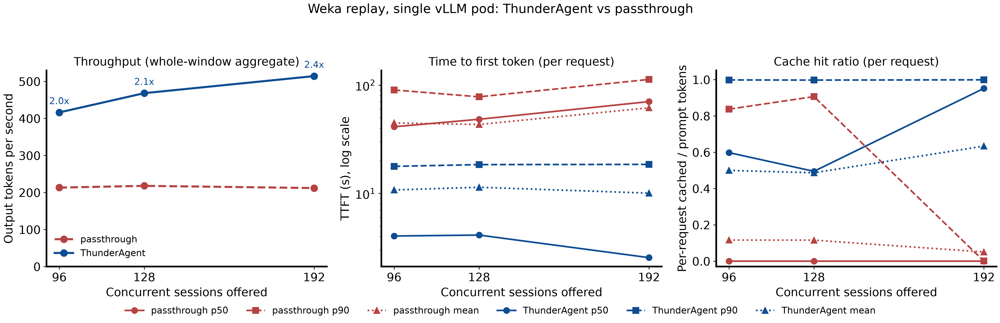
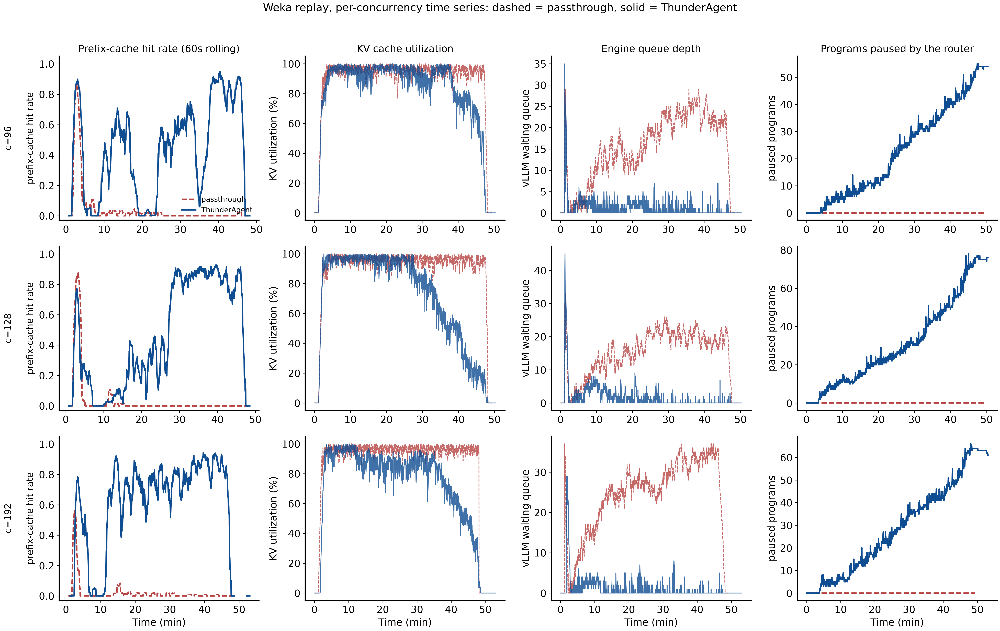
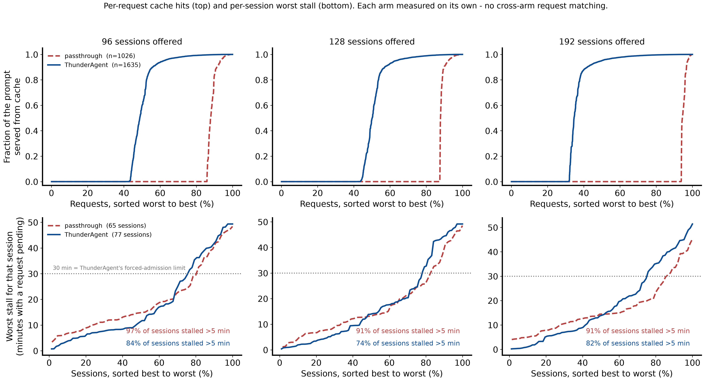

# ThunderAgent on a single vLLM replica: real Claude Code traffic, admission control only

Run: `results/weka-20260916-185331-full` (2026-09-16, six cells, all completed, no spot preemptions). Every number below is computed from the files in that folder. The figures are the ones produced by `pair.py`, regenerated from the same data with the arms labelled passthrough and ThunderAgent.

## 1. Summary

On one vLLM pod that is over-subscribed by real coding-agent sessions, the original ThunderAgent router (paper mode `tr`, with acting-token decay) delivers **2.0x to 2.4x the output-token throughput** of the same router used as a passthrough, raises the prefix-cache hit rate from **0.04-0.10 to 0.54-0.69**, and cuts the median time to first token from **41-70 s to 2.5-4.1 s**. It does this on a single replica, where there is no placement choice at all. The whole gain comes from one mechanism: holding some sessions at the door so that the sessions already on the GPU keep their KV cache.

| metric (45 min window) | c=96 | c=128 | c=192 |
|---|---|---|---|
| output tokens/s, passthrough -> ThunderAgent | 213 -> **416** (1.95x) | 218 -> **468** (2.15x) | 212 -> **514** (2.43x) |
| completed requests | 1026 -> 1635 | 1056 -> 1972 | 1107 -> 1893 |
| prefix-cache hit rate (pod counters) | 0.095 -> **0.541** | 0.097 -> **0.555** | 0.037 -> **0.690** |
| prompt tokens recomputed (cache misses) | 53.4M -> 42.0M | 54.7M -> 43.5M | 59.0M -> 32.5M |
| requests with zero cache hit | 79% -> 41% | 86% -> 42% | 86% -> 30% |
| TTFT p50 | 41 s -> **4.0 s** | 48 s -> **4.1 s** | 70 s -> **2.5 s** |
| TTFT p90 | 90 s -> 18 s | 78 s -> 19 s | 113 s -> 19 s |
| vLLM waiting queue, mean | 14.9 -> 1.2 | 14.7 -> 1.6 | 23.5 -> 1.0 |
| programs paused by the router, peak | 0 -> 55 | 0 -> 78 | 0 -> 66 |
| sessions forced in after 1800 s | 0 -> 8 | 0 -> 12 | 0 -> 13 |
| failed requests | 20 -> 31 | 14 -> 49 | 15 -> 36 |

The price is a longer tail: a small number of sessions wait minutes at the router, and a few wait the full 30-minute forced-admission limit. Section 6 covers this and the other limits of the measurement.

## 2. What ThunderAgent is

ThunderAgent (Kang et al., arXiv 2602.13692, ICML 2026 spotlight) is a scheduler that sits between agent clients and inference engines such as vLLM. It is an OpenAI-compatible HTTP proxy. The only change a client makes is to tag every request with a `program_id` (or here, an `x-session-id` header). The paper's claim is a 1.5x to 3.6x throughput gain on agentic workloads.

The idea behind it: a coding agent is not a stream of independent requests. It is a **program**: a long multi-turn conversation whose prompt grows every turn, and whose next turn shares almost all of its prompt with the previous one. If that shared prefix is still in the engine's KV cache when the next turn arrives, the engine skips most of the prefill work. If it was evicted, the engine recomputes tens of thousands of tokens. So the useful unit to manage is the program's resident KV footprint, not the individual request.

The router keeps, per program, the token count of its conversation and one of two statuses:

- **REASONING**: a request is in flight, the program is on the GPU.
- **ACTING**: no request in flight, the agent is running a tool or waiting; its KV blocks may still be cached.

Per backend it keeps a capacity model: `used = reasoning_tokens + acting_token_weight * acting_tokens - shared_tokens + buffer`, checked against the KV pool size read from vLLM at startup (`block_size x num_gpu_blocks`). Every 5 s a background loop does two things:

1. **Pause** when a backend is over capacity: ACTING programs first (smallest first), then REASONING ones are marked and paused when their request ends. A paused program's next request waits inside the router instead of entering the engine queue.
2. **Resume** when room frees, in priority order: programs with a pending request, then brand-new programs, then idle ACTING ones, placed best-fit-decreasing. A program that has waited 1800 s is admitted regardless (`_wait_for_resume` in `scheduler/router.py`).

Two flags matter for this report:

- `--router default` turns admission control off: every request passes straight through to the one backend, the router still counts programs but never pauses one. This passthrough is the baseline arm.
- `--use-acting-token-decay` makes an idle program's footprint decay as `2^-t` (t in seconds since it went ACTING) in the resume calculation. Without it, capacity is only freed by an explicit `POST /programs/release`, which real clients never send. Step 06 measured that without decay and without release the router is 8x slower than the passthrough; with decay it is 1.45x faster. Decay is off by default upstream, so it is turned on here.

The paper demonstrates the mechanism with cooperative rollout frameworks that call release. This experiment asks whether it holds for ordinary clients that do not, on real traffic, on one replica.

## 3. Benchmark setup

### 3.1 System under test

| | |
|---|---|
| model | `Qwen/Qwen3-Coder-30B-A3B-Instruct-FP8` (MoE, 48 layers, 4 KV heads, head dim 128) |
| engine | `vllm/vllm-openai:v0.28.0`, tensor parallel 2, `--max-model-len 262144`, `--kv-cache-dtype fp8_e4m3`, `--gpu-memory-utilization 0.88`, chunked prefill and prefix caching on (defaults) |
| hardware | one pod = 2x NVIDIA H100 80GB on a GKE `a3-highgpu-4g` spot node |
| router | upstream ThunderAgent commit `7ddc861`, unmodified, image `thunderagent-original:7ddc861`, one router per lane, one backend each |
| load generator | official `quay.io/inference-perf/inference-perf:v0.7.0`, digest-pinned in `job-weka.yaml` |

Full serving-side reference, including the resolved engine config: `../model-server/README.md`.

### 3.2 KV cache capacity of one replica

The number every admission decision is measured against is the pod's KV pool in tokens. vLLM reports it in `vllm:cache_config_info`, and the router reads the same two fields at startup:

```
num_gpu_blocks  = 139,815
block_size      = 16 tokens
KV pool         = 139,815 x 16 = 2,237,040 tokens
```

Consistency check against the memory budget. The per-token KV size for this model is:

```
bytes/token = layers x 2 (K and V) x kv_heads x head_dim x bytes(fp8)
            = 48 x 2 x 4 x 128 x 1 = 49,152 B = 48 KiB
KV pool     = 2,237,040 x 48 KiB = 102.4 GiB
GPU budget  = 0.88 x 2 x 80 GiB = 140.8 GiB
```

So the KV pool is about 73% of the budget; the rest holds the FP8 weights (about 30 GiB) and the activation workspace vLLM profiles at startup. The 4 KV heads (grouped-query attention) are why a 2.2M-token pool is possible at all on two GPUs. A full 262k-token conversation costs 12 GiB, so the pod can hold at most 8.5 of them (vLLM reports this as `kv_cache_max_concurrency` 8.53).

### 3.3 Workload: replayed Claude Code sessions

The corpus is the public weka trace set `semianalysisai/cc-traces-weka-with-subagents-060826-256k`: 391 recorded Claude Code sessions, 640 MB. A trace stores no text, only per request the timestamp, prompt and output token counts, think time, and a list of 64-token block hashes. inference-perf rebuilds a prompt per turn by mapping each hash to a fixed slice of a text corpus, so a block that repeats across turns tokenizes to identical text and produces the same KV blocks on the server. This reproduces the real prefix-reuse structure of the sessions without their content.

Corpus filter, one rule: keep traces with at most 400 requests (a memory guard for the load generator's graph compile, not a workload judgement). 338 of 391 traces kept. Every trace's keep/drop decision and the download sha256 are in each cell's `trace-manifest.json`.

What the kept traces look like:

| per kept trace | p50 | mean | p90 | max |
|---|---|---|---|---|
| turns | 64 | 93 | 219 | 392 |
| largest prompt in the trace (tokens) | 150k | 158k | 253k | 256k |

What the replayed requests looked like in the 45-minute window (successful requests, from `server_usage.prompt_tokens`):

| per request | p50 | mean | p90 | max |
|---|---|---|---|---|
| prompt tokens | 53k-59k | 50k-58k | 74k-100k | 203k |
| output tokens | 350 | 557 | 1.3k | 3.7k |

Prompt dominates: about 100 prompt tokens per output token. This is the regime where prefix-cache reuse decides throughput.

Replay settings (same in every cell, only `concurrent_sessions` differs): `base_seed 20260915`, real think times kept up to 10 s (`trace_idle_gap_cap_seconds 10`, `max_wait_ms 10000`), `request_timeout 600`, 24 worker processes, stage `timeout 2700` s (45 min), the whole 338-trace corpus as the work list. Subagent requests carry the parent's session id, so a program includes its subagents, matching the paper's abstraction. Rendered config per cell: `<cell>/config.yml`.

### 3.4 How over-subscribed the pod is

Put the two sides together. With a median prompt of about 53k tokens, the pool holds the context of roughly 40 sessions at once (2,237,040 / 53k = 42). Everything above that must evict something.

| | c=96 | c=128 | c=192 |
|---|---|---|---|
| offered sessions x median prompt | 5.1M tokens = **2.3x** the pool | 6.8M = **3.0x** | 10.2M = **4.6x** |
| sessions that actually sent requests in 45 min, passthrough / ThunderAgent | 65 / 77 | 64 / 101 | 75 / 87 |
| passthrough: tracked programs (mean) x median prompt | 53.2 x 52.9k = 2.81M = **1.26x** the pool | 52.2 x 52.8k = 2.76M = **1.23x** | 60.3 x 53.1k = 3.20M = **1.43x** |
| ThunderAgent: admitted (non-paused) programs (mean) x median prompt | 33.6 x 57.7k = 1.94M = **0.87x** the pool | 35.7 x 53.0k = 1.89M = **0.85x** | 32.9 x 59.0k = 1.94M = **0.87x** |

The third row is the failure mode of the passthrough: the live working set is 1.2x to 1.4x the pool, so each new prefill evicts blocks another live session will need seconds later. The fourth row is what the router does about it: at every offered load it settles on 33 to 36 admitted sessions whose combined context is about 87% of the pool, and holds the rest. That admitted set is nearly identical across the three concurrencies, which is why the steady-state hit rate and throughput are so similar across them.

Two saturation signals were checked before the run in a 10-minute calibration (`calibrate.sh`, `verdict.py`): baseline hit rate below 0.85 and peak KV utilization above 0.80. Both arms peaked at KV 1.00 in every cell here. Note that vLLM's KV utilization gauge counts only blocks held by running requests, so 1.00 means the running set alone fills the pool; the hit rate is the primary pressure signal.

### 3.5 Layout and procedure

- Three lanes in parallel, one per concurrency (96, 128, 192), each on its own vLLM pod on a distinct node. Pods are pinned by UID; a spot preemption would void the cell.
- Inside a lane the two arms run **sequentially on the same pod**: `default` first, then `tr-decay`, with `POST /reset_prefix_cache` on the pod and a router redeploy between them. The two arms of a pair therefore see identical hardware and start from a cold cache.
- Router flags: `--router default` vs `--router tr --use-acting-token-decay`, both with `--metrics --profile`, one backend. No `/programs/release` is ever sent.
- Instrumentation, every 2 s from a sidecar in the bench pod (`prober.py`): vLLM `/metrics` scraped directly from the pod (KV utilization, running, waiting, preemptions, prefix-cache query and hit counters, from which the hit rate is a ratio of counter deltas), router `/health` (programs, reasoning, acting, paused), and router `/programs` per program (status, paused state, backend). Plus the inference-perf per-request report with `server_usage.prompt_tokens_details.cached_tokens` (needs vLLM `--enable-prompt-tokens-details`, which is on) and the router log with every pause, resume and forced-resume event.
- Driver: `run-weka-ab.sh`; analysis and figures: `pair.py`.

## 4. Results

### 4.1 Throughput, latency, cache hits



Left: output tokens per second over the whole 45-minute window. The passthrough sits at 212-218 tok/s at every load; ThunderAgent reaches 416, 468 and 514 tok/s. Middle: time to first token on a log scale. The passthrough's median is 41-70 s because every request waits in the engine queue behind full re-prefills; ThunderAgent's median is 2.5-4.1 s because an admitted session's next turn is mostly a cache hit. Its p90 (18-19 s) is still 4-6x better than the passthrough's (78-113 s). Right: per-request cached fraction. Under the passthrough the median request gets nothing from the cache; under ThunderAgent the median request has 50-96% of its prompt already resident.

The cache-miss row in the summary table is the same fact in compute terms: at c=192 the pod recomputed 32.5M prompt tokens under ThunderAgent against 59.0M under the passthrough while finishing 2.4x more output.

### 4.2 The mechanism over time



One row per concurrency, dashed is the passthrough, solid is ThunderAgent. The same four-stage story appears in every row:

1. **Both arms start the same and both collapse.** In the first 3-5 minutes each arm climbs to a hit rate near 0.85 while sessions build their prefixes into an empty pool, then falls to near zero as the pool fills. ThunderAgent does not prevent the first thrash; it needs the pool to be full before it has anything to decide.
2. **Only ThunderAgent recovers.** From about minute 10-25 the solid line climbs back to 0.4-1.0 and stays there, oscillating as admitted cohorts finish and new ones enter. The passthrough stays pinned at about 0.00 for the remaining 40 minutes: once every session is evicting every other session, nothing breaks the cycle.
3. **The queue moves from the engine into the router.** The passthrough's vLLM waiting queue (third column) grows to 20-35 and stays there. ThunderAgent's stays at 0-5 while its paused-program count (fourth column) ramps to 54-78. It is the same backlog, held where it costs nothing instead of where it evicts cache.
4. **KV utilization diverges late.** Both arms pin at 100% early. Under ThunderAgent it drifts down after minute 30 (most visibly at c=128, to 40-60%) as admitted cohorts complete, while the passthrough stays at 100% to the end, still holding everything and finishing less. Section 6 notes that part of this late drop is an artifact of the client timeout.

The hit rate in this figure is a 60 s rolling ratio of summed hits to summed queries, not an average of per-interval ratios, because 2 s buckets carry very different token counts.

### 4.3 Who pays: per-request and per-session distributions



Top row: every successful request's cached fraction, sorted worst to best, each arm on its own. Under the passthrough 79-86% of requests get zero cache hit; under ThunderAgent that share is 30-42%, and the remaining requests are mostly above 0.8. Bottom row: for each session, the longest continuous stretch with a request outstanding (engine queueing for the passthrough, router hold plus engine queueing for ThunderAgent), measured from the router's own program timeline so session identity is real.

| per session | c=96 | c=128 | c=192 |
|---|---|---|---|
| sessions stalled more than 5 min, passthrough -> ThunderAgent | 97% -> 84% | 91% -> 74% | 91% -> 82% |
| median worst stall | 896 s -> 704 s | 815 s -> 845 s | 870 s -> 840 s |
| p90 worst stall | 2520 s -> 2557 s | 2474 s -> 2667 s | 2015 s -> 2498 s |

So the 2x throughput does not come from starving a class of sessions: ThunderAgent leaves fewer sessions badly stalled and has a similar median, while serving 12 to 37 more sessions in the window. Its p90 is somewhat worse (by 40-480 s): the pain is more concentrated. Under the passthrough the pain is close to universal.

### 4.4 What the router did

From the router logs and health series of the ThunderAgent cells:

| | c=96 | c=128 | c=192 |
|---|---|---|---|
| pause events | 913 | 1057 | 1015 |
| resume events | 1297 | 1446 | 1416 |
| forced admissions after 1800 s | 8 | 12 | 13 |
| paused programs, mean / peak | 22.8 / 55 | 31.3 / 78 | 28.8 / 66 |
| admitted programs, mean | 33.6 | 35.7 | 32.9 |

Across the three cells the median pause is 6-8 s and the p90 is 188-278 s. The pause distribution is extremely skewed. Most holds are a few seconds (one or two scheduler ticks); a small minority run into minutes, and 8 to 13 sessions per cell only got in because the 1800 s backstop fired. No session was never admitted. The passthrough cells show zero pauses and zero forced admissions, as expected.

## 5. Why this works on a single replica

With more than one backend, ThunderAgent also chooses where to place a program, and part of the paper's gain could come from spreading memory across nodes. Here there is exactly one backend, so placement is a no-op and the whole difference between the arms is admission control. The experiment isolates that mechanism, and the single-pod result says it is sufficient on its own: on this workload the pod is not short of compute, it is short of KV residency, and holding the 60th session at the router for a few seconds is cheaper than letting it evict the 30 sessions already warm.

Two supporting facts from the data: the router converged on the same admitted set size (33-36 programs, about 87% of the pool) at every offered load, and the engine's waiting queue emptied (mean 1.0-1.6) while its throughput doubled. The engine was never starved; it was fed only work it could serve from cache.

## 6. Limits of this measurement

- **Single trial per cell.** Step 08 (`../08-weka-replicates/RESULTS.md`) re-ran c=128 three times on three pods: ThunderAgent 464-476 tok/s vs passthrough 210-242, so 2.12x with a 1.3% spread, and this run's 468 vs 218 falls inside that. The apparent rise from 2.0x to 2.4x with load is within run-to-run variation and should not be read as a trend; the admitted set is the same size at every load, so there is no mechanism for it.
- **Offered concurrency is nominal.** inference-perf v0.7.0 lets only part of the dispatched sessions start (a worker-permit issue, `../INFERENCE-PERF-BUGS.md` issue 4), so mean in-flight requests were 48-58 in every cell and 64-101 sessions issued any request. The three points are still distinct regimes (the passthrough's hit rate falls from 0.095 to 0.037), but they are closer together than 96/128/192 suggests. Both arms ran under the same limit.
- **The 600 s client timeout trims the workload in ThunderAgent's favour.** Nearly all the failed requests are `request_timeout: 600` cutoffs, not server errors (one router-side HTTP 500 in the whole run, from a pause-vs-request race recorded in `UPSTREAM-ISSUES.md`). Under ThunderAgent the requests that hit 600 s are the largest held sessions, and a failed request ends its session and drops its remaining turns, so the tail of each ThunderAgent cell runs on a lighter workload. Step 08's addendum measured 2.06x restricted to minutes 10-30, before most cutoffs, against 2.12x for the whole window. Step 10 additionally found that the upstream router never returns a client-abandoned request's program to ACTING (`vllm_request_processor.py`, `on_usage` only runs when a usage chunk arrives), so such programs stay REASONING forever and throttle later admissions; this contributes to the late KV drop in the time series. A client timeout above the 1800 s backstop removes both effects; with it, the llm-d port of the same policy measured 1.54x on this workload.
- **The pre-registered paired analysis was retracted.** The plan matched requests across arms on `graph_event_id` plus prompt tokens within 1%, but `graph_event_id` is a position inside a session's graph, not a request identity, and 57% of matches had several candidates. Every paired delta in `analysis.md` is withdrawn. Nothing in this report depends on it: throughput, pod-counter hit rate, TTFT, the per-request cached-fraction curves and the per-session stall analysis each measure one arm at a time.
- **Tail latency is worse for a few sessions.** Median and p90 pauses are short, but the p90 worst stall per session is 40-480 s longer than under the passthrough, and 8-13 sessions per cell waited the full 1800 s. The resume order (smallest footprint first, no aging) is why large sessions lose repeatedly; `../proposal/PROPOSAL.md` Part 1 quantifies this.
- **Decay is mandatory and off by default.** Without `--use-acting-token-decay` and without release calls the same setup is 8x slower than the passthrough (step 06).
- **No comparison against a plain concurrency cap.** This measures admission control against no admission control, not ThunderAgent's policy against a trivial limiter.
- Subagent requests inherit the parent's session id, which matches the paper's program abstraction but treats a parent and its subagents as one KV footprint.

## 7. Files

Per cell (`results/weka-20260916-185331-full/<arm>-c<N>/`):

- `results/report/` inference-perf reports; per request: token counts, `server_usage` with `cached_tokens`, TTFT. No prompt or response text. `per_request_lifecycle_metrics.json` (50-112 MB) is not committed; every number here is also in the summary reports and the CSVs.
- `results/vllm-metrics.csv` 2 s series from the pod: KV utilization, running, waiting, preemptions, prefix-cache counters and interval hit rate.
- `results/router-health.csv` 2 s series: programs, reasoning, acting, paused.
- `results/programs-timeline.csv` per program per sample: status, state (`paused` lives here), backend.
- `router.log` pause, resume and forced-resume events with token counts; `config.yml`, `manifest.json` (pod name and UID, image digests, sha256 of the rendered config, timings), `results/trace-manifest.json`.

Reproduce:

```
./calibrate.sh 96 128 192      # optional regime check, about 15 min
./run-weka-ab.sh               # three lanes in parallel, about 1 h 40 min
python3 pair.py results/<run>  # figures and analysis.md
```

Related: `RESULTS.md` (index of every run in this folder, including the superseded unsaturated sweep and the calibrations), `PLAN.md` (pre-registered design and version pins), `HANG-INVESTIGATION.md` and `UPSTREAM-ISSUES.md` (tooling incidents), `../06-single-node-ab/results.md` (synthetic single-pod A/B that established the decay requirement), `../08-weka-replicates/RESULTS.md` (replication and the client-timeout addenda).
