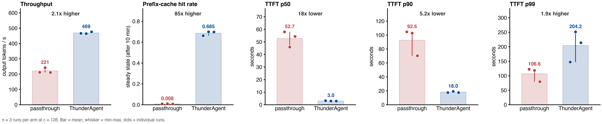
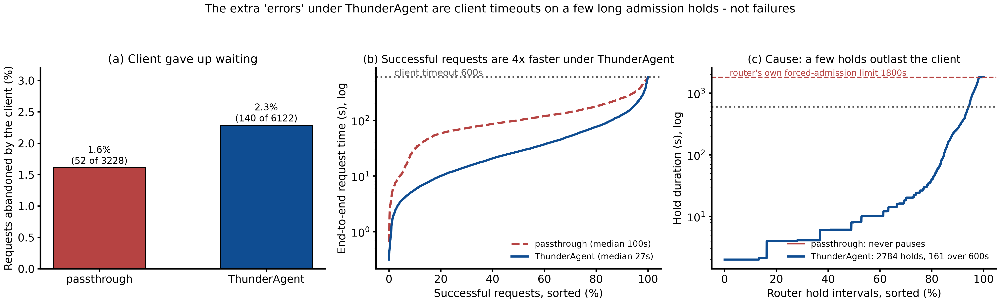

# ThunderAgent on a single vLLM replica, repeated: three runs of the same weka replay at c=128

Run: `results/rep-20260917-031427-c128` (2026-09-17, six cells, three runs per arm, all completed, no spot preemptions). Every number below is computed from the files in that folder. The two figures are the ones produced by `analyze.py`, regenerated from the same data with the arms labelled passthrough and ThunderAgent.

This step repeats one configuration three times instead of sweeping concurrency. Section 3.4 explains why: a load-generator bug in inference-perf v0.7.0 meant that step 07's c=96, c=128 and c=192 were nearly the same experiment, so error bars were worth more than a third load level.

## 1. Summary

On one over-subscribed vLLM pod, with real Claude Code sessions and no client-side release signal, ThunderAgent's admission control reproduces its gain across three independent runs on three different pods:

| metric, mean over 3 runs (min-max) | passthrough (`default`) | ThunderAgent (`tr-decay`) | ratio |
|---|---|---|---|
| output tokens/s, 45 min window | 221 (210-242) | **469 (464-476)** | **2.12x** |
| requests completed | 1059 (1033-1108) | 1994 (1978-2011) | 1.88x |
| prefix-cache hit rate, steady state (after minute 10) | 0.008 (0.007-0.009) | **0.685 (0.661-0.698)** | 85x |
| prefix-cache hit rate, whole window | 0.057 (0.037-0.077) | 0.615 (0.603-0.622) | 10.8x |
| prefix-cache hit rate, first 10 min | 0.197 (0.124-0.258) | 0.188 (0.117-0.310) | 0.96x |
| TTFT p50 | 52.7 s (45.9-58.0) | **3.0 s (2.9-3.2)** | 18x lower |
| TTFT p90 | 92.5 s (70.2-104.5) | 18.0 s (17.4-19.1) | 5x lower |
| TTFT p99 | 106.6 s (79.3-122.2) | 204.2 s (147.4-251.3) | **1.9x higher** |
| requests with zero cache hit | 88% (86-91) | 36% (35-40) | |
| vLLM waiting queue, mean | 17.7 | 1.2 | |
| programs paused by the router, peak | 0 | 69-85 | |
| sessions forced in after 1800 s | 0 | 16-18 | |
| client timeouts (600 s) | 17 (15-20) | 47 (45-50) | 2.7x |

ThunderAgent's throughput varies by 1.3% across runs. The result is not noise. Two later corrections, both measured, lower the clean number: restricted to minutes 10 to 30, before the client's 600 s timeout has removed many sessions, the ratio is about 2.06x, and looking only at the sessions both arms ran, each session got through about 1.3x as many turns under ThunderAgent, not 2.1x; the rest of the throughput gain comes from reaching more sessions. Section 6 has both.

## 2. What ThunderAgent is, in short

ThunderAgent (arXiv 2602.13692) is an OpenAI-compatible proxy in front of vLLM. Clients tag each request with a program id, here the `x-session-id` header. The router tracks each program's conversation length in tokens, knows the pod's KV pool size from vLLM's metrics, and every 5 s pauses programs when the tracked total exceeds the pool and resumes them when room frees. A paused program's next request waits inside the router instead of entering the engine, so the programs already on the GPU keep their KV cache and their next turn is mostly a prefix hit. A program that has waited 1800 s is admitted regardless.

`--router default` disables all of this and leaves a plain passthrough: that is the baseline arm. `--use-acting-token-decay` lets an idle program's footprint decay as `2^-t` so that finished sessions stop blocking admission even though no client ever calls release; it is off by default upstream and on here, because without it the router is 8x slower than the passthrough under this traffic (step 06). A fuller description, with the capacity formula and the state machine, is in `../07-inference-perf-weka/REPORT.md` section 2.

## 3. Benchmark setup

### 3.1 System under test

Identical to step 07: `Qwen/Qwen3-Coder-30B-A3B-Instruct-FP8` on `vllm/vllm-openai:v0.28.0`, tensor parallel 2 on two H100 80GB, `--max-model-len 262144`, FP8 KV cache, `--gpu-memory-utilization 0.88`, prefix caching on. Router: upstream ThunderAgent commit `7ddc861`, unmodified. Load generator: official `quay.io/inference-perf/inference-perf:v0.7.0`, digest-pinned. Serving-side reference: `../model-server/README.md`.

### 3.2 KV cache capacity of one replica

How many tokens the pool holds. vLLM reports the two inputs, and the router reads them at startup:

```
pool in tokens = num_gpu_blocks x block_size
               = 139,815 x 16
               = 2,237,040 tokens
```

How much memory one token of KV cache takes. Every layer stores one key and one value vector per KV head:

```
bytes per token = layers x 2 (key and value) x kv_heads x head_dim x bytes per number
                = 48 x 2 x 4 x 128 x 1 (FP8 is 1 byte)
                = 49,152 bytes = 48 KiB
```

How much memory the whole pool takes:

```
pool in bytes = 2,237,040 tokens x 49,152 bytes
              = 109,955,112,960 bytes
              = 102.4 GiB (110 GB in decimal units)
```

Where that fits in the GPU budget. vLLM may use 88% of each of the two 80 GiB GPUs:

```
budget = 0.88 x 2 x 80 GiB = 140.8 GiB
```

So the KV pool takes 102.4 GiB of a 140.8 GiB budget, about 73%. Under tensor parallel 2 each GPU holds two of the four KV heads, so 51.2 GiB per GPU. The other 38 GiB hold the FP8 weights, about 30 GiB, plus the working memory vLLM measures at startup. The token count is what vLLM reported; the byte figures are derived from it and only serve to show that the reported pool is the size the hardware allows.

### 3.3 Workload

The workload is the same as in step 07. It replays real coding-agent sessions.

The data comes from the public weka trace set `semianalysisai/cc-traces-weka-with-subagents-060826-256k`. It holds 391 recorded Claude Code sessions. A session is one long conversation between a user, the agent, and its tools. Each session has many turns. Each turn is one request to the model.

A trace does not store any text. For each request it stores only numbers: the time, the number of prompt tokens, the number of output tokens, the think time before the request, and a list of block hashes. A block hash is an id for one 64-token piece of the prompt. When a turn repeats a piece of the previous turn, the same hash appears again.

The load generator, inference-perf, turns these hashes back into text. Each hash always maps to the same fixed piece of text. So the replayed prompts have the same repeat structure as the real sessions, and the server sees the same prefix-cache hits and misses it would have seen in real life. The content of the text is not real, but the shape of the traffic is.

We keep 338 of the 391 sessions. The one rule is: a session must have at most 400 requests. Very long sessions cost too much memory in the load generator. This is a resource limit, not a judgement about the traffic.

Replay settings, the same in every cell:

| setting | value | meaning |
|---|---|---|
| `concurrent_sessions` | 128 | how many sessions the load generator tries to keep open at once (see 3.4 for what was really reached) |
| stage `timeout` | 2700 s | each cell runs for 45 minutes, then stops |
| `request_timeout` | 600 s | the client gives up on a request after 10 minutes |
| `base_seed` | 20260915 | fixed random seed, so every cell replays the sessions in the same order |
| think-time cap | 10 s | real pauses between turns are kept, but cut to 10 s at most |
| `num_workers` | 24 | worker processes in the load generator |
| `worker_max_concurrency` | 100 | request slots per worker |

What the replayed requests looked like, measured on the successful requests of all six cells:

| | typical value |
|---|---|
| prompt size per request, median | 51k to 56k tokens |
| prompt size per request, p90 | 77k to 100k tokens |
| output size per request, median | 350 tokens |
| largest prompt a session reached, median over sessions | 70k to 85k tokens |

Prompts are large and outputs are small. About 100 prompt tokens are sent for every output token. This is why the prefix cache matters so much: if the prompt is already in the cache, the server skips almost all of the work.

### 3.4 What "c=128" actually was: the inference-perf permit bug

The configured concurrency was never reached, in this step or in step 07. The cause was found on 2026-09-18 and is recorded as issue 4 in `../INFERENCE-PERF-BUGS.md`:

In v0.7.0 a worker process takes one of its `worker_max_concurrency` permits (100 here) before it pulls each event from its queue. An event that then parks waiting for its predecessor turns keeps that permit. All of a session's turns are enqueued at dispatch, and sessions are pinned to a worker by hash. So the first one or two sessions on a worker fill its 100 permits with parked turns, and the worker never reads the first turn of the other sessions pinned to it. Nothing in the output reports this. The fix (release the permit while parked) is commit `d5a7c8c` on `zetxqx/inference-perf`, branch `fix-session-replay-permits`, and is not in v0.7.0.

Evidence in this run's own logs:

| per cell | passthrough r1 / r2 / r3 | ThunderAgent r1 / r2 / r3 |
|---|---|---|
| sessions the load generator dispatched | 143 / 149 / 149 | 183 / 179 / 173 |
| sessions that ever sent a request | **68 / 73 / 65** | **109 / 103 / 91** |
| tasks a worker was still holding at stage teardown, max | 100 / 98 / 98 | 100 / 100 / 100 |
| requests in flight at vLLM, mean (peak) | 30 / 32 / 30 (45-48) | 28 / 27 / 28 (43-45) |
| bench pod CPU, median | 1.3 cores of 24 | 1.3 cores of 24 |

The teardown counts are exactly the permit count, and the bench pod was nearly idle, which rules out a CPU limit. Consequences:

- Offered load was about 65 to 110 active sessions, not 128, and it was the same ceiling at c=96 and c=192 in step 07. The step 07 "sweep" therefore measured one operating point three times while changing which traces were sampled. That is why this step runs instead of sweeping.
- Both arms ran under the same limit, so every comparison within a run stands. Only the absolute load label is wrong.
- Any future run needs an inference-perf image built from the fix, and the concurrency should then be re-derived from the achieved in-flight count, not the config value.

### 3.5 How over-subscribed the pod is, from the router's own books

Step 08 added `total_tokens` and `step_count` per program to the 2 s program timeline, so the demand side can be read from the router's own accounting instead of estimated from prompt sizes:

| mean over the window | passthrough r1 / r2 / r3 | ThunderAgent r1 / r2 / r3 |
|---|---|---|
| programs tracked | 56.6 / 59.1 / 54.7 | 69 / 70 / 65 |
| tokens of all tracked programs | 3.82M / 3.74M / 3.75M = **1.7x** the pool | 5.18M / 5.30M / 5.07M = **2.3x** the pool |
| programs admitted (not paused) | all | 34.8 / 34.5 / 34.4 |
| tokens of admitted programs | 3.8M = 1.7x the pool | 2.18M / 2.22M / 2.20M = **0.98x** the pool |
| programs paused, mean (peak) | 0 | 34 / 36 / 31 (85 / 79 / 69) |

Under the passthrough the live working set is 1.7 times the pool, so every prefill evicts blocks another live session needs within seconds; its steady-state hit rate is 0.008. Under ThunderAgent the tracked demand is larger (it gets further through the corpus, 2.3x the pool) but the admitted set is held at almost exactly one pool's worth of context, 34 to 35 programs, in all three runs. That admitted set is what produces the 0.685 hit rate. This is the same 33-36 admitted programs step 07 found at every offered load, now confirmed from token counts rather than program counts.

### 3.6 The two arms

Both arms use the same router binary, the same pod, the same workload and the same client. The only difference is the router's mode.

**Arm 1: passthrough (`--router default`).** The router forwards every request to the pod as soon as it arrives. It does not check capacity. It never makes a request wait. It still counts programs for its health endpoint, but it never acts on the count. The pod's own scheduler then decides what runs. When the KV pool is full, vLLM queues new requests and evicts the least recently used cache blocks to make room. In this arm a new session's first prefill can evict the cached context of a session that is about to send its next turn. That session then has to be prefilled again from scratch. This is the baseline. It shows what the pod does on its own.

**Arm 2: ThunderAgent (`--router tr --use-acting-token-decay`).** The router keeps a record for every session: how many tokens its conversation holds, and whether a request is in flight right now. It also knows the pod's KV pool size, 2,237,040 tokens. Every 5 s it adds up the tokens of all sessions it has admitted. If the sum is above the pool, it pauses sessions, starting with idle ones. A paused session's next request is held inside the router and does not reach the pod. When admitted sessions finish turns and their footprint decays, room frees up, and the router resumes paused sessions, largest fit first. A session that has been held for 1800 s is let in regardless. The effect is that the pod only ever holds about one pool's worth of live sessions, so their cached prefixes survive between turns.

What the client sees in each arm:

| | passthrough | ThunderAgent |
|---|---|---|
| where a request waits when the pod is full | in vLLM's queue, after it was sent to the pod | in the router, before it is sent to the pod |
| what happens to other sessions' cache while it waits | it evicts them as soon as its prefill starts | nothing, it has not touched the pod yet |
| how long a typical request waits | tens of seconds, every request | a few seconds, most requests |
| how long the unlucky request waits | about the same as everyone else | minutes, sometimes the full 1800 s |

Router parameters per arm. The first two rows are what the run recorded per cell in `manifest.json`. The next rows are what the router printed at startup in each cell's `router.log`. The rest are values the launcher or the upstream code fixes; they are not written to the results folder, so they are listed here from `../02-deploy/launcher.py` and the upstream source at commit `7ddc861`.

| parameter | passthrough | ThunderAgent | where the value comes from |
|---|---|---|---|
| `--router` | `default` | `tr` | `manifest.json`, `router_mode` |
| extra flag | none | `--use-acting-token-decay` | `manifest.json`, `router_extra` |
| backends | one, the lane's pod | one, the lane's pod | `router.log`: "Started router with 1 backend(s)" |
| KV capacity used for admission | 2,237,040 tokens (read, not used) | 2,237,040 tokens | `router.log`: "Fetched cache config ... total_capacity=2237040" |
| `--metrics`, metrics poll interval | on, 5 s | on, 5 s | `router.log`: "Started metrics monitoring ... interval: 5.0s" |
| scheduler loop | not started | every 5 s | `router.log`: "Started scheduler loop (interval=5.0s)" appears only in ThunderAgent cells |
| `--profile` | on | on | `router-weka.yaml` |
| `--acting-token-weight` | not used | 1.0 | launcher default, never overridden |
| acting-token decay | not used | `2^-t`, t in seconds since the program went idle | upstream `backend/state.py`, enabled by the flag above |
| forced admission after | not used | 1800 s | hard-coded in upstream `scheduler/router.py`, `_wait_for_resume` |
| buffer per admitted program | not used | 100 tokens | hard-coded upstream, `BUFFER_PER_PROGRAM` |
| release calls from the client | never | never | inference-perf config has no `session_close_path` |
| image | `thunderagent-original:7ddc861` | same | `manifest-global.json` |

Neither arm ever receives a `/programs/release` call. Real clients do not send one, so the experiment does not either. That is why the decay flag is on: without it, ThunderAgent would never free capacity for a finished session.

### 3.7 Layout and procedure

- Three lanes in parallel, one per vLLM pod on a distinct node. Lane = run. Within a lane, `default` then `tr-decay` run sequentially on the same pod with `POST /reset_prefix_cache` and a fresh router between them, so each pair shares hardware and starts cold.
- Router flags as in 3.6, plus `--metrics --profile` on both arms, one backend each.
- Instrumentation every 2 s from a sidecar (`prober.py`): vLLM `/metrics` from the pod (KV utilization, running, waiting, preemptions, prefix-cache counters), router `/health`, router `/programs` per program with status, paused state, backend, `step_count` and `total_tokens`. Plus the inference-perf per-request report with `cached_tokens`, the router log, and `cpu-usage.csv` from `kubectl top` every 30 s for the router, the vLLM pod and the bench pod.
- Driver: `run-replicates.sh`; analysis and figures: `analyze.py`.

## 4. Results

### 4.1 Spread across runs



Bar is the mean, whisker is min to max, dots are the three runs. Throughput: 464, 466, 476 tok/s for ThunderAgent against 210, 211, 242 for the passthrough. Steady-state hit rate: 0.661 to 0.698 against 0.007 to 0.009. TTFT p50: 2.9 to 3.2 s against 45.9 to 58.0 s. TTFT p90: 17.4 to 19.1 s against 70.2 to 104.5 s. The ThunderAgent arm is the tighter of the two on all of these.

The last panel is where ThunderAgent loses. Its TTFT p99 is 147 to 251 s against 79 to 122 s for the passthrough, and it is also the one metric where ThunderAgent's runs spread widely. Under the passthrough every request waits in the engine queue, so the distribution is compressed: p50 53 s, p99 107 s, a 2x span. Under ThunderAgent most requests are admitted within seconds and the waiting is concentrated on the few sessions held at the router, so p50 is 3 s and p99 is 204 s, a 68x span. The 1% of requests behind p99 are the held sessions of section 4.4 and the 1800 s forced admissions of section 4.5. Whether that trade is acceptable depends on whether the deployment cares about the median agent or the worst one; the report's limits section and `../proposal/PROPOSAL.md` Part 1 discuss how to shorten that tail.

Cross-check against step 07, which ran c=128 once on a different day: ThunderAgent 468 tok/s and passthrough 218 tok/s there, inside this run's ranges.

### 4.2 Where the variance lives: warm-up, not steady state

| prefix-cache hit rate | passthrough | ThunderAgent |
|---|---|---|
| minutes 0-10 (cold pool filling) | 0.197 (0.124-0.258) | 0.188 (0.117-0.310) |
| minutes 10-45 | 0.008 (0.007-0.009) | 0.685 (0.661-0.698) |

During warm-up the arms are indistinguishable: admission control has nothing to do while the pool has room. All of the run-to-run noise is in that phase (ranges of plus or minus 30%), while the steady state varies by a few percent. This explains why two nominally identical 10-minute calibration cells in step 07 had disagreed by 2.6x: short windows measure the transient. It also means the whole-window hit rate understates the steady-state gap by an order of magnitude (10.8x versus 85x).

### 4.3 Per-session progress: 1.3x, not 2.1x

With `step_count` recorded per program, the arms can be compared on only the sessions both of them started in a run, which removes the advantage the faster arm gets from pulling more traces out of the corpus:

| run | shared sessions | turns completed, passthrough | turns completed, ThunderAgent | ratio |
|---|---|---|---|---|
| r1 | 54 | 853 | 1068 | 1.25x |
| r2 | 54 | 927 | 1041 | 1.12x |
| r3 | 46 | 777 | 1196 | 1.54x |

For a given session, ThunderAgent advances it about 1.3x faster. The 2.12x system-level throughput is a different and also true quantity: it counts all work, and part of the gain is reaching more sessions (91-109 versus 65-73). Quote both: 2.1x is the operator's view, 1.3x is one agent's view.

### 4.4 The extra "errors" are client timeouts on a few long holds



Across the three runs, 140 of 6122 ThunderAgent requests (2.3%) and 52 of 3228 passthrough requests (1.6%) failed. Every one but a single router-side HTTP 500 is a `TimeoutError` at 600-601 s, the client's `request_timeout`. Panel (b) shows where the arms really differ: the median successful request takes 27 s under ThunderAgent and 100 s under the passthrough. Panel (c) shows the cause of the timeouts: 2784 router holds, of which 161 exceeded 600 s, against 140 timeouts, near one to one. The router's own backstop is 1800 s, so the client gave up three times sooner than the system is designed to make it wait. The one genuine failure is a race between the pause sweep and an in-flight request (`../07-inference-perf-weka/UPSTREAM-ISSUES.md`, ThunderAgent section).

### 4.5 What the router did

| ThunderAgent cell | r1 | r2 | r3 |
|---|---|---|---|
| pause events | 1035 | 1012 | 942 |
| resume events | 1019 | 995 | 923 |
| forced admissions after 1800 s | 18 | 16 | 17 |
| paused programs, mean / peak | 34 / 85 | 36 / 79 | 31 / 69 |
| router CPU, median / peak | 0.06-0.11 / 0.23 cores | | |

The passthrough cells log no pauses. The single-process Python router used a tenth of a core, so it was not the in-flight ceiling; the load generator was (section 3.4).

## 5. Why this works on a single replica

There is one backend per lane, so placement is a no-op and the entire difference between the arms is admission control. Section 3.5 shows it directly: the router held the admitted set at one pool's worth of context in all three runs, the engine's waiting queue emptied (mean 1.2 against 17.7), and the same engine produced 2.1x the output. The pod was never short of compute; it was short of KV residency, and holding the 60th session at the router for a few seconds is cheaper than letting it evict the 35 that are warm.

## 6. Limits of this measurement

- **The 600 s client timeout trimmed the workload asymmetrically.** In this load generator a new session starts only when one ends, and within 45 minutes a weka session ends only when a request fails, dropping its remaining turns. Each ThunderAgent cell lost 45 to 50 requests to the timeout from minute 10 on, and with them 2126 to 2471 downstream turns; the passthrough cells lost 15 to 20 requests and 572 to 829 turns. The requests that wait longest under ThunderAgent belong to the largest sessions, so the client removed exactly the most expensive work from that arm. Restricted to minutes 10 to 30, before most cutoffs took effect, ThunderAgent is 2.06x the passthrough (433 versus 210 tok/s) at a 0.57 hit rate. The reproducibility, warm-up and per-session findings are unaffected.
- **Abandoned requests corrupt the upstream router's accounting.** A request whose stream ends without a usage chunk never runs `on_usage` (`vllm_request_processor.py`), so its program stays REASONING at full weight and is never decayed, paused or evicted. In the ThunderAgent cells the router's REASONING count climbs to 76 to 83 by minute 45 while vLLM runs 17 to 20 requests. Those phantoms fill the capacity model, live admissions are throttled, KV utilization falls to about 0.4 over the last 15 minutes, and the survivors' hit rate rises to 0.76 to 0.82. The late-window regime that lifts this arm's whole-window numbers is therefore partly an artifact of dead sessions on the router's books. The llm-d port of the same policy handles abandoned requests correctly and measured 1.80x under this 600 s client and 1.54x under a 1900 s client (step 10).
- **Offered concurrency is nominal** (section 3.4). The load was about 65 to 110 active sessions with 27 to 32 requests in flight, for both arms. No claim should be made about behaviour at a specific concurrency.
- **Single configuration and one workload.** The concurrency sweep is superseded but not replaced.
- **No comparison against a plain concurrency cap.** This measures admission control against none, not ThunderAgent's policy against a trivial limiter.
- **Decay is mandatory and off by default upstream.** Without it the same setup is 8x slower than the passthrough (step 06).
- **Tail latency is worse for a few sessions.** 16 to 18 sessions per cell waited the full 1800 s; the resume order (smallest footprint first, no aging) is why large sessions lose repeatedly (`../proposal/PROPOSAL.md`, Part 1).

## 7. Files

Per cell (`results/rep-20260917-031427-c128/<arm>-r<N>/`):

- `results/report/` inference-perf reports; per request: token counts, `server_usage` with `cached_tokens`, TTFT. No prompt or response text. `per_request_lifecycle_metrics.json` (50-120 MB) is not committed; every number here is also derivable from the summary reports and the CSVs.
- `results/vllm-metrics.csv`, `results/router-health.csv`, `results/programs-timeline.csv` (with `step_count`, `total_tokens`, `context_len`), `results/bench-stdout.log` (dispatch and teardown lines used in section 3.4), `router.log`, `cpu-usage.csv`, `config.yml`, `manifest.json`, `results/trace-manifest.json`.

Reproduce:

```
./run-replicates.sh 128 3          # three lanes in parallel, about 1 h 40 min
python3 analyze.py results/<run>   # analysis.md, replicates.png, errors.png
```

Related: `RESULTS.md` (original write-up and the two addenda), `../07-inference-perf-weka/REPORT.md` (the single-run sweep, ThunderAgent background, KV arithmetic), `../INFERENCE-PERF-BUGS.md` (issue 4 is the permit bug), `../10-llm-d-router-replicates/RESULTS.md` (the same protocol through the llm-d port, with the client timeout raised).
