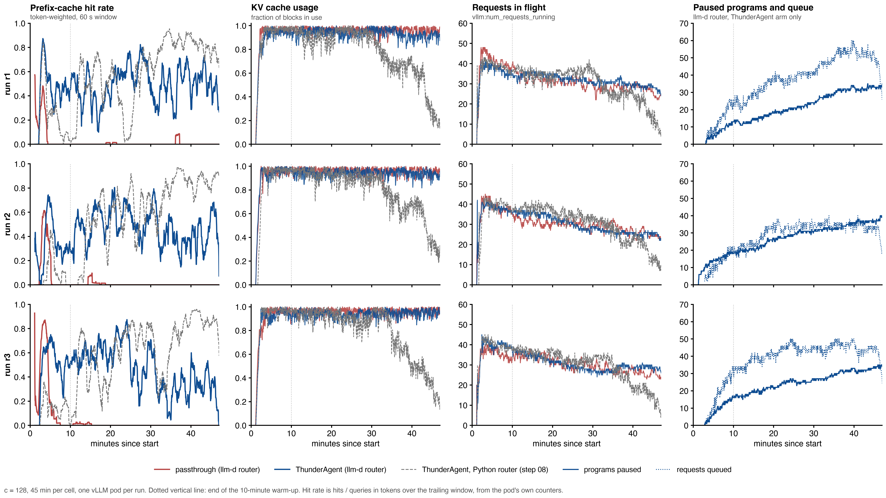
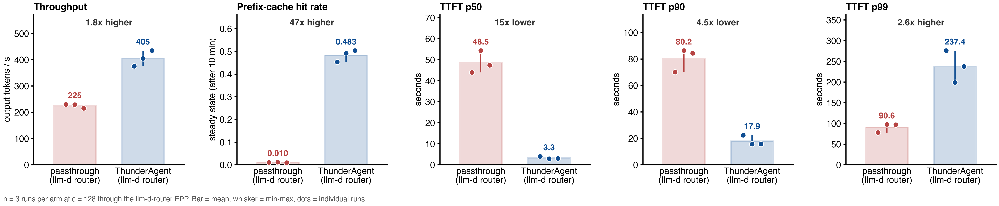

# LLM Inference Benchmarking Report: llm-d router implementation of ThunderAgent vs passthrough on one vLLM replica, Qwen3-Coder-30B-A3B-FP8, real Claude Code traffic
**Date:** 2026-09-17 (run 1) and 2026-09-18 (run 2)
**Author:** [fill in]

* Data, run 1: `results/rep-20260917-173839-c128-t1900`, client timeout 1900 s.
* Data, run 2: `results/rep-20260917-221857-c128-t600`, client timeout 600 s.
* Longer write-up with figures: `REPORT.md`. Original notes: `RESULTS.md`.

---

## 1. Executive Summary
* **Objective:**
  * Check that the ThunderAgent admission policy, ported into llm-d's router (the Endpoint Picker, EPP), reproduces what the paper's Python router did in step 08.
  * Same pods, same real coding-agent workload, same load, three runs per arm.
  * Also check that the llm-d request path itself (Envoy plus EPP) adds no cost.
* **Key Finding:**
  * With a patient client (1900 s), the port gives **1.54x the output-token throughput** (351 vs 227 tokens/s).
  * It cuts the **median time to first token from 49 s to 4.0 s**.
  * It lifts the steady-state prefix-cache hit rate from **0.003 to 0.489**.
  * With step 08's 600 s client it gives **1.80x** (405 vs 225 tokens/s).
  * The passthrough arm through llm-d equals the Python passthrough (227 vs 221 tok/s). The llm-d path is free.
  * Under equal load (minutes 10 to 30) the llm-d and Python implementations of ThunderAgent are within 0.02 on hit rate and 10% on throughput.
  * Step 08's 2.12x for the Python router rests on two artifacts the port does not have: a client that removed the most expensive sessions, and a router that kept dead sessions on its books.
  * The cost is the tail: **p99 TTFT is 2.8x worse** (410 s vs 147 s), because 8 to 11 sessions per run wait the full 1800 s.
* **Decision / Recommendation:**
  * The port is a faithful implementation and the llm-d path costs nothing. It is the version to carry forward.
  * Before latency-sensitive use, shorten the 1800 s forced-admission limit and change the resume order so large sessions are not starved.
  * Try `utilThreshold` below 1.0. The Python router accidentally ran better when it admitted less.
  * Always set the client timeout above the router's hold limit, or the errors hide the tail.

---

## 2. Setup & Environment
* **Hardware:**
  * Per test lane, one vLLM pod using 2x NVIDIA H100 80GB (tensor parallel 2).
  * Three lanes in parallel on three different nodes.
  * Node type: GKE `a3-highgpu-4g`, spot. Each node has 4 H100s; the pod uses 2.
* **Host:**
  * 104 vCPU and 965 GiB RAM per node. CPU model not recorded.
  * The vLLM pod is limited to 16 CPU cores and 128 GiB.
* **Software:**
  * GKE, kubelet `v1.35.3-gke.1389002`, GPU driver channel `latest`.
  * Exact driver and CUDA versions not recorded. CUDA is bundled in the vLLM image.
* **Serving Engine & Version:** `vllm/vllm-openai:v0.28.0`, official image, not modified.
* **Model Configuration:**
  * `Qwen/Qwen3-Coder-30B-A3B-Instruct-FP8`, a mixture-of-experts model, 30B total, 3B active.
  * TP=2, PP=1, `--max-model-len 262144`, FP8 weights, FP8 KV cache, `--gpu-memory-utilization 0.88`.
  * Chunked prefill and prefix caching on.
  * KV cache pool: 139,815 blocks x 16 tokens = **2,237,040 tokens** per pod (about 102 GiB).
* **Router under test:**
  * llm-d router EPP, image `llm-d-router-endpoint-picker:thunder-agent-v3` (llm-d-router commit `ae371354`), with the `thunder-agent` plugin.
  * One EPP and one Envoy per lane, pinned to that lane's pod.
  * Envoy ext_proc message timeout raised to 2400 s so a held request can outlast the 1800 s forced admission.
* **Load generator:** `quay.io/inference-perf/inference-perf:v0.7.0`, official image, digest-pinned. 24 CPU cores requested.

---

## 3. Workload & Traffic
* **Input / Output Token Lengths:**
  * Real, not fixed.
  * Prompt per request: median 50k to 63k tokens, p90 78k to 101k.
  * Output per request: median about 350 tokens.
  * About 100 prompt tokens per output token.
* **Traffic Pattern:**
  * Replay of 338 recorded Claude Code sessions from the public weka trace set.
  * Each session is a multi-turn conversation.
  * A turn is sent only after the previous answer arrived, plus the real think time from the recording, capped at 10 s.
  * Sessions run in a closed loop: when one ends, the next starts.
  * Prompts are rebuilt from 64-token block ids, so cache reuse between turns matches the real sessions.
* **Concurrency Levels Tested:**
  * One level, configured as 128 sessions.
  * Because of a bug in inference-perf v0.7.0 the real load was lower: 51 to 62 sessions ever sent a request in run 1 and 68 to 97 in run 2.
  * 29 to 33 requests were in flight at the pod on average.
  * Both arms had the same limit. See section 7.
* **Test Duration / Warm-up:**
  * 45 minutes per cell.
  * The first 10 minutes are warm-up. Steady-state numbers use minutes 10 to 45.
  * Each arm was run 3 times per client timeout, one run per lane, each on its own pod. Arm order alternated across lanes.
  * Prefix cache reset and fresh EPP before every cell.

---

## 4. Test Arms (Variables Under Test)
* **Arm 0 (Baseline), "passthrough" (`epp-sticky`):**
  * The `thunder-agent` plugin with llm-d's flow-control gate off.
  * It keeps a session on its pod (a no-op with one pod) and never holds a request.
  * Every request goes to the pod as soon as Envoy and the EPP have processed it.
  * This is the twin of step 08's passthrough, through the llm-d path.
* **Arm 1, "llm-d router implementation of ThunderAgent" (`epp-thunder`):**
  * The same plugin with the flow-control gate on.
  * Parameters: `capacityTokens 2237040`, `utilThreshold 1.0`, `actingHalfLifeSeconds 1`, `bufferTokensPerProgram 100`, `pauseSweepSeconds 5`, `headWaitStarvationMs 1800000`, `evictionTtlSeconds 3600`.
  * The plugin tracks each session's tokens and queues a request inside the EPP when its session does not fit in the pool.
  * When room frees it resumes paused sessions first, then new ones.
  * Any request that has waited 1800 s is admitted regardless.
* **Two client settings:**
  * Run 1: `request_timeout 1900` s, above the router's hold limit, so no held request is counted as an error.
  * Run 2: `request_timeout 600` s, what step 08 used, so the port faces exactly what the Python router faced.
* **Same in both arms:** EPP image, pod, workload, seed, client settings, no release calls from the client.

---

## 5. Key Metrics Tracked
* **TTFT (Time to First Token):** p50, p90, p99, in seconds. Includes queueing in the pod (Arm 0) or holding in the EPP plus queueing (Arm 1).
* **ITL (Inter-Token Latency):** p50, p90, p99, in ms. Each request's mean ITL first; percentiles over requests.
* **Throughput:** Output tokens per second over the 45-minute window; completed requests per second.
* **Cache:** Prefix-cache hit rate from the pod's own counters, steady state and whole window; share of requests with zero cache hit.
* **Resource Usage:**
  * Peak KV cache utilization from vLLM.
  * The EPP's own capacity view (admitted footprint / pool).
  * VRAM is fixed at 88% of each GPU in both arms and is not reported.
  * GPU compute utilization was not collected.
  * CPU of the EPP, the pod and the load generator sampled every 30 s.
* **Router activity:** holds, pauses, resumes, forced admissions, peak paused programs, queue size and mean queue wait, from the EPP's metrics.

---

## 6. Results

Mean over 3 runs, min to max in brackets. TTFT in seconds, ITL in ms.

| Test Arm | Client timeout | Concurrency (configured / real in flight) | p50 TTFT (s) | p90 TTFT (s) | p99 TTFT (s) | p50 ITL (ms) | p99 ITL (ms) | Output Tokens/s | Requests/s | Steady hit rate | Peak KV |
| :--- | :--- | :--- | :--- | :--- | :--- | :--- | :--- | :--- | :--- | :--- | :--- |
| **Arm 0 (passthrough)** | 1900 s | 128 / 29 | 49.4 (28.4 to 68.6) | 113.5 (88.2 to 136.6) | 146.6 (117.8 to 168.3) | 137 | 281 | 227 (221 to 236) | 0.36 | 0.003 (0.002 to 0.003) | 100% |
| **Arm 1 (llm-d router implementation of ThunderAgent)** | 1900 s | 128 / 29 | **4.0** (3.6 to 4.6) | **22.0** (19.8 to 24.1) | 409.7 (352.9 to 462.7) | **87** | **245** | **351** (327 to 367) | **0.52** | **0.489** (0.482 to 0.502) | 100% |
| ratio, run 1 | | | 12x lower | 5.2x lower | **2.8x higher** | 1.6x lower | 1.1x lower | **1.54x** | 1.43x | 173x | same |
| **Arm 0 (passthrough)** | 600 s | 128 / 31 | 48.5 (43.9 to 54.3) | 80.2 (70.1 to 86.2) | 90.6 (77.8 to 97.1) | 136 | 260 | 225 (215 to 230) | 0.40 | 0.010 (0.009 to 0.011) | 100% |
| **Arm 1 (llm-d router implementation of ThunderAgent)** | 600 s | 128 / 33 | **3.3** (2.9 to 4.0) | **17.9** (15.6 to 22.4) | 237.4 (199.0 to 275.7) | **85** | **237** | **405** (375 to 434) | **0.63** | **0.483** (0.453 to 0.503) | 100% |
| ratio, run 2 | | | 15x lower | 4.5x lower | **2.6x higher** | 1.6x lower | 1.1x lower | **1.80x** | 1.59x | 47x | same |

Reference, step 08's Python router under the 600 s client:

* Passthrough: 221 tok/s, TTFT p50 52.7 s.
* ThunderAgent: 469 tok/s, TTFT p50 3.0 s, steady hit rate 0.685, 2.12x.

Per run, client timeout 1900 s:

| run | arm | requests ok | client timeouts | out tok/s | p50 TTFT (s) | p99 TTFT (s) | p50 ITL (ms) | steady hit rate | forced admissions |
| :--- | :--- | :--- | :--- | :--- | :--- | :--- | :--- | :--- | :--- |
| r1 | passthrough | 985 | 0 | 224 | 68.6 | 168.3 | 138 | 0.003 | 0 |
| r1 | llm-d ThunderAgent | 1469 | 6 | 367 | 3.6 | 413.6 | 87 | 0.502 | 10 |
| r2 | passthrough | 965 | 0 | 221 | 51.1 | 153.7 | 136 | 0.003 | 0 |
| r2 | llm-d ThunderAgent | 1319 | 5 | 327 | 4.6 | 352.9 | 90 | 0.484 | 8 |
| r3 | passthrough | 987 | 0 | 236 | 28.4 | 117.8 | 135 | 0.002 | 0 |
| r3 | llm-d ThunderAgent | 1407 | 6 | 358 | 3.8 | 462.7 | 85 | 0.482 | 11 |

Per run, client timeout 600 s:

| run | arm | requests ok | client timeouts | out tok/s | p50 TTFT (s) | p99 TTFT (s) | p50 ITL (ms) | steady hit rate | forced admissions |
| :--- | :--- | :--- | :--- | :--- | :--- | :--- | :--- | :--- | :--- |
| r1 | passthrough | 1154 | 16 | 230 | 43.9 | 77.8 | 135 | 0.010 | 0 |
| r1 | llm-d ThunderAgent | 1525 | 37 | 375 | 4.0 | 275.7 | 91 | 0.453 | 0 |
| r2 | passthrough | 1042 | 18 | 229 | 54.3 | 97.1 | 134 | 0.011 | 0 |
| r2 | llm-d ThunderAgent | 1793 | 37 | 404 | 2.9 | 199.0 | 86 | 0.492 | 0 |
| r3 | passthrough | 1029 | 19 | 215 | 47.4 | 96.9 | 141 | 0.009 | 0 |
| r3 | llm-d ThunderAgent | 1799 | 44 | 434 | 3.0 | 237.3 | 80 | 0.503 | 0 |

Other measured facts, run 1:

| | Arm 0 (passthrough) | Arm 1 (llm-d router implementation of ThunderAgent) |
| :--- | :--- | :--- |
| requests with zero cache hit | 86% | 38% |
| vLLM waiting queue, mean | 17.6 | 0.8 |
| EPP capacity view, mean (admitted footprint / pool) | not tracked | 0.93 to 0.95 |
| programs paused, mean (peak) | 0 | 21 to 27 (42 to 57) |
| holds / pauses / resumes per run | 0 | 615 to 677 / 938 to 1009 / 886 to 952 |
| mean queue wait in the EPP | none | 3.6 to 13.6 s |
| pod moves on resume | 0 | 0 |

Same load, minutes 10 to 30, both routers:

| arm | hit rate | tok/s | in flight | ratio over its passthrough |
| :--- | :--- | :--- | :--- | :--- |
| Python passthrough (step 08) | 0.013 | 210 | 33.0 | |
| Python ThunderAgent (step 08) | 0.571 | 433 | 35.2 | 2.06x |
| llm-d passthrough (run 1) | 0.004 | 214 | 31.6 | |
| llm-d router implementation of ThunderAgent (run 1) | 0.550 | 393 | 32.7 | 1.84x |

**Figure 1. Run 1, the five headline metrics, one dot per run.**

* The p99 TTFT panel is where the llm-d router implementation of ThunderAgent is worse.
* With the 1900 s client the full tail shows in latency instead of in the error count.


**Figure 2. Run 1 time series, one row per run, with the step 08 Python ThunderAgent lane in grey.**

* For 30 minutes the port and the Python router run the same.
* After minute 30 the Python lane's in-flight count falls, its KV empties and its hit rate climbs. The port stays steady.
* That divergence is the client-timeout and phantom-program artifact, not scheduling.



**Figure 3. Run 2, same metrics with step 08's 600 s client.**

* The port reaches 1.80x with the same TTFT as the Python router.



---

## 7. Analysis
* **Primary Bottleneck:**
  * KV cache capacity, not compute, as in step 08.
  * The pod ran 29 to 33 requests at a time against a `max_num_seqs` of 1024, but its KV pool was 100% full in every cell.
  * Under the passthrough every new prefill evicts blocks another live session is about to reuse. The steady-state hit rate is 0.003 to 0.010.
  * Under the llm-d router implementation of ThunderAgent the port held its admitted footprint at 93% to 95% of the pool, and those sessions kept their cache between turns.
* **Trade-offs:**
  * The llm-d router implementation of ThunderAgent improves throughput 1.54x to 1.80x, median TTFT 12x to 15x, and median ITL 1.6x.
  * It does this by moving the waiting from the pod's queue into the EPP.
  * The waiting is then concentrated: most requests wait seconds, a few sessions wait minutes, and 8 to 11 per run wait the full 1800 s before they are forced in.
  * That is why p99 TTFT is 2.6x to 2.8x worse.
  * The 1900 s client shows this honestly. Step 08's 600 s client turned the same tail into "errors" and dropped those sessions from the workload.
* **Why the port shows 1.54x where the Python router showed 2.12x:**
  * Not scheduling. Under equal load (minutes 10 to 30) the two implementations are within 0.02 on hit rate and 10% on throughput.
  * Artifact 1: the 600 s client removed about 2300 turns per cell from the largest held sessions.
  * Artifact 2: the Python router never returns a client-abandoned request's session to idle. By minute 45 it believed 76 to 83 sessions were active while vLLM ran 17 to 20.
  * Those phantoms throttled admissions, emptied the engine to 0.67 KV and pushed the survivors' hit rate to 0.81.
  * The port handles disconnects correctly, so it gets no such accidental benefit.
  * With the same 600 s client the port is 1.80x.
* **Anomalies / Failures:**
  * **Client timeouts, run 1:** 0 for the passthrough, 5 to 6 per cell for the llm-d router implementation of ThunderAgent. All were requests force-admitted at 1800 s that then exceeded 1900 s.
  * **Client timeouts, run 2:** 16 to 19 vs 37 to 44 per cell, all at 600 s. The same churn as step 08 (176 vs 178 sessions started per cell).
  * **Load generator bug:** inference-perf v0.7.0 holds a worker slot for every queued turn, so most configured sessions never start. Real load was 55 to 65 active sessions in run 1 and 65 to 100 in run 2. Both arms had the same limit. Fixed in commit `d5a7c8c` on `zetxqx/inference-perf`; not used here.
  * **About 10% of throughput under equal load is unexplained:** 393 vs 433 tok/s at 2 to 3 fewer requests in flight. Candidates: the port's byte-based size estimate under-sizes programs, the ext_proc round trip per turn, and event-driven admission against the Python router's 5 s tick.
  * **What could not be measured:** per-session progress (the EPP lists no program ids; step 08 found 1.3x per session against 2.1x overall) and the hold-duration distribution (the EPP exposes only the sum and count of queue waits).
  * **What was not tested:** a plain concurrency cap as a third arm, more than one concurrency level, and `utilThreshold` below 1.0.

---

## 8. Reproduce

```
./deploy-lanes.sh thunder                          # one EPP + Envoy per pod, three lanes
./run-replicates.sh 128 3 2700 sticky,thunder 1900 # run 1, about 1 h 40 min
./run-replicates.sh 128 3 2700 sticky,thunder 600  # run 2
python3 analyze.py results/<run>                   # analysis.md and two figures
python3 plot_timeseries.py results/<run>           # timeseries.png
./teardown-lanes.sh
```

* Per cell the folder keeps the rendered client config, a manifest with arm, lane, pod UID and client timeout, the EPP log, 2 s time series from the pod and the EPP, CPU samples, and the inference-perf reports without prompt text.
