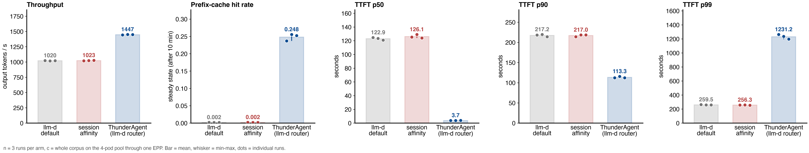
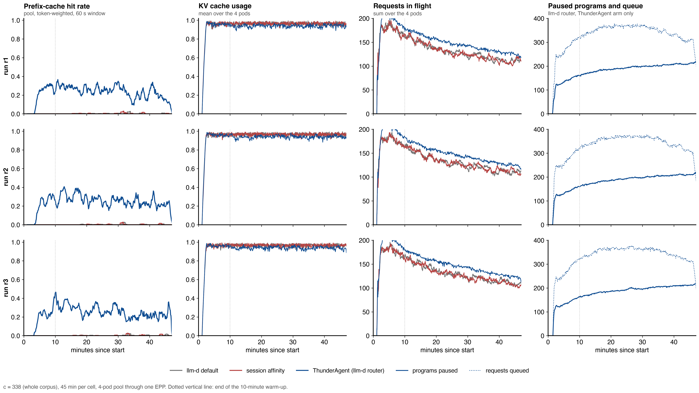
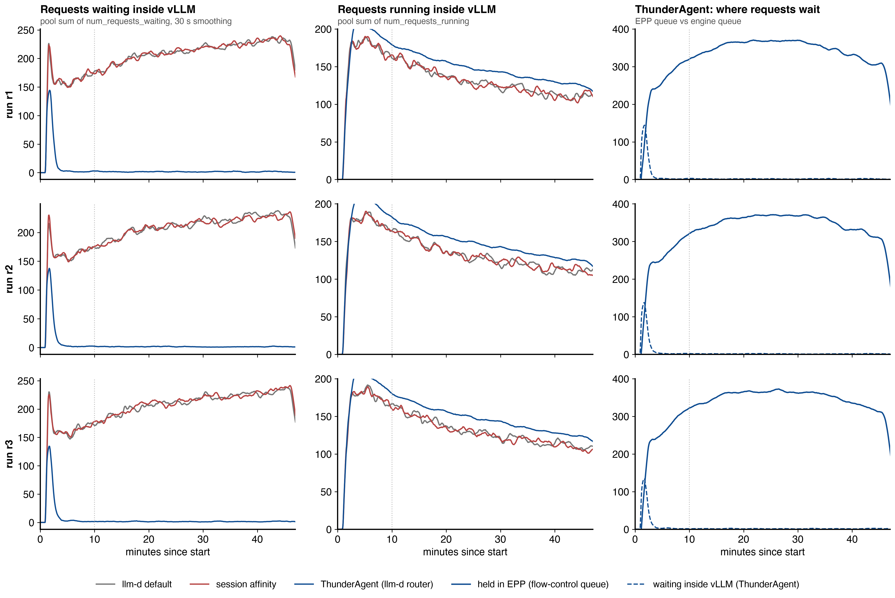

# LLM Inference Benchmarking Report: llm-d router implementation of ThunderAgent vs llm-d's two standard policies on a four-pod pool, Qwen3-Coder-30B-A3B-FP8, real Claude Code traffic
**Date:** 2026-09-18
**Author:** [fill in]

* Data: `results/rep-20260918-012350-c338-t1900`, nine cells, three runs per arm.
* Original notes: `RESULTS.md`. Setup and calibration: `README.md`.

---

## 1. Executive Summary
* **Objective:**
  * Compare three routing policies on the real llm-d deployment shape: one router (the Endpoint Picker, EPP) in front of a pool of four vLLM pods.
  * Policies: llm-d's default profile (prefix-cache, queue and KV scorers), llm-d's session affinity (pin a session to a pod), and the llm-d router implementation of ThunderAgent (pin plus admission control).
  * Same real coding-agent workload as steps 07 to 10, the whole 338-session corpus at once, three runs per arm.
  * First run with the fixed load generator, so the configured concurrency was actually reached.
* **Key Finding:**
  * llm-d's default profile and session affinity are indistinguishable: 1020 vs 1023 tokens/s, steady-state hit rate 0.002 for both, median TTFT 123 vs 126 s. Placement alone does nothing on an over-subscribed pool.
  * The llm-d router implementation of ThunderAgent gives **1.42x the output-token throughput** (1447 tokens/s), a **steady-state hit rate of 0.248**, and a **median TTFT of 3.7 s**, 33x lower.
  * All three arms repeat to within about 1% across runs.
  * The gain is smaller than on one pod (1.42x here vs 1.54x in step 10, hit rate 0.25 vs 0.49) because about 70% of resumed sessions were moved to a different pod, and each move pays a full re-prefill.
  * The cost is the tail: **p99 TTFT is 1231 s vs 260 s**, 4.7x worse, because 53 to 58 sessions per run wait the full 1800 s before they are forced in, and 25 per run then exceed the 1900 s client timeout.
* **Decision / Recommendation:**
  * On this workload, admission control is the whole effect. Adding a smarter placement scorer without it changes nothing.
  * Keep the ThunderAgent policy in the llm-d router and fix its resume placement: an origin-only resume (wait for the session's own pod unless it is gone or the 1800 s backstop fires) should recover most of the single-pod hit rate. That is step 13.
  * Before latency-sensitive use, shorten the 1800 s forced-admission limit and change the resume order so large sessions are not starved.

---

## 2. Setup & Environment
* **Hardware:**
  * Four vLLM pods, each using 2x NVIDIA H100 80GB (tensor parallel 2), 8 GPUs in total.
  * GKE `a3-highgpu-4g` spot nodes, 4 H100s per node. The four pods sit on three nodes; two pods share one node.
* **Host:**
  * 104 vCPU and 965 GiB RAM per node. CPU model not recorded.
  * Each vLLM pod is limited to 16 CPU cores and 128 GiB.
* **Software:**
  * GKE, kubelet `v1.35.3-gke.1389002`, GPU driver channel `latest`.
  * Exact driver and CUDA versions not recorded. CUDA is bundled in the vLLM image.
* **Serving Engine & Version:** `vllm/vllm-openai:v0.28.0`, official image, not modified.
* **Model Configuration:**
  * `Qwen/Qwen3-Coder-30B-A3B-Instruct-FP8`, a mixture-of-experts model, 30B total, 3B active.
  * TP=2, PP=1, `--max-model-len 262144`, FP8 weights, FP8 KV cache, `--gpu-memory-utilization 0.88`.
  * Chunked prefill and prefix caching on.
  * KV cache pool: 139,815 blocks x 16 tokens = **2,237,040 tokens per pod**, about 102 GiB. The four pods together hold **8,948,160 tokens**.
* **Router under test:**
  * The deployment's main llm-d router release, one EPP and one Envoy over the four-pod InferencePool.
  * EPP image `llm-d-router-endpoint-picker:thunder-agent-v3` (llm-d-router commit `ae371354`). Only the plugin config changes between arms.
  * Envoy ext_proc message timeout raised to 2400 s so a held request can outlast the 1800 s forced admission.
* **Load generator:**
  * inference-perf built from branch `fix-session-replay-permits`, commit `d5a7c8c`, digest in `results/inference-perf-image.txt`.
  * This build fixes the v0.7.0 bug that kept most sessions from starting in steps 07 to 10. 24 CPU cores requested.

---

## 3. Workload & Traffic
* **Input / Output Token Lengths:**
  * Real, not fixed.
  * Prompt per request: median 50k to 54k tokens, p90 72k to 88k.
  * Output per request: median about 350 tokens.
  * About 100 prompt tokens per output token.
* **Traffic Pattern:**
  * Replay of 338 recorded Claude Code sessions from the public weka trace set.
  * Each session is a multi-turn conversation. A turn is sent only after the previous answer arrived, plus the real think time from the recording, capped at 10 s.
  * All 338 sessions are dispatched at the start. The corpus is the whole kept set, so no new sessions replace finished ones.
  * Prompts are rebuilt from 64-token block ids, so cache reuse between turns matches the real sessions.
* **Concurrency Levels Tested:**
  * One level: 338 sessions, the whole corpus, over four pods, about 85 active sessions per pod.
  * With the fixed load generator all 338 sessions issued requests in every cell.
  * Requests in flight across the pool: 123 to 129 on average, about 30 to 33 per pod.
  * Over-subscription: 338 sessions x about 52k tokens median prompt = about 17.6M tokens against an 8.95M-token pool, roughly 2x.
* **Test Duration / Warm-up:**
  * 45 minutes per cell. The first 10 minutes are warm-up. Steady-state numbers use minutes 10 to 45.
  * Three runs per arm. Cells run one after another on the shared pool, arm order rotated as a Latin square (r1 default, affinity, ThunderAgent; r2 affinity, ThunderAgent, default; r3 ThunderAgent, default, affinity).
  * Before every cell: prefix cache reset on all four pods, EPP upgraded to the arm's config and restarted.
  * One cell (`epp-baseline-r2`) was lost to a transient Kubernetes API timeout during its config switch and was rerun afterwards under the same conditions.

---

## 4. Test Arms (Variables Under Test)
* **Arm 0 (Baseline), "llm-d default" (`epp-baseline`, `baseline-plugins.yaml`):**
  * The scheduling profile this deployment ships with: prefix-cache scorer (weight 3), KV-utilization scorer (weight 2), queue scorer (weight 2), max-score picker.
  * The prefix-cache scorer prefers the pod most likely to hold the prompt's prefix, so it tends to keep a session on one pod, but it has no session concept and no admission control.
  * Every request goes to a pod at once.
* **Arm 1, "session affinity" (`epp-affinity`, `affinity-plugins.yaml`):**
  * llm-d's session-affinity scorer (weight 3) pinned by the `x-session-id` header, one-hour binding, plus the active-request scorer (weight 1) to spread new sessions.
  * Pinning only. No admission control. Every request goes to its pod at once.
* **Arm 2, "llm-d router implementation of ThunderAgent" (`epp-thunder`, `thunder-plugins.yaml`):**
  * The `thunder-agent` plugin with llm-d's flow-control gate on, the same config as steps 09 and 10.
  * Parameters: `capacityTokens 2237040` per pod, `utilThreshold 1.0`, `actingHalfLifeSeconds 1`, `bufferTokensPerProgram 100`, `pauseSweepSeconds 5`, `headWaitStarvationMs 1800000`, `evictionTtlSeconds 3600`.
  * The plugin tracks each session's tokens per pod, holds a request in the EPP when its session does not fit, pauses idle sessions when a pod is over capacity, and resumes paused sessions when room frees.
  * Resume placement in this build: a resumed session goes to its own pod if it fits, otherwise to the pod with the most room. This is what moved 70% of resumed sessions.
  * Any request that has waited 1800 s is admitted regardless.
* **Same in all arms:** EPP image, pods, workload, seed, client timeout 1900 s, no release calls from the client.

---

## 5. Key Metrics Tracked
* **TTFT (Time to First Token):** p50, p90, p99, in seconds. Includes queueing in the pod, or holding in the EPP plus queueing.
* **ITL (Inter-Token Latency):** p50, p90, p99, in ms. Each request's mean ITL first; percentiles over requests.
* **Throughput:** Output tokens per second over the 45-minute window, summed over the pool; completed requests per second.
* **Cache:** Prefix-cache hit rate from the pods' own counters, pooled over four pods, steady state and whole window; share of requests with zero cache hit.
* **Resource Usage:**
  * Mean and peak KV cache utilization per pod and averaged over the pool.
  * Requests running and waiting inside vLLM, summed over the pool.
  * VRAM is fixed at 88% of each GPU in every arm and is not reported. GPU compute utilization was not collected. CPU of the EPP and the load generator sampled every 30 s.
* **Router activity:** holds, pauses, resumes, pod moves on resume, forced admissions, peak paused programs, EPP queue size, from the EPP's metrics.

---

## 6. Results

Mean over 3 runs, min to max in brackets. TTFT in seconds, ITL in ms.

| Test Arm | Concurrency (sessions / in flight) | p50 TTFT (s) | p90 TTFT (s) | p99 TTFT (s) | p50 ITL (ms) | p99 ITL (ms) | Output Tokens/s | Requests/s | Steady hit rate | Pool KV mean (peak) |
| :--- | :--- | :--- | :--- | :--- | :--- | :--- | :--- | :--- | :--- | :--- |
| **Arm 0 (llm-d default)** | 338 / 123 | 122.9 (120.8 to 124.6) | 217.2 (213.9 to 219.5) | 259.5 (257.7 to 262.5) | 137 | 282 | 1020 (1018 to 1023) | 1.56 | 0.002 | 0.86 (1.00) |
| **Arm 1 (session affinity)** | 338 / 123 | 126.1 (123.9 to 129.0) | 217.0 (214.0 to 218.5) | 256.3 (253.9 to 257.9) | 135 | 289 | 1023 (1020 to 1027) | 1.57 | 0.002 | 0.87 (0.99) |
| **Arm 2 (llm-d router implementation of ThunderAgent)** | 338 / 129 | **3.7** (3.7 to 3.8) | **113.3** (112.1 to 115.6) | 1231 (1196 to 1263) | **105** | **260** | **1447** (1443 to 1450) | **2.26** | **0.248** (0.237 to 0.255) | 0.79 (0.99) |
| ratio, Arm 2 vs Arm 0 | | 33x lower | 1.9x lower | **4.7x higher** | 1.3x lower | 1.1x lower | **1.42x** | 1.44x | 139x | |
| ratio, Arm 1 vs Arm 0 | | 1.03x | 1.00x | 0.99x | 0.99x | 1.02x | 1.00x | 1.00x | 1.09x | |

Per run:

| run | arm | requests ok | client timeouts | out tok/s | p50 TTFT (s) | p99 TTFT (s) | p50 ITL (ms) | steady hit rate | forced admissions | pod moves on resume |
| :--- | :--- | :--- | :--- | :--- | :--- | :--- | :--- | :--- | :--- | :--- |
| r1 | llm-d default | 4234 | 1 | 1023 | 124.6 | 262.5 | 136 | 0.002 | - | - |
| r1 | session affinity | 4253 | 1 | 1020 | 125.3 | 257.2 | 134 | 0.002 | - | - |
| r1 | llm-d ThunderAgent | 6068 | 25 | 1443 | 3.7 | 1262.5 | 105 | 0.237 | 55 | 3128 of 4433 |
| r2 | llm-d default | 4225 | 1 | 1018 | 123.3 | 258.4 | 137 | 0.002 | - | - |
| r2 | session affinity | 4216 | 1 | 1023 | 129.0 | 257.9 | 136 | 0.002 | - | - |
| r2 | llm-d ThunderAgent | 6100 | 25 | 1450 | 3.7 | 1235.0 | 104 | 0.255 | 58 | 3096 of 4437 |
| r3 | llm-d default | 4216 | 1 | 1020 | 120.8 | 257.7 | 137 | 0.002 | - | - |
| r3 | session affinity | 4211 | 1 | 1027 | 123.9 | 253.9 | 136 | 0.002 | - | - |
| r3 | llm-d ThunderAgent | 6120 | 25 | 1449 | 3.8 | 1196.2 | 105 | 0.252 | 53 | 3114 of 4539 |

Other measured facts, mean over runs:

| | Arm 0 (llm-d default) | Arm 1 (session affinity) | Arm 2 (llm-d router implementation of ThunderAgent) |
| :--- | :--- | :--- | :--- |
| requests with zero cache hit | 90% | 92% | 67% |
| median end-to-end request time | 194 s | 193 s | 51 s |
| requests waiting inside vLLM, pool sum, after minute 10 | 187 to 189, growing from 150 to 240 | 188 to 190 | 1.2 to 1.3 |
| requests running inside vLLM, pool sum, after minute 10 | 113 to 114 | 113 to 115 | 119 to 120 |
| requests held in the EPP | 0 | 0 | about 370 |
| EPP capacity view, mean (admitted footprint / pool) | not tracked | not tracked | 0.90 to 0.91 |
| programs paused, mean (peak) | 0 | 0 | 179 to 180 (247 to 253) |
| holds / pauses / resumes per run | 0 | 0 | 2376 to 2452 / 4684 to 4789 / 4433 to 4539 |

Per pod, first run of each arm (steady-state hit rate / mean KV / mean in flight):

| pod | llm-d default | session affinity | llm-d router implementation of ThunderAgent |
| :--- | :--- | :--- | :--- |
| 10-100-15-20 | 0.00 / 0.87 / 33 | 0.00 / 0.86 / 30 | 0.23 / 0.79 / 32 |
| 10-100-15-21 | 0.00 / 0.86 / 28 | 0.00 / 0.86 / 30 | 0.23 / 0.78 / 32 |
| 10-100-2-6 | 0.00 / 0.87 / 32 | 0.00 / 0.87 / 31 | 0.25 / 0.78 / 32 |
| 10-100-3-12 | 0.00 / 0.87 / 30 | 0.01 / 0.87 / 31 | 0.23 / 0.78 / 32 |

Comparison with the single-pod run of the same policy (step 10, 1900 s client):

| | one pod (step 10) | four-pod pool (this step) |
| :--- | :--- | :--- |
| active sessions per pod | about 60 (v0.7.0 load generator) | about 85 |
| throughput per pod | 351 tok/s | 362 tok/s |
| steady-state hit rate | 0.49 | 0.25 |
| resumes that changed pod | 0 (nowhere to go) | about 70% |
| ratio over its no-admission arm | 1.54x | 1.42x |

**Figure 1. The five headline metrics, one dot per run.**

* The two llm-d policies sit on top of each other in every panel.
* The p99 TTFT panel is where the llm-d router implementation of ThunderAgent is worse: the 1800 s forced admissions dominate the last percent.



**Figure 2. Time series, one row per run.**

* Hit rate: the two llm-d policies stay at zero after warm-up; the ThunderAgent arm holds 0.2 to 0.4.
* KV usage: near 1.0 for every arm. The pool is full in all three; the arms differ in what the pool holds.
* Requests in flight: the ThunderAgent arm keeps slightly more requests running, because the blocks freed by paused sessions are usable.
* Paused programs and queue: the router holds about 200 programs paused and about 370 requests queued through the steady state.



**Figure 3. Where requests wait.**

* Under the two llm-d policies 150 to 240 requests wait inside vLLM's queue, and the queue grows through the run as contexts grow.
* Under the ThunderAgent arm the engine queue is empty after the first four minutes; the same waiting happens inside the EPP, where a paused session's context no longer occupies the pod.



---

## 7. Analysis
* **Primary Bottleneck:**
  * KV cache capacity on every pod, not compute. Each pod ran 30 to 33 requests at a time against a `max_num_seqs` of 1024, with its KV pool at 0.86 to 0.87 mean and 1.0 peak.
  * Under the two llm-d policies about 85 live sessions per pod need roughly 2x the pod's pool. Every new prefill evicts blocks another live session is about to reuse, and the steady-state hit rate is 0.002.
  * Under the llm-d router implementation of ThunderAgent the EPP held its admitted footprint at 90% to 91% of the pool per pod and kept about 180 sessions paused, so admitted sessions kept their cache between turns.
* **Trade-offs:**
  * The ThunderAgent arm improves throughput 1.42x, median TTFT 33x, and median ITL 1.3x, by moving the waiting from the pods' queues into the EPP.
  * The waiting is then concentrated: most requests wait seconds, a few sessions wait minutes, and 53 to 58 per run wait the full 1800 s. That is why p99 TTFT is 4.7x worse and why 25 requests per run exceed the 1900 s client.
  * The gain is smaller than on one pod. About 70% of resumes moved the session to another pod, because at the moment a paused session's turn arrives its own pod rarely has room while the pod with the most room does. Each move is a full re-prefill that also evicts other sessions' prefixes. The pool hit rate is half the single-pod value for this reason.
  * Placement scoring adds nothing. The prefix-cache scorer in the default profile and the session pin in the affinity arm both keep a session on one pod, but with no admission control the pod's cache is gone by the time the next turn arrives.
* **Anomalies / Failures:**
  * **Client timeouts:** 1 per run for the two llm-d policies, 25 per run for the ThunderAgent arm. All are requests force-admitted at 1800 s that then exceeded the 1900 s client timeout. Session churn is small in every arm, so the workload was not trimmed the way step 08's 600 s client trimmed it.
  * **Lost cell:** `epp-baseline-r2` failed to start because a Kubernetes API timeout interrupted its Helm upgrade; the driver's arm check refused to run under the wrong config. It was rerun after the other cells under the same conditions.
  * **Shared node:** two of the four pods share one node, so they share CPU and network. All arms saw the same pods, and the per-pod table shows no odd pod.
  * **What could not be measured:** per-session progress (the EPP lists no program ids) and the hold-duration distribution (the EPP exposes only the sum and count of queue waits).
  * **What was not tested:** origin-only resume placement (step 13), a plain concurrency cap as a fourth arm, more than one concurrency level, and `utilThreshold` below 1.0.

---

## 8. Reproduce

```
./run-pool.sh 338 1 600 thunder     # calibration, one 10-minute cell
./run-pool.sh                        # main run: 338 3 2700 baseline,affinity,thunder 1900, about 7.5 h
python3 analyze.py results/<run>     # analysis.md and pool.png
python3 plot_timeseries.py results/<run>
python3 plot_waiting.py results/<run>
```

* Per cell the folder keeps the rendered client config, a manifest with arm, pods, client timeout and plugin config sha256, the EPP log, 2 s time series per pod and for the pool plus the EPP metrics, CPU samples, and the inference-perf reports without prompt text.
* After the run the main release was returned to its step 09 configuration; the change is logged in `../08-cluster-changes.md`.
