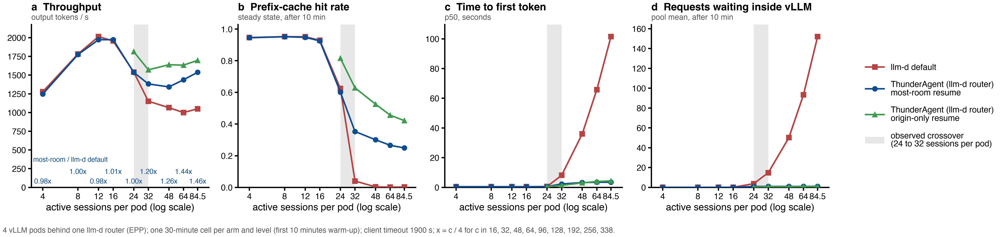
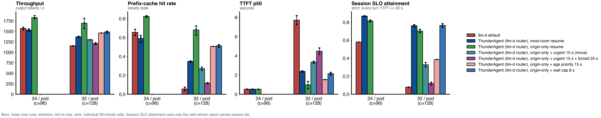
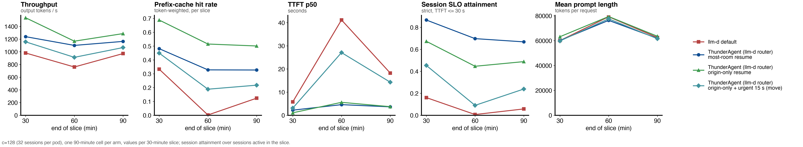
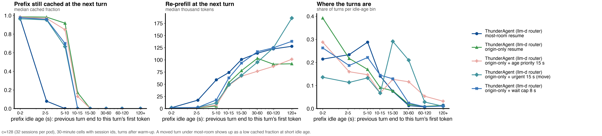

# LLM Inference Benchmarking Report: concurrency sweep of the llm-d router implementation of ThunderAgent vs llm-d default on a four-pod pool, plus resume-policy variants, Qwen3-Coder-30B-A3B-FP8, real Claude Code traffic
**Date:** 2026-09-18 to 2026-09-21
**Author:** [fill in]

* Data: `results/sweep-20260918-134248-t1900`, 42 valid cells.
* Original notes: `README.md` (design, every arm, every table), `RESULTS.md` (why throughput falls with load), `SATURATION.md` (how to choose a concurrency).
* Arm naming in this report and in the figures: **llm-d default** is the router's shipped profile; **llm-d router implementation of ThunderAgent** is the ported policy, always followed by the resume policy it ran with (**most-room**, the upstream behaviour, or **origin-only**) and any variant switch on top.

---

## 1. Executive Summary
* **Objective:**
  * Step 12 measured one load point (338 sessions, 1.42x). This step draws the curve: how the gain of the llm-d router implementation of ThunderAgent over llm-d's default depends on load, and where the two cross.
  * Then fix the loss found in step 12 (70% of resumed sessions moved to another pod) with an origin-only resume policy, repeat it, and test four variants that try to shorten origin-only's tail.
* **Key Finding:**
  * Below 16 sessions per pod the two arms are equal within 2%. The admission gate stays idle and costs nothing.
  * The arms separate between 24 and 32 sessions per pod, where the sessions' working set crosses the KV pool. From there llm-d default's hit rate collapses to about 0.002 and its median TTFT grows to 101 s at 84 sessions per pod.
  * With most-room resume the gain over llm-d default is 1.20x at 32 sessions per pod, 1.26x at 48, 1.44x at 64 and 1.46x at 84, with median TTFT held at 2 to 4 s.
  * **Origin-only resume removes every pod move and lifts the gain to 1.37x at 32, 1.54x at 48, 1.63x at 64 and 1.62x at 84 sessions per pod.** Hit rate rises from 0.25 to 0.42 at the top level. Three runs at 24 and 32 sessions per pod confirm it: 1.20x and 1.24x over most-room, never below 1.14x in any paired run.
  * Origin-only's cost is a longer tail for a few sessions: 5 to 6 points lower strict session SLO attainment than most-room, and the per-session worst TTFT p90 rises from 167 s to 261 s.
  * Of the four tail fixes, only the **8 s origin-wait cap** works: it keeps most-room's tail (strict attainment 0.77 vs 0.76) with 8% more throughput and 0.17 higher hit rate. The 15 s urgent tier, with or without a 25 s forced backstop, and 15 s age priority all made things worse, because a paused session's prefix survives only 10 to 12 s on its pod and those policies act after it is gone.
  * Across every level the pool does the same total token work per second once saturated (87k to 94k tokens/s); the arms differ only in how much of it is wasted re-prefill.
* **Decision / Recommendation:**
  * Ship the llm-d router implementation of ThunderAgent with origin-only resume on multi-pod pools when total work matters, or with the 8 s wait cap when the per-session tail matters. Both dominate most-room; llm-d default is worst on every metric past 24 sessions per pod.
  * Do not use fixed-threshold "wait then move" or "oldest first" policies at 15 s; the threshold sits past the cache-residency horizon.
  * Next: make the wait cap adaptive using the router's KV-block index, so a session is moved only when its prefix is already evicted.
  * Size capacity by session SLO, not by throughput: at a 30 s TTFT SLO and 75% strict attainment, llm-d default supports fewer than 24 sessions per pod and the port about 32.

---

## 2. Setup & Environment
* **Hardware:**
  * Four vLLM pods, each using 2x NVIDIA H100 80GB (tensor parallel 2), 8 GPUs in total.
  * GKE `a3-highgpu-4g` spot nodes, 4 H100s per node. The four pods sit on three nodes; two pods share one node.
* **Host:**
  * 104 vCPU and 965 GiB RAM per node. CPU model not recorded.
  * Each vLLM pod is limited to 16 CPU cores and 128 GiB.
  * The load generator ran on the non-spot `default-pool` (8 cores requested, 16 limit), so a spot preemption cannot take it down.
* **Software:**
  * GKE, kubelet `v1.35.3-gke.1389002`, GPU driver channel `latest`.
  * Exact driver and CUDA versions not recorded. CUDA is bundled in the vLLM image.
* **Serving Engine & Version:** `vllm/vllm-openai:v0.28.0`, official image, not modified.
* **Model Configuration:**
  * `Qwen/Qwen3-Coder-30B-A3B-Instruct-FP8`, a mixture-of-experts model, 30B total, 3B active.
  * TP=2, PP=1, `--max-model-len 262144`, FP8 weights, FP8 KV cache, `--gpu-memory-utilization 0.88`.
  * Chunked prefill and prefix caching on.
  * KV cache pool: 139,815 blocks x 16 tokens = **2,237,040 tokens per pod**, about 102 GiB. The four pods together hold **8,948,160 tokens**.
* **Router under test:**
  * The deployment's main llm-d router release, one EPP and one Envoy over the four-pod InferencePool.
  * EPP images: `thunder-agent-v3` (llm-d-router commit `ae371354`) for the sweep; `thunder-agent-v4` (`8ee881c2`, adds `resumePlacement: origin-only`) for the origin-only arm, the replicates and the long window; `v5` (`1e922b63`, adds `urgentWaitMs`), `v6` (`urgentMove: false`) and `v7` (`originWaitMaxMs`) for the variants. Every cell's `manifest.json` records its image tag.
  * Envoy ext_proc message timeout raised to 2400 s so a held request can outlast the 1800 s forced admission.
* **Load generator:**
  * inference-perf built from branch `fix-session-replay-permits` (commit `d5a7c8c`, digest `63f2fbcf`), which fixes the v0.7.0 bug that kept most sessions from starting in steps 07 to 10.
  * Replicates 2 and 3, the long window and the variants used `session-id-v1` (commit `d2bfa20`), which adds the session id to the per-request report and so allows session-level metrics.

---

## 3. Workload & Traffic
* **Input / Output Token Lengths:**
  * Real, not fixed. Prompt per request: median 47k to 86k tokens depending on the level (deeper turns at low load, see section 7). Output per request: 570 to 970 tokens on average.
  * About 100 prompt tokens per output token.
* **Traffic Pattern:**
  * Replay of 338 recorded Claude Code sessions from the public weka trace set.
  * Each session is a multi-turn conversation. A turn is sent only after the previous answer arrived, plus the real think time from the recording, capped at 10 s.
  * Closed loop: the load generator keeps c sessions open; when one finishes its trace, the next trace starts. At c=338 the corpus is exhausted, so finished sessions are not replaced.
  * Prompts are rebuilt from 64-token block ids, so cache reuse between turns matches the real sessions.
* **Concurrency Levels Tested:**
  * Sweep: c = 16, 32, 48, 64, 96, 128, 192, 256, 338 sessions on the pool, that is 4, 8, 12, 16, 24, 32, 48, 64, 84 sessions per pod.
  * Origin-only arm: c = 96 to 338, the five levels where the router pauses and resumes sessions.
  * Replicates and variants: c = 96 and 128.
  * Working set against the pool: c x mean prompt tokens crosses the 8.95M-token pool between c=128 (0.87x) and c=192 (1.18x).
* **Test Duration / Warm-up:**
  * 30 minutes per cell. The first 10 minutes are warm-up. Steady-state numbers use minutes 10 to 30.
  * One cell per arm and level in the sweep; three runs per arm at c=96 and c=128; one 90-minute cell per arm at c=128 sliced into three 30-minute windows.
  * Arm order alternated per level. Before every cell: prefix cache reset on all four pods, EPP restarted with the arm's config. Client timeout 1900 s, so no held request is counted as an error.

---

## 4. Test Arms (Variables Under Test)
* **Arm 0 (Baseline), "llm-d default" (`epp-baseline`):**
  * The scheduling profile this deployment ships with: prefix-cache scorer (weight 3), KV-utilization scorer (weight 2), queue scorer (weight 2).
  * No session concept, no admission control. Every request goes to a pod at once.
* **Arm 1, "llm-d router implementation of ThunderAgent, most-room resume" (`epp-thunder`):**
  * The `thunder-agent` plugin with llm-d's flow-control gate on: `capacityTokens 2237040` per pod, `utilThreshold 1.0`, `actingHalfLifeSeconds 1`, `bufferTokensPerProgram 100`, `pauseSweepSeconds 5`, `headWaitStarvationMs 1800000`, `evictionTtlSeconds 3600`.
  * Holds a request in the EPP when its session does not fit, pauses idle sessions when a pod is over capacity, resumes paused sessions when room frees.
  * **Resume placement, most-room:** a resumed session goes to its own pod if it fits, otherwise to the pod with the most room. This is the upstream ThunderAgent behaviour and the step 12 configuration.
* **Arm 2, "llm-d router implementation of ThunderAgent, origin-only resume" (`epp-thunder-origin`):**
  * Same as Arm 1, plus `resumePlacement: origin-only`: a resumed session waits for its own pod unless that pod is gone or the 1800 s forced admission fires. The router counts these waits as "origin waits".
* **Arm 2 variants, all on top of origin-only, tested only at 32 sessions per pod:**

| variant | switch | what it does |
| :--- | :--- | :--- |
| urgent 15 s (move) | `urgentWaitMs: 15000` | a session that has waited 15 s jumps ahead of all others (oldest first) and may move to any pod with room |
| urgent 15 s + forced 25 s | plus `headWaitStarvationMs: 25000` | same, and the forced-admission backstop drops from 1800 s to 25 s |
| age priority 15 s | `urgentWaitMs: 15000`, `urgentMove: false` | reorder only: the 15 s waiter goes first but still waits for its own pod |
| wait cap 8 s | `originWaitMaxMs: 8000` | origin-only for 8 s, then move to the pod with the most room; ordering unchanged (smallest first) |

* **Same in all arms:** EPP release, pods, workload, seed, client timeout 1900 s, no release calls from the client.

---

## 5. Key Metrics Tracked
* **TTFT (Time to First Token):** p50, p90, p99, in seconds. Includes queueing in the pod, or holding in the EPP plus queueing.
* **ITL (Inter-Token Latency):** p50, p90, p99, in ms. Each request's mean ITL first; percentiles over requests.
* **Throughput:** Output tokens per second over the 30-minute window, summed over the pool; completed requests per second; **prefill tokens per second** (prompt tokens the engine actually computed, `prompt_tokens - cached_tokens`), which is what saturates the pool.
* **Cache:** Prefix-cache hit rate, steady state (pod counters, minutes 10 to 30) and prompt-weighted over the window; cached fraction per turn against how long the prefix sat idle (the wait-cost curve).
* **Resource Usage:** Mean KV utilization over the pool; requests running and waiting inside vLLM; requests held in the EPP. VRAM is fixed at 88% of each GPU and not reported. GPU compute utilization was not collected.
* **Router activity:** holds, pauses, resumes, pod moves on resume (rebinds), origin waits, urgent promotions, forced admissions.
* **Session-level (cells with session ids only):** goodput within a 30 s TTFT SLO, strict session attainment (every turn within SLO) and lenient (95% of turns), turns per session, per-session worst TTFT.

---

## 6. Results

### 6.1 Sweep: one cell per arm and level

Throughput, latency and cache. TTFT in seconds, ITL in ms.

| sessions per pod (c) | arm | Output tok/s | Requests/s | Prefill tok/s | p50 TTFT | p90 TTFT | p99 TTFT | p50 ITL | p99 ITL | Steady hit rate | Waiting in vLLM | Pool KV |
| :--- | :--- | :--- | :--- | :--- | :--- | :--- | :--- | :--- | :--- | :--- | :--- | :--- |
| 4 (16) | llm-d default | 1278 | 1.22 | 7.5k | 0.5 | 1.3 | 6.7 | 10 | 23 | 0.947 | 0 | 0.13 |
| 4 (16) | ThunderAgent, most-room | 1247 | 1.19 | 7.3k | 0.4 | 1.2 | 6.4 | 11 | 24 | 0.945 | 0 | 0.12 |
| 8 (32) | llm-d default | 1782 | 1.72 | 9.8k | 0.5 | 1.4 | 6.5 | 16 | 39 | 0.953 | 0 | 0.24 |
| 8 (32) | ThunderAgent, most-room | 1775 | 1.71 | 9.8k | 0.4 | 1.3 | 5.6 | 16 | 37 | 0.952 | 0 | 0.23 |
| 12 (48) | llm-d default | **2014** | 2.08 | 11.8k | 0.4 | 1.4 | 5.7 | 22 | 57 | 0.952 | 0 | 0.32 |
| 12 (48) | ThunderAgent, most-room | 1972 | 2.03 | 11.8k | 0.4 | 1.4 | 6.1 | 23 | 68 | 0.948 | 0 | 0.31 |
| 16 (64) | llm-d default | 1956 | 2.23 | 14.6k | 0.4 | 1.8 | 8.4 | 31 | 79 | 0.930 | 0 | 0.41 |
| 16 (64) | ThunderAgent, most-room | 1974 | 2.24 | 15.1k | 0.4 | 1.7 | 8.6 | 32 | 87 | 0.926 | 0 | 0.39 |
| 24 (96) | llm-d default | 1541 | 1.99 | 38.2k | 0.5 | 14.0 | 34.4 | 45 | 210 | 0.625 | 3 | 0.58 |
| 24 (96) | ThunderAgent, most-room | 1536 | 1.99 | 40.2k | 0.5 | 8.1 | 26.6 | 49 | 221 | 0.602 | 1 | 0.54 |
| 24 (96) | ThunderAgent, origin-only | **1813** | 2.27 | 28.4k | 0.5 | 5.7 | 35.3 | 41 | 151 | **0.816** | 1 | 0.48 |
| 32 (128) | llm-d default | 1151 | 1.68 | 68.2k | 8.2 | 32.9 | 49.9 | 99 | 255 | 0.040 | 12 | 0.67 |
| 32 (128) | ThunderAgent, most-room | 1382 | 2.02 | 64.1k | 2.3 | 9.9 | 65.5 | 84 | 235 | 0.353 | 2 | 0.59 |
| 32 (128) | ThunderAgent, origin-only | **1571** | 2.24 | 46.2k | 1.3 | 12.5 | 102.4 | 66 | 208 | **0.629** | 1 | 0.56 |
| 48 (192) | llm-d default | 1065 | 1.63 | 86.1k | 36.0 | 81.1 | 107.4 | 132 | 264 | 0.003 | 43 | 0.71 |
| 48 (192) | ThunderAgent, most-room | 1342 | 2.17 | 81.1k | 3.2 | 12.0 | 516.7 | 103 | 258 | 0.301 | 2 | 0.59 |
| 48 (192) | ThunderAgent, origin-only | **1639** | 2.45 | 62.1k | 3.0 | 17.2 | 400.8 | 81 | 222 | **0.525** | 2 | 0.55 |
| 64 (256) | llm-d default | 999 | 1.67 | 86.3k | 65.8 | 124.0 | 156.3 | 145 | 299 | 0.002 | 86 | 0.72 |
| 64 (256) | ThunderAgent, most-room | 1438 | 2.43 | 88.9k | 3.4 | 27.1 | 596.9 | 107 | 263 | 0.266 | 3 | 0.56 |
| 64 (256) | ThunderAgent, origin-only | **1633** | 2.67 | 77.1k | 4.0 | 29.2 | 587.7 | 93 | 252 | **0.456** | 3 | 0.54 |
| 84 (338) | llm-d default | 1050 | 1.84 | 90.1k | 101.5 | 177.9 | 199.1 | 142 | 292 | 0.002 | 143 | 0.73 |
| 84 (338) | ThunderAgent, most-room | 1538 | 2.63 | 92.8k | 3.5 | 75.2 | 748.0 | 108 | 275 | 0.249 | 4 | 0.53 |
| 84 (338) | ThunderAgent, origin-only | **1698** | 2.83 | 82.2k | 4.4 | 73.0 | 748.3 | 95 | 263 | **0.422** | 4 | 0.52 |

"ThunderAgent" in the arm column is short for the llm-d router implementation of ThunderAgent. Waiting in vLLM and pool KV are means over the window.

Ratios per level:

| sessions per pod | most-room / llm-d default | origin-only / most-room | origin-only / llm-d default | pod moves on resume, most-room | origin waits, origin-only | forced admissions, most-room / origin-only |
| :--- | :--- | :--- | :--- | :--- | :--- | :--- |
| 4 | 0.98x | - | - | 0 of 0 | - | 0 / - |
| 8 | 1.00x | - | - | 0 of 1 | - | 0 / - |
| 12 | 0.98x | - | - | 0 of 2 | - | 0 / - |
| 16 | 1.01x | - | - | 1 of 26 | - | 0 / - |
| 24 | 1.00x | 1.18x | 1.18x | 461 of 949 (49%) | 552 | 0 / 0 |
| 32 | 1.20x | 1.14x | 1.37x | 1079 of 1797 (60%) | 1231 | 0 / 0 |
| 48 | 1.26x | 1.22x | 1.54x | 1808 of 2619 (69%) | 1912 | 0 / 2 |
| 64 | 1.44x | 1.14x | 1.63x | 2169 of 3157 (69%) | 2587 | 2 / 2 |
| 84 | 1.46x | 1.10x | 1.62x | 2428 of 3440 (71%) | 2972 | 7 / 10 |

**Figure 1. The sweep.** Four panels against active sessions per pod on a log axis. The grey band is the observed crossover, 24 to 32 sessions per pod.

* Panel a: output throughput peaks at 12 to 16 sessions per pod for every arm, then falls. Below the crossover the arms overlap; above it llm-d default keeps falling while the ThunderAgent arms hold or rise.
* Panel b: llm-d default's hit rate collapses at 32 sessions per pod. Origin-only keeps about 0.2 more than most-room at every level.
* Panels c and d: llm-d default's median TTFT and its in-engine queue grow linearly with load; both ThunderAgent arms stay near 2 to 4 s and an empty engine queue.



### 6.2 Three runs per arm at 24 and 32 sessions per pod, and the four variants

Mean over runs, min to max in brackets. Variants exist only at 32 sessions per pod.

| sessions per pod | arm | n | Output tok/s | Steady hit rate | p50 TTFT (s) | p90 TTFT (s) | goodput in SLO (turns/s) | strict session attainment | worst-turn TTFT per session, p90 (s) | rebinds / origin waits / forced |
| :--- | :--- | :--- | :--- | :--- | :--- | :--- | :--- | :--- | :--- | :--- |
| 24 | llm-d default | 2 | 1569 (1541 to 1597) | 0.655 | 0.5 | 12.8 | 1.22 | 0.58 | 40 | 0 / 0 / 0 |
| 24 | ThunderAgent, most-room | 3 | 1531 (1500 to 1556) | 0.590 | 0.5 | 8.0 | 1.09 | **0.87** | 33 | 454 / 0 / 0 |
| 24 | ThunderAgent, origin-only | 3 | **1830** (1804 to 1872) | **0.824** | 0.5 | 5.9 | **1.58** | 0.82 | 62 | 0 / 544 / 0 |
| 32 | llm-d default | 2 | 1154 (1151 to 1156) | 0.057 | 7.7 | 33.9 | 0.57 | 0.08 | 52 | 0 / 0 / 0 |
| 32 | ThunderAgent, most-room | 3 | 1370 (1362 to 1382) | 0.347 | 2.4 | 10.1 | 1.28 | 0.76 | 167 | 1091 / 0 / 0 |
| 32 | ThunderAgent, origin-only | 3 | **1693** (1571 to 1807) | **0.680** | 1.0 | 11.4 | **1.53** | 0.70 | 261 | 0 / 1105 / 0 |
| 32 | origin-only + urgent 15 s (move) | 2 | 1300 (1297 to 1303) | 0.272 | 3.3 | 29.8 | 0.90 | 0.33 | 77 | 586 / 1280 / 0 |
| 32 | origin-only + urgent 15 s + forced 25 s | 2 | 1207 (1188 to 1225) | 0.118 | 4.5 | 34.9 | 0.61 | 0.12 | 57 | 384 / 1124 / 510 |
| 32 | origin-only + age priority 15 s | 1 | 1461 | 0.506 | 1.5 | 31.3 | 1.06 | 0.39 | 171 | 0 / 1117 / 0 |
| 32 | origin-only + wait cap 8 s | 3 | 1484 (1456 to 1504) | 0.513 | 2.1 | 13.4 | 1.41 | **0.77** | 183 (125 to 232) | 354 / 1280 / 0 |

Paired ratios, origin-only over most-room, per run: throughput 1.18x to 1.20x at 24 per pod and 1.14x to 1.32x at 32; hit rate 1.34x to 1.51x and 1.78x to 2.08x.

**Figure 2. Runs and variants at 24 and 32 sessions per pod.** Bars are means, whiskers min to max, dots individual cells.

* Origin-only is the tallest bar on throughput and hit rate at both levels.
* On strict session attainment most-room and the 8 s wait cap tie at the top; the 15 s variants fall to 0.12 to 0.39, below even their own origin-only base.



### 6.3 Long window: 90 minutes at 32 sessions per pod, one cell per arm

| slice (minutes) | metric | llm-d default | ThunderAgent, most-room | ThunderAgent, origin-only | origin-only + urgent 15 s |
| :--- | :--- | :--- | :--- | :--- | :--- |
| 0 to 30 | output tok/s | 981 | 1238 | 1536 | 1157 |
| 30 to 60 | output tok/s | 761 | 1101 | 1167 | 913 |
| 60 to 90 | output tok/s | 972 | 1164 | 1287 | 1067 |
| 0 to 30 | hit rate | 0.33 | 0.48 | 0.69 | 0.45 |
| 30 to 60 | hit rate | 0.002 | 0.33 | 0.52 | 0.19 |
| 60 to 90 | hit rate | 0.12 | 0.33 | 0.50 | 0.22 |
| 30 to 60 | TTFT p50 / p90 (s) | 41.2 / 67 | 4.6 / 13.8 | 5.6 / 27.2 | 27.1 / 88 |
| 30 to 60 | strict session attainment | 0.01 | 0.70 | 0.45 | 0.09 |
| 30 to 60 | mean prompt tokens | 79k | 76k | 79k | 78k |

**Figure 3. The 90-minute cell sliced into 30-minute windows.**

* Minutes 30 to 60 are the deepest sessions (mean prompt 76k to 79k). There llm-d default gets almost nothing done inside the SLO, the port's gain over it peaks at 1.45x, and origin-only's extra gain over most-room shrinks to 1.06x while its attainment gap widens.
* Minutes 60 to 90 mix fresh and deep sessions after a wave of traces finished, so every arm recovers.



### 6.4 The wait-cost curve: how long a paused session's prefix survives

Median cached fraction of the prompt at the next turn, against how long the prefix sat idle, 32 sessions per pod, turns after warm-up:

| idle age | ThunderAgent, most-room | ThunderAgent, origin-only | origin-only + age priority 15 s | origin-only + urgent 15 s (move) | share of origin-only turns |
| :--- | :--- | :--- | :--- | :--- | :--- |
| 0 to 2 s | 0.97 | 0.99 | 0.98 | 0.96 | 39% |
| 2 to 5 s | 0.08 | 0.98 | 0.97 | 0.95 | 22% |
| 5 to 10 s | 0.00 | 0.92 | 0.85 | 0.67 | 17% |
| 10 to 15 s | 0.00 | 0.17 | 0.13 | 0.00 | 9% |
| 15 s and more | 0.00 | 0.00 | 0.00 | 0.00 | 13% |

**Figure 4. Prefix still cached at the next turn, re-prefill size, and where the turns are, by idle age.**

* A paused session's prefix survives about 10 to 12 s on its pod at this load, then it is evicted.
* Most-room pays a full re-prefill on turns whose prefix was still warm (0.08 cached at 2 to 5 s idle) because it moved them. Origin-only keeps the prefix for the 78% of turns that resume within 10 s.
* The 15 s policies act only on turns whose prefix is already gone.



---

## 7. Analysis
* **Primary Bottleneck, two regimes:**
  * Below 16 sessions per pod the engines are bound by memory bandwidth on attention over 75k to 85k-token contexts. Per-stream ITL p50 doubles from 10 ms at 4 per pod to 22 ms at 12 and 31 ms at 16 while KV is only 13% to 41% full and nothing waits. Output throughput peaks at 12 to 16 sessions per pod for that reason, and the admission gate has nothing to do.
  * From 24 to 32 sessions per pod the working set crosses the KV pool. Prefill work jumps from 15k to 68k tokens/s for llm-d default and total token throughput plateaus at 87k to 94k tokens/s from 48 per pod on. Past that point every arm saturates the same hardware at the same total rate; they differ only in how much of it is re-prefill of prefixes that were cache hits before.
  * The mechanism is exact: requests completed = prefill throughput x window / prefill tokens per request. At 84 sessions per pod most-room cuts prefill per request by 28% (35.3k vs 48.8k) and completes 42% more requests; origin-only cuts it further.
* **Why output throughput falls with load in every arm:**
  * Prefill crowds out decode once the pool is full, and the measured requests are shallower turns with shorter outputs: from 4 to 84 sessions per pod, requests completed fall to 0.89x while output per request falls to 0.59x. The pool finishes a roughly fixed number of turns in 30 minutes and concurrency decides how many sessions share them (46 turns per session at 12 per pod, 10 at 84).
  * So the curve should be read as an arm comparison at each level, not as a capacity curve, and ratios should not be quoted against the demand-limited low levels.
* **Trade-offs:**
  * Most-room vs llm-d default: 1.20x to 1.46x throughput, TTFT p50 held at 2 to 4 s, at the price of a long tail (TTFT p99 517 to 748 s from 48 per pod, from the 1800 s forced admissions).
  * Origin-only vs most-room: 1.10x to 1.22x more throughput and about 0.2 more hit rate, 8% to 14% more requests, more sessions completed. Cost: 55% to 69% more holds, TTFT p50 0.5 to 0.9 s higher at 64 and 84 per pod, TTFT p90 higher at 32 and 48, strict attainment 5 to 6 points lower, per-session worst TTFT p90 167 s to 261 s. The two arms violate the SLO on the same share of turns (about 3.5%); origin-only completes 30% to 40% more turns per session, so an all-turns criterion gives it more chances to fail, and when it waits it waits longer.
  * Wait cap 8 s vs the two above: most-room's tail (attainment 0.77, worst-over-60 s share 14%) with 8% more throughput and 0.17 more hit rate than most-room; 12% less throughput and 0.17 less hit rate than origin-only. Three operating points are now not dominated: origin-only for total work, the 8 s cap and most-room for the tail, with the cap strictly better than most-room.
* **Anomalies / Failures:**
  * **The 15 s variants failed their pre-registered criteria.** Urgent 15 s with a move: throughput 0.77x of origin-only, hit rate 0.27, 21.5% of turns over 30 s, attainment 0.33; 804 urgent promotions per cell, more than half of all turns. Mechanism: a head that reaches 15 s moves with a 60k to 80k-token re-prefill, overfills the target pod, whose idle sessions are paused, whose next turns then wait 15 s and move in turn. Adding the 25 s forced backstop (510 forced admissions per cell) lands near llm-d default. Age priority without a move also fails (attainment 0.39): oldest first is largest first, each freed block resumes fewer sessions, and the queue lengthens for everyone.
  * **Voided and rerun cells:** the first `epp-thunder-origin-c192` cell ran on a truncated corpus download (10 of 338 traces) and was voided; one `epp-thunder-c128-r3` cell returned 0 traces and was rerun. The driver now voids such cells automatically.
  * **Hand-collected cell:** `epp-thunder-c256` ran normally but the driver lost the bench pod name on a transient API error; artifacts were copied by hand with the same commands.
  * **Corpus exhaustion at c=338:** finished sessions are not replaced, so concurrency decays by up to 6% during the cell, more for the faster arm. Ratios at that level are conservative. Replicates were therefore run at c <= 256.
  * **Request errors:** 0 in every llm-d default and most-room cell except 2 at c=16 (`400 - Context Window`, from the trace corpus); 2 each in two origin-only cells, same cause.
  * **One cell per arm and level in the sweep**, so no error bars there; the three-run replicates at 24 and 32 per pod give the spread (under 4% for most-room, 4% to 14% for origin-only). The c=338 point reproduces step 12's three-run result.
  * **Not measured:** the throughput peak between 8 and 16 sessions per pod was bracketed, not located exactly; GPU compute utilization was not collected; the adaptive wait cap (proposal Part 8 layer 2) has not been built.

---

## 8. Reproduce

```
./run-sweep.sh "16 32 48 64 96 128 192 256 338" 1800        # sweep, both arms, about 15 h
AB_ID=<run> ./run-origin.sh "96 128 192 256 338"               # origin-only arm appended to the same run
AB_ID=<run> ./run-origin-replicates.sh                         # runs 2 and 3 at c=96 and c=128
AB_ID=<run> ./run-optionb.sh                                   # the 15 s variants at c=128
python3 analyze_sweep.py results/<run>                         # sweep.md, sweep.png
python3 analyze_replicates.py results/<run>                    # replicates.md, replicates.png
python3 analyze_long.py results/<run>                          # long.md, long.png
python3 analyze_wait_cost.py results/<run>                     # wait-cost.md, wait-cost.png
```

* Per cell the folder keeps the rendered client config, a manifest with arm, level, EPP image tag, bench image digest and plugin config sha256, the EPP log, 2 s time series per pod and for the pool plus the EPP metrics, CPU samples, and the inference-perf reports without prompt text.
* Cells are named `epp-<arm>-c<level>[-r<n>][-w90]`; voided cells keep a `-VOID-...` suffix.
