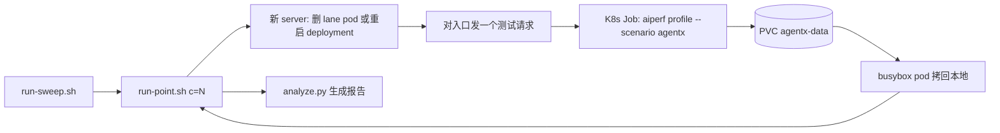

# Step 23 指南：用 AgentX harness（aiperf）跑 Weka trace benchmark

这份指南说明怎么在 `bobbm` 集群里，用和 SemiAnalysis AgentX（InferenceX）**完全相同的客户端代码和设置**跑 concurrency sweep，以及怎么读报告。英文的 step 概要在 [README.md](README.md)，指标清单在 [../BENCHMARK-METRICS.md](../BENCHMARK-METRICS.md)。

| 文件 | 作用 |
|---|---|
| `run-point.sh` | 跑一个 concurrency 点：准备一个新的 server，提交 K8s Job，等它跑完，把结果拷回本地 |
| `run-sweep.sh` | 按顺序跑多个 concurrency 点，最后生成报告 |
| `analyze.py` | 生成报告：汇总表、Pareto 图、每个点的时间序列图、有效性检查 |
| `make_figures.py` | 报告里的图（论文风格），由 `analyze.py` 调用 |
| `lane-svc.yaml` | Service `agentx-lane`：直接指向带 `agentx-lane=a` 标签的那个 vLLM pod |
| `pvc.yaml` | 共享磁盘 `agentx-data`：HF 缓存、重建好的数据集缓存、所有结果 |
| `results/<label>/c<N>/` | 一个点的结果；`results/<label>/report/` 是报告和所有图 |

复用的已有脚本：

| 脚本 | 用到的部分 |
|---|---|
| `../20-cpu-offload-pool/lib.sh` | `NS`、`DEPLOY`、`CTX`、`pin_kube`（把 kubectl 固定到 bobbm，kubeconfig 写在 `results/bobbm.kubeconfig`）、`vllm_pod_on`、`vllm_get`。和 step 21 一样，通过 `STEP_RESULTS` 用本 step 的结果目录 |
| `../model-server/collect.sh` | 每个点保存一份服务端状态（只读）到 `meta/model-server.txt` |
| `../BENCHMARK-METRICS.md` | 报告里的引擎、会话、SLO 指标按它的定义计算 |
| lane 做法（step 10、15、20） | 给一个 vLLM pod 打标签，只对它发流量，其他 pod 不动 |

## 1. AgentX 实际用的是什么

以下内容来自 InferenceX 源码（`SemiAnalysisAI/InferenceX` commit `255b9b8`）。

| 项目 | AgentX 的做法 | 本 step |
|---|---|---|
| 客户端代码 | `SemiAnalysisAI/agentx-harness`（aiperf 的 fork），release `agentx-v1.0.6` = commit `89b21867872a` | 同一个 commit 打的镜像 |
| scenario | `--scenario agentx` | 相同 |
| 数据集 | `semianalysis_cc_traces_weka_062126`，或 `_256k` 版本 | `_256k`，因为 vLLM 是 `--max-model-len=262144` |
| 每个点 | 一个 concurrency 配一个新部署的 server。官方文档："restart the server for every CONC value... Do not flush caches or reuse a live server across concurrency points" | 每个点重启 server |
| 种子 | 默认 42 | 相同 |

为什么不用官方 aiperf release（v0.13.0）：AgentX 的规则（按请求数预热、每棵 session 树的空闲上限、测量覆盖率检查、full-response ITL）在 v0.13.0 里没有，或者实现方式不同。官方 `main` 通过 #1413 合进了大部分，但还没有 `--scenario agentx` 预设。为什么不用 aiperf 的 K8s operator：operator 在集群里不执行 `scenario:`，而且不允许 scenario 和 sweep 一起用。

## 2. 两种模式

| | `MODE=lane`（默认） | `MODE=pool` |
|---|---|---|
| 目标 | 1 个 vLLM pod（带 `agentx-lane=a` 标签） | 全部 4 个 vLLM pod |
| 请求入口 | `http://agentx-lane:8000`，直接打 vLLM，不经过 envoy 和 EPP | `http://program-aware-scheduling-epp:80`（envoy + EPP） |
| 每个点之前 | 删掉 lane pod，等 deployment 补出新 pod，给新 pod 打标签 | `rollout restart` vLLM deployment 和 EPP |
| `X-Session-ID` 头 | 不加（和 AgentX 一样） | 加（EPP 的 `agent-identity` 插件读它） |
| 用途 | 单 replica 的普通 vLLM 基线 | 路由对比，比如 llm-d 默认和 PR3 gate |



lane 模式下，删掉的 pod 释放 2 张 GPU。H100 节点上没有别的地方有 2 张空卡，所以新 pod 会回到同一个节点。其他 3 个 vLLM pod 一直运行，但没有流量。thunder EPP 的 pool 里也包含 lane pod，所以 lane 测试期间不要通过 gateway 跑别的实验。

一个点的时间：vLLM 重启（几分钟）+ 数据集准备（第一次约 1 分钟，之后从缓存读）+ 预热（随 concurrency 增长）+ 测量 60 分钟 + 收尾。

## 3. 准备（都已经做好）

### 3.1 镜像

```
us-central1-docker.pkg.dev/bobzetian-gke-dev/bobinference/agentx-harness:agentx-v1.0.6
digest sha256:918909fef9175f7476a53633727a8a3a6aae9828670a59dccb284109729e0a5a
```

AgentX 没有发布容器镜像（官方安装方式是 `uv venv` 加 `pip install -e .`）。这个镜像用 `agentx-v1.0.6` 自带的 `Dockerfile`（`runtime` stage）在 Cloud Build 上打出来，代码没有改动。重新打镜像：

```bash
SRC=$(mktemp -d)
git -C ~/projects/llmdthunder/aiperf archive 89b21867872a5bbc4b0676bf5005c404da5e9f94 | tar -x -C "$SRC"
cat > /tmp/cloudbuild-agentx.yaml <<'EOF'
steps:
  - name: gcr.io/cloud-builders/docker
    env: ['DOCKER_BUILDKIT=1']
    args: [build, --platform=linux/amd64, --target=runtime, -t, us-central1-docker.pkg.dev/bobzetian-gke-dev/bobinference/agentx-harness:agentx-v1.0.6, -f, Dockerfile, .]
images: [us-central1-docker.pkg.dev/bobzetian-gke-dev/bobinference/agentx-harness:agentx-v1.0.6]
options: {machineType: E2_HIGHCPU_32}
timeout: 3600s
EOF
cd "$SRC" && gcloud builds submit --project bobzetian-gke-dev --config=/tmp/cloudbuild-agentx.yaml --async .
```

本地 `~/projects/llmdthunder/aiperf` 里有一个 remote `semianalysis` 指向这个 fork。

这个镜像是 distroless（极简镜像）：只有 `bash` 和 aiperf 的 Python 环境，**没有 `tar`、`mkdir`、`ls`**。所以 Job 里只能用 bash 内建命令和 `aiperf`，也不能对它 `kubectl cp`。结果写到 PVC，再用 busybox pod 拷出来。

### 3.2 PVC 和 Service

```bash
kubectl apply -f pvc.yaml        # agentx-data, standard-rwo, 200Gi
kubectl apply -f lane-svc.yaml   # run-point.sh 发现没有时也会自动创建
```

| PVC 路径 | 内容 |
|---|---|
| `/data/hf` | HuggingFace 缓存：Weka 语料和 tokenizer，只下载一次 |
| `/data/mmap` | aiperf 重建好的数据集缓存。key 包括种子、tokenizer、数据集和 entry 数量，不包括 concurrency，所以 sweep 的各个点共用 |
| `/data/results/<label>/c<N>/aiperf_artifacts` | 每个点的完整输出 |

PVC 是 ReadWriteOnce，同一时间只能跑一个 Job。sweep 本来就是一个接一个跑。

### 3.3 集群里的对象

| 对象 | 值 |
|---|---|
| 集群 | `gke_bobzetian-gke-dev_us-central1_bobbm`，`pin_kube` 固定，不受笔记本当前 context 影响 |
| namespace | `llm-d-program-aware-scheduling` |
| vLLM | `deploy/program-aware-vllm-decode`，4 个 pod，每个 TP=2（H100 spot）。端口 8000，`/metrics` 也在这里 |
| vLLM 参数 | `--max-model-len=262144 --kv-cache-dtype=fp8_e4m3 --gpu-memory-utilization=0.88 --enable-prompt-tokens-details` |
| KV pool | 每个 pod 2,237,040 token（`vllm:cache_config_info` 的 `kv_cache_size_tokens`） |
| EPP | `deploy/program-aware-scheduling-epp`，当前是 `thunder-agent-v7` 镜像加 `thunder-plugins.yaml`（origin-w8 配置） |
| 客户端 pod | `default-pool`（e2-standard-32 CPU 节点），不占 GPU 节点 |

## 4. 跑一个点

```bash
./run-point.sh <concurrency> [label]
```

步骤：

1. `pin_kube`。
2. 准备新 server（见第 2 节的两种模式）。`RESTART=0` 时跳过。
3. 对入口发一个 1 token 的测试请求，直到成功（最多 5 分钟）。原因：AgentX 只要一个主会话的预热请求失败，就中止整次运行。
4. 把目标 pod 的 IP 组成 `--server-metrics` 地址列表。
5. 保存 `meta/`：目标 pod 的身份（name、uid、IP、节点、重启次数）、vLLM 和 EPP 的 deployment、节点上的其他 pod、`cache_config_info`、`model-server/collect.sh` 的输出、Job YAML、`point.json`。
6. 提交 Job，每分钟打印一行最新日志。
7. 跑完后再记一次 pod 身份。uid 或重启次数变了，说明 pod 被抢占或重启过，这个点**无效**（`meta/finish.json` 里 `pod_changed: true`，脚本退出码非 0）。
8. 保存 Job 日志，用 busybox pod 把结果拷到 `results/<label>/c<N>/aiperf_artifacts/`。

Job 里运行的命令：

```bash
aiperf profile --scenario agentx \
  --url <入口> --model Qwen/Qwen3-Coder-30B-A3B-Instruct-FP8 --tokenizer Qwen/Qwen3-Coder-30B-A3B-Instruct-FP8 \
  --concurrency <N> --public-dataset semianalysis_cc_traces_weka_062126_256k \
  --server-metrics http://<目标 pod>:8000/metrics ... \
  --server-metrics-formats json csv parquet \
  --output-artifact-dir /data/results/<label>/c<N>/aiperf_artifacts
aiperf analyze swim-lane /data/results/<label>/c<N>/aiperf_artifacts -c <N> --html
```

环境变量：

| 变量 | 默认值 | 说明 |
|---|---|---|
| `MODE` | `lane` | `lane` 或 `pool` |
| `RESTART` | `1` | `0` 表示不准备新 server。正式结果要用 `1`，和 AgentX 一致 |
| `DURATION` | 空 | 空表示预设的 3600 秒。短于 900 秒必须加 `--unsafe-override` |
| `EXTRA_ARGS` | 空 | 额外的 aiperf flag，比如 `--unsafe-override --num-dataset-entries 8` |
| `URL` | 按模式 | 换成别的入口就能比较不同路由 |
| `SESSION_ID_HEADER` | lane `false`，pool `true` | 是否加 `X-Session-ID` |
| `LANE_NODE` | 空 | 第一次选 lane pod 时优先用这个节点上的 pod |
| `DATASET`、`IMAGE`、`MODEL`、`TOKENIZER` | 见脚本 | |
| `CLIENT_CPU` / `CLIENT_MEM` | `8` / `32Gi` | concurrency 很高时调大 |
| `DEADLINE_SECONDS` | `21600` | Job 最长运行时间 |
| `EPP_DEPLOY`、`PVC`、`CLIENT_POOL` | 见脚本 | |

冒烟测试（2 分钟，8 条 trace，不重启，结果标记为无效）：

```bash
RESTART=0 DURATION=120 EXTRA_ARGS="--unsafe-override --num-dataset-entries 8 --warmup-requests-per-lane 1" \
./run-point.sh 4 smoke-lane
```

## 5. 跑 sweep

单 replica 普通 vLLM 基线：

```bash
nohup caffeinate -i ./run-sweep.sh lane-vllm-20261009 2 4 8 16 32 64 > results/lane-vllm-20261009.log 2>&1 &
```

4 个 pod 经过 EPP（以后比较路由时用）：

```bash
MODE=pool ./run-sweep.sh pool-<arm>-<date> 8 16 32 64 128 256
```

- 每个点都准备新 server，一个接一个跑。某个点失败或无效也会继续，结果保留。
- 最后自动运行 `analyze.py`，报告在 `results/<label>/report/`。
- 本地驱动脚本中途退出也不会丢结果：结果在 PVC 上，Job 会继续跑完。

### 怎么选 concurrency

- 单个 pod 的 KV pool 只有约 224 万 token，一个会话常常超过 10 万 token，所以十几个会话的 working set 就超过 HBM。lane 基线建议 2 到 64。
- 4 个 pod 一共约 895 万 token，建议 8 到 256。
- InferenceX 的 concurrency 按 2 倍递增（比如 4 到 128），也有 c1024 的配置。

### concurrency 超过 trace 数量（393）时

不会报错，会循环复用 trace（在 `agentx-v1.0.6` 的 `src/aiperf/timing/trajectory_source.py` 里确认）：

- 开了 cache-bust（agentx 强制开启）就允许复用。
- trace 按顺序轮流分给 lane。比如 c=1024：lane 0 到 392 用 trace 0 到 392，lane 393 到 785 再用一遍，lane 786 到 1023 用 trace 0 到 237。所以 c 不是 393 的整数倍时，前面的 trace 多出现一次。
- 同一条 trace 的副本起点不同（按 `seed、trace_id、lane 编号` 算哈希），cache-bust 标记也不同，所以标记之后的内容不会互相命中。
- 标记加在第一个 user 消息的开头，所以前面的 system prompt 和工具定义在副本之间相同，server 可以共享这部分 cache。

## 6. aiperf 的设置

### 6.1 `--scenario agentx` 设置的值

| 设置 | 值 | 作用 |
|---|---|---|
| timing mode | `agentic_replay` | 一共 N 条 lane，每条 lane 放一棵 session 树（主 agent 加它的 subagent）。树跑完就从数据集取下一条。closed loop：server 越快，完成的请求越多 |
| `--streaming` | on | 测 TTFT 和 ITL 必须逐 token 接收 |
| `--extra-inputs ignore_eos:true` | on | 一定生成到 trace 记录的输出长度，不让模型提前停 |
| `--cache-bust first_turn_prefix` | on | 每次播放 trace 都在第一个 user 消息前加唯一标记，防止循环复用同一条 trace 时 cache 命中率虚高 |
| `--system-idle-gap-cap-seconds` | 10 | 整个系统都空闲时，把所有定时器一起提前，下一个请求最多等 10 秒 |
| `--trace-idle-gap-cap-seconds` | 300 | 单棵 session 树空闲超过 300 秒时，只提前这棵树的定时器。真实 trace 里有几个小时的空档，不处理的话 lane 会长时间占着槽位却不发请求。副作用：超过 5 分钟的空档被压缩了 |
| `--benchmark-duration` | 3600 | 测 1 小时。最少 900 秒 |
| trajectory 起点 | 0.25 到 0.75 | 第一批 trace 从 25% 到 75% 之间的随机位置开始，测量一开始就有长有短的上下文。后面循环取到的 trace 从第 0 轮开始 |
| `--warmup-requests-per-lane` | 10 | 每条 lane 先发起点之前的完整上下文（primer），再多发 10 个请求：不等思考时间，每个只生成 1 个 token。按请求数预热，快慢不同的 server 预热量才一样。预热请求不计入结果 |
| `--warmup-grace-period` | 1800 | 预热结束后最多等 30 分钟，让深上下文的 primer 跑完 |
| `--failed-request-threshold` | 0.10 | 测量阶段失败超过 10% 就提前停止（至少先积累 `max(concurrency, 10)` 个结果）。超出上下文长度的请求不算 |
| `--random-seed` | 42 | 所有点、所有配置用同一个种子，抽到的 trace 和起点相同 |
| `--slice-duration` | 1.0 | 按 1 秒切片输出指标 |
| `--stats-interval` | 30 | 每 30 秒在日志里打一段实时统计 |
| `--use-server-token-count` | on | ISL/OSL 用 server 返回的 `usage` |
| `--no-gpu-telemetry` | on | 不用 aiperf 自带的 DCGM 采集 |
| entry 数量 | 393 | 用整个语料库 |
| 测量覆盖率 | 95% | TTFT/ITL 数据要覆盖测量阶段的 95% 以上，不够就判为无效 |
| 环境变量 | `AIPERF_DATASET_CONFIGURATION_TIMEOUT=1800`、`AIPERF_SERVICE_PROFILE_CONFIGURE_TIMEOUT=1800`、`AIPERF_UI_REALTIME_METRICS_ENABLED=true`、`AIPERF_HTTP_TCP_USER_TIMEOUT=900000` | 数据集重建需要的时间；实时统计日志；连接 15 分钟没有确认才算断开（默认 30 秒，server 很忙时会误判） |

### 6.2 本 step 额外加的设置

这些只影响数据采集，不改变发出去的请求。

| 设置 | 原因 |
|---|---|
| `--server-metrics <目标 pod>/metrics` | aiperf 默认只抓 `--url` 的 `/metrics`。pool 模式下那是 gateway，它会把 `/metrics` 转到一个随机的 vLLM pod，数据没有意义。分析只用 pod 地址（BENCHMARK-METRICS 1：直接抓每个 pod） |
| `--server-metrics-formats json csv parquet` | parquet 是测量阶段每秒一次的完整抓取（所有指标），代替以前的 `raw-vllm-metrics.txt.gz` |
| `AIPERF_SERVER_METRICS_COLLECTION_INTERVAL=1.0` | 默认 0.333 秒一次，1 秒够用，文件也小 |
| `AIPERF_HTTP_X_SESSION_ID_FROM_CORRELATION_ID` | 见第 2 节。值是会话固定的 ID（主 agent 和每个 subagent 各一个） |
| `HF_HOME=/data/hf`、`AIPERF_DATASET_MMAP_CACHE_DIR=/data/mmap` | 缓存放在 PVC 上，多个点共用 |
| `aiperf analyze swim-lane ... --html` | 每个点生成 session 泳道图 |

注意：aiperf 不发送 `x-session-final`。pool 模式下，thunder 插件只能靠 `evictionTtlSeconds`（现在是 3600 秒）释放已经结束的会话，这和以前的 inference-perf 实验不同。

## 7. 输出文件

```
results/<label>/c<N>/
  meta/point.json                 模式、concurrency、GPU 数、镜像、数据集、入口、metrics 地址
  meta/finish.json                结束时间、Job 状态、pod_changed
  meta/pods-start.txt, pods-end.txt   目标 pod 的 name uid IP 节点 重启次数
  meta/job.yaml                   提交的 Job
  meta/vllm-deployment.yaml, epp-deployment.yaml (pool), model-server.txt
  meta/node-<node>-pods.txt       目标 pod 所在节点上的其他 pod（邻居）
  meta/cache-config-<pod>.txt     vllm:cache_config_info
  bench-stdout.log                Job 的完整日志
  aiperf_artifacts/
    profile_export.jsonl                    每个请求一条记录（warmup 和 profiling 都有）
    profile_export_aiperf.json / .csv       整次运行的汇总指标
    profile_export_aiperf_timeslices.json / .csv   按 1 秒切片的指标
    profile_export_console.txt              控制台表格
    server_metrics_export.csv               vLLM 指标的汇总（每个 pod 每个系列一行）。注意：计数器的 total 包括预热阶段
    server_metrics_export.parquet           vLLM 指标在测量阶段的时间序列，计数器是从测量开始的增量。分析只用它
    server_metrics_export.json              同样的汇总，加上 warmup 阶段和每秒切片。很大（1 小时约几百 MB），已加入 .gitignore
    swim_lane.png / swim_lane.html          session 泳道图
    logs/aiperf.log                         aiperf 日志，含每 30 秒的实时统计
```

### 7.1 `profile_export.jsonl`

每行一个请求：`{"metadata": {...}, "metrics": {...}, "error": {...} 或 null}`。

| 字段 | 用途 |
|---|---|
| `metadata.benchmark_phase` | `warmup` 或 `profiling`，**只统计 profiling** |
| `metadata.conversation_id`、`turn_index`、`source_trace_id`、`source_outer_idx`、`source_inner_idx` | 对应回原始 trace |
| `metadata.root_correlation_id`、`parent_correlation_id`、`agent_depth` | session 树 ID、父会话、深度（0 = 主 agent） |
| `metadata.credit_issued_ns`、`request_start_ns`、`request_ack_ns`、`request_end_ns` | 决定发送、开始发送、第一个响应、最后一个字节（wall clock，纳秒） |
| `metadata.was_cancelled`、`context_overflow_skip` | 被取消、超出上下文长度 |
| `metadata.worker_id` | aiperf worker 进程，**不是 lane**。lane 用 `root_correlation_id` |
| `metrics.<tag>.value` / `.unit` | `time_to_first_token`（ms）、`request_latency`（ms）、`input_sequence_length`、`output_sequence_length`、`full_response_inter_token_latency`、`usage_prompt_cache_read_tokens`（server 报告的 cached tokens）、`http_req_*` 等 |
| `error.type`、`error.code`、`error.message` | 错误详情 |

超出上下文长度的请求在 scenario 模式下**不会**写进这个文件，只在汇总 JSON 里有 `context_overflow_count` 和 `skipped_context_overflow_count`。测量结束、grace period 到期时被取消的请求也不在任何导出文件里，只在 `logs/aiperf.log` 的 `Phase profiling (profiling) complete | completed=..., cancelled=...` 这一行。`analyze.py` 从这一行读 `cancelled`。

### 7.2 `profile_export_aiperf.json`

每个指标是 `{unit, avg, p1, p5, p10, p25, p50, p75, p90, p95, p99, min, max, std, count, sum}`。

| key | 含义 |
|---|---|
| `metadata.submission_valid`、`submission_invalid_reasons` | 是否符合 scenario 规则 |
| `request_count`、`error_summary`、`was_cancelled` | 请求计数和错误 |
| `time_to_first_token`、`request_latency`、`full_response_inter_token_latency` | 延迟分布。full-response ITL = (latency - TTFT) / (OSL - 1)，和 InferenceX 一样 |
| `full_response_output_token_throughput_per_user` | 每个请求 1 / ITL 再取分布。它的 p10 才约等于 AgentX 的 "P90 interactivity" |
| `theoretical_prefix_cache_hit` | 按 trace hash 算的理论最大命中率（%），整次运行一个值 |
| `effective_concurrency`、`tokens_in_flight` 等 | 按时间加权的并发和在途 token |
| `warmup_metrics` | 预热阶段的同样指标 |
| `run_info.random_seed`、`run_info.cli_command` | 复现用 |

## 8. 报告（`analyze.py`）

```bash
uv run analyze.py --out results/<label>/report results/<label>/c*
# 比较两种配置（每个 label 一条曲线）：
uv run analyze.py --out results/compare results/lane-vllm-20261009/c* results/<other>/c*
# 成本类指标、换 TTFT SLO：
uv run analyze.py --cost-per-gpu-hour 2.5 --ttft-slo 30 --out ... results/<label>/c*
```

`analyze.py` 算数字，并调用 `make_figures.py` 画图。所有输出都在 `results/<label>/report/`。图是论文风格（和 step 20 到 22 同样的配色和字体，PNG 300 dpi），每张图只有简短的子图标题，没有总标题和图内说明文字。横轴的分钟从测量开始算，竖虚线是 300 秒每棵树空闲上限到期的时刻（第 10 节）。曲线是 30 秒滑动平均。

| 输出 | 内容 | 对应以前的图 |
|---|---|---|
| `summary.md` | 主要列的表格，加上每个点的有效性检查 | |
| `summary.csv` | 每个点一行，所有列 | |
| `pareto.png` | AgentX 风格的 Pareto 图，每个 label 一条曲线：(a) total tok/s/GPU 对 P90 interactivity；(b) output tok/s/GPU 对 P90 interactivity；(c) input tok/s/GPU 对 P90 TTFT；(d) total tok/s/GPU 对 P90 E2E normalized interactivity；有成本时多一个 tokens per $ | |
| `concurrency.png` | 横轴是 concurrency，每个 label 一条线：(a) total tok/s/GPU；(b) output tok/s/GPU；(c) TTFT p50（实线）和 p90（虚线）；(d) interactivity p50 和 p90 | |
| `c<N>-<label>/timeline.png` | (a) 客户端在途请求数、有请求在跑的 session 树数量、concurrency；(b) vLLM running 和 waiting；(c) server 输入和输出吞吐（每 30 秒）；(d) 每分钟的 TTFT p50/p90；(e) 每分钟的 interactivity p50/p90；(f) KV 使用率 | step 20 fig6/7 |
| `c<N>-<label>/cache.png` | (a) working set、在途 token 和 KV pool；(b) 每分钟的 prompt token 来源（GPU 命中、CPU 层、本次计算）和理论命中率 | step 20 fig2、fig5 |
| `c<N>-<label>/prefill.png` | (a) 每分钟的 TTFT 拆成两部分：在 vLLM 里排队的时间和 prefill 计算的时间（来自 vLLM 的 `request_queue_time` 和 `request_prefill_time` 直方图）；(b) 每分钟 vLLM 计算的 prefill token 数（柱子，k tok/s）和每个输出 token 的时间（线，ms）。prefill 多的时候，每个 step 变慢，所有请求的输出都会变慢 | summary fig3 的简化版 |
| `c<N>-<label>/latency.png` | (a) TTFT 分布（CDF），标出每轮的 p50、p90、p99，另画每个会话最差一轮；(b) 不同 TTFT 目标（SLO）下满足目标的轮次比例和输出 token 比例（goodput）；(c) 每个请求的输出速度（= 1 / 这个请求每个输出 token 的平均时间，AgentX 叫它 tok/s/user）分布，标出 p50、p90、p99（p90 和 p99 表示最慢的 10% 和 1%） | step 22 fig1 到 3 |
| `c<N>-<label>/isl-osl.png` | ISL 和 OSL 分布（OSL 用对数横轴） | |

只重画一个点：`uv run make_figures.py results/<label>/c<N>`。

两条规则：
- 每个 step 的 prefill 超过 `max_num_batched_tokens`（8192）的 10 秒区间不可能出现（chunked prefill 的上限），是指标延迟造成的，分析和图里都去掉，个数记在 `step_bins_dropped` 列。`try-lane-c16-20m` 里有 1 个这样的区间：前面约 20 秒几乎没有 step，然后一个区间里出现 217k token，可能是 vLLM 前端忙于处理很长的 prompt 时，step 直方图延迟后一次补上。
- 拟合结果要和区间分布一起看：c=16 时 92% 是 cache 命中，117 个区间里有 94 个的 prefill 少于 0.2k token，斜率主要由少数几个 prefill 很多的区间决定（R² 0.53）。
- `prefill.png` (b) 的"每个输出 token 的时间"就是引擎 step 时间 T：每个 step 给每个在 decode 的请求生成 1 个 token。按每分钟里"一直有请求在跑"的 10 秒区间计算。B、T 和拟合的数字仍然在 `summary.csv` 里（`batch_B`、`step_time_T_ms`、`step_fit_*`），只是不再单独画图。

### 8.1 `summary.csv` 的列

只用 profiling 阶段、没有报错、没有被取消的请求。

AgentX（InferenceX）的列：

| 列 | 公式或来源 |
|---|---|
| `duration_s` | max(request_end) - min(request_start) |
| `input_tput`、`output_tput`、`total_tput` | sum(ISL)、sum(OSL)、两者之和 / duration。ISL 包含 cache 命中的部分 |
| `*_tput_per_gpu` | / `num_gpus`（每个 pod 的 GPU 数 x 目标 pod 数） |
| `*_tokens_per_dollar`、`*_cost_per_mtok` | `tput_per_gpu x 3600 / cost_hr`、`cost_hr x 1e6 / (3600 x tput_per_gpu)` |
| `{mean,p50,p75,p90,p95}_intvty` | 1 / pXX(每个请求的 full ITL)。p90 表示最慢的 10% |
| `{...}_ttft_s`、`{...}_e2el_s` | TTFT、端到端延迟 |
| `{...}_e2e_norm_intvty` | 1 / pXX(latency / OSL)，包括等待 prefill 的时间 |
| `completed`、`errors`、`error_types`、`cancelled`、`context_overflow`、`overflow_rate_pct`、`warmup_requests` | 请求计数。closed loop 下完成数本身就是结果 |
| `gpu_hit_pct`、`cpu_hit_pct`、`recompute_pct`、`overall_hit_pct` | `vllm:prompt_tokens_by_source` 的 `local_cache_hit`、`external_kv_transfer`、`local_compute` 占比 |
| `theoretical_hit_pct`、`usage_cache_read_pct`、`prefix_hits_over_queries_pct` | 理论命中率；客户端 `usage` 的 cached tokens / ISL；`prefix_cache_hits / queries` |
| `inflight_unique_tokens_max`、`inflight_unique_over_pool_max` | AgentX 的在途去重 token：正在跑的请求的 ISL 按会话相加 |

BENCHMARK-METRICS 的列：

| 列 | 公式或来源 |
|---|---|
| `working_set_mean`、`working_set_max`、`working_set_over_pool_*` | 所有活着的会话（包括在等工具调用的）的最新 ISL 之和，和 step 20 `working_set()` 的定义相同 |
| `kv_pool_tokens` | 目标 pod 的 KV pool 之和 |
| `kv_usage_avg_pct`、`kv_usage_max_pct`、`kv_usage_skew_pct` | 每个 pod KV 使用率的平均、峰值、pod 之间平均值的差 |
| `running_avg_sum`、`waiting_avg_sum`、`*_max_pod` | running/waiting 的平均值之和、单个 pod 的峰值 |
| `waiting_<reason>_share_pct` | `vllm:num_requests_waiting_by_reason` 的占比（`capacity` 或 `deferred`） |
| `preemptions` | 抢占次数 |
| `batch_B`、`step_time_T_ms`、`prefill_tokens_per_step`、`busy_bins`、`step_bins_dropped` | 引擎 step 指标（2.3 节）：每 10 秒的计数器增量，只用 pod 一直有 running 请求的区间；去掉 prefill 超过 8192 token/step 的区间（不可能出现，见 8.0） |
| `step_fit_a_ms`、`step_fit_b_ms_per_k`、`step_fit_r2` | 拟合 `T = a + b x (每 step 的 k prefill token)`，以前的结果是 46 ms + 29 ms x k |
| `engine_request_{queue,prefill,decode}_time_avg_s` | 引擎侧的排队、prefill、decode 平均时间，把 TTFT 拆成"排队"和"计算" |
| `prefill_compute_per_output_token` | `local_compute` prompt token / 输出 token（5.4 节） |
| `effective_sessions_inflight`、`effective_conc_requests` | 有请求在跑的 session 树数量（按时间平均）；平均同时在 server 上的请求数。通常远小于 concurrency |
| `session_worst_ttft_p90_s`、`sessions_worst_ttft_over_slo_pct` | 每棵 session 树最差一轮的 TTFT 取 p90；最差一轮超过 SLO 的会话比例（5.2 节） |
| `turns_per_session_p10/p50/p90` | 每棵 session 树在测量阶段完成的轮数 |
| `goodput_output_tput`、`turn_slo_share_pct` | TTFT ≤ SLO（默认 60 秒）的轮次的输出 token / duration；满足 SLO 的轮次比例，错误算不满足。注意这里按整轮计算，不是 step 22 那样按 token 时间戳 |
| `srv_prompt_tput`、`srv_generation_tput` | server 计数器算的吞吐，和客户端数字对照 |
| `mode`、`job_status`、`pod_changed`、`submission_valid`、`invalid_reasons` | 有效性 |

### 8.2 自动的有效性检查

`summary.md` 最后一节对每个点列出：pod 被替换或重启（无效）；Job 失败；`submission_valid=false`；有错误；overflow 超过 1%；结束时有请求被取消；实际命中率比理论低 10 个百分点以上；working set 超过 KV pool；负载太轻（命中率高于 85% 且 KV 峰值低于 80%，BENCHMARK-METRICS 的校准规则）；concurrency 超过 393。

## 9. 怎么分析结果

完整清单见 [../BENCHMARK-METRICS.md](../BENCHMARK-METRICS.md) 第 5、6 节。重点：

1. **先看结果是否有效**：`pod_changed`、`submission_valid`、错误、取消、overflow 都应该接近 0。closed loop 下快的配置完成的请求更多，负载组合也略有不同。
2. **在相同的 P90 interactivity 下比较吞吐**，不要只比峰值。同时看 TTFT 或 E2E normalized interactivity，因为 interactivity 不包括 TTFT。也要看 goodput，吞吐相同时 goodput 可能差很多。
3. **看撞到了哪种 KV 上限**：
   - working set 上限：所有会话的前缀装不下。信号是 `overall_hit_pct` 下降、`recompute_pct` 上升、`working_set_over_pool_mean` 超过 1。
   - 活跃上限：正在跑的请求装不下。信号是 `waiting` 持续增长、`waiting_capacity_share_pct` 高、KV 使用率接近 100%、出现抢占、吞吐不再随 concurrency 增加。
   - vLLM 的 `kv_cache_usage_perc` 把"已缓存但没人用"的块算作空闲，看不到 working set 上限，不能只看它。
4. **用 B 和 T 解释吞吐**：output tok/s = B / T。调度器主要改变每个 step 的 prefill 量（从而改变 T），而不是 B。
5. **看实际和理论命中率的差距**。差得多，说明 cache 被挤掉，或者路由把同一个会话发到了不同 pod（pool 模式）。
6. **看时间序列和泳道图**：TTFT 是否越跑越差，waiting 是否一直涨，哪些会话卡住，lane 是否长时间空着。
7. 结论要靠的点至少跑 3 次重复（BENCHMARK-METRICS 5.7），差异小于约 5% 算持平。

## 10. 注意事项

- **CSV 和 JSON 的计数器包括预热**：`server_metrics_export.csv` 的 counter total 等于测量阶段的增量加上预热阶段（在 `try-lane-c16-20m` 上核对过：CSV prompt tokens 64.82M = parquet 测量阶段 47.96M + 预热 ISL 16.86M）。所以 `analyze.py` 的服务端指标全部从 parquet 计算。用 parquet 以后，server 和客户端的输入吞吐只差约 1.5%（结束时还在跑的请求）。
- **测量开始后约 5 分钟负载很低**：测量开始时，每条 lane 的第一个请求按 trace 里记录的间隔排队，有的间隔长达十几个小时。只要还有几条 lane 在跑，系统空闲上限（10 秒）就不会触发，要等每棵树的空闲上限（300 秒）到期，这些 lane 才一起开始。所以前 5 分钟只有 2 到 5 个请求在跑。这是 AgentX harness 本身的行为。1 小时的运行里它占 8%，20 分钟的运行里占 25%。正式比较用 1 小时，或者分析时去掉前 5 分钟。
- **测量结束时的长请求**：结束后只等 30 秒（`--benchmark-grace-period` 默认值，AgentX 没有改）。没完成的请求被取消，不计入结果，看 `cancelled` 列。
- **失败率保护**：server 严重过载时，10% 的阈值会让运行提前停止，Job 失败，但结果还是会拷回来。这本身是一个结果。
- **spot 节点**：vLLM 在 spot H100 上，运行中可能被抢占。`pod_changed` 会标出来。
- **HF 限速**：没有 `HF_TOKEN` 时 HF 会限速。语料只下载一次，一般没问题。
- **重启会影响同一个 namespace 里的其他实验**：lane 模式只动 lane pod；pool 模式会重启整个 deployment 和 EPP。
- **`server_metrics_export.json` 很大**：分析脚本只读 parquet，不需要它。

## 11. 试跑和冒烟测试（2026-10-09）

### `results/lane-20m`：lane 模式，c = 12、16、20、24、32，各 20 分钟

报告由 skill `../.claude/skills/agentic-benchmark` 的脚本生成（`results/lane-20m/report/`）。c12、c20、c24、c32 在 4 个 pod 上同时跑；c16 是单独跑的，之后移进来。`summary.md` 有两张表：整段（AgentX 口径）和稳定状态（第 5 分钟以后开始的请求，`ss_*` 列，sweep 图用它）。

- c = 20 到 24 之间有一个悬崖：稳定状态的命中率从 88% 掉到 22%（c = 32 是 10%），P90 TTFT 从 3.3 秒升到 45 秒（c = 32 是 124 秒），output 吞吐从 164 降到 44 tok/s/GPU。working set 平均超过 KV pool 的 0.89 倍以后，前缀不断被挤掉、重新计算。
- 整段平均会高估高 concurrency：c = 32 有 53% 的完成请求发生在前 5 分钟的低负载阶段，整段 p50 tok/s/user 是 43.7，第 5 分钟以后只有 7.7。

### `results/lane-20m/c16`（原 `try-lane-c16-20m`）：lane 模式，c=16，20 分钟，有效结果

- `submission_valid=true`，测量覆盖率 TTFT 98.9%，`pod_changed: false`。数据集（393 条 trace，含 subagent 共 9,602 个会话）重建 41 秒，缓存到 PVC。预热 176 个请求，166 秒。
- 524 个请求完成，0 个错误，结束时 5 个被取消。
- 吞吐：total 19,374 tok/s/GPU，output 167 tok/s/GPU。P90 interactivity 18.8 tok/s/user，P90 TTFT 2.07 秒，P95 端到端 122 秒。
- cache：实际命中 91.9%，理论 94.9%。working set 平均是 KV pool 的 0.70 倍，峰值 1.12 倍；KV 使用率峰值 97%；waiting 平均 0.14，全部是 `capacity` 原因；没有抢占。
- 引擎：B = 8.1，T = 21.9 ms，拟合 T = 29 ms + 68 ms x k（R² 0.53，去掉 1 个不可能的区间；斜率主要由少数 prefill 很多的区间决定）；排队平均 0.33 秒，prefill 0.59 秒，decode 27.7 秒。
- 单独跑完后移进了 `results/lane-20m/`（`meta/point.json` 里保留原 label `original_label`），和 c12、c20、c24、c32 一起出报告：`results/lane-20m/report/`。
- 前 5 分钟负载很低（见第 10 节），从第 5 分钟开始 16 到 22 个请求同时在跑。


### `results/smoke-lane/c4`：lane 模式，带重启

c=4，120 秒，8 条 trace，`--unsafe-override`，`LANE_NODE=...-hpdp`。

- lane 流程跑通：选中 `hpdp` 上的 pod 打标签，删掉，替换 pod `w665h` 回到同一个节点，Ready 后打标签，直接对 `agentx-lane:8000` 发请求。
- `pods-start.txt` 和 `pods-end.txt` 一致（uid 相同、0 次重启），`pod_changed: false`。
- aiperf 抓了 2 个 metrics 地址（Service 名字和 pod IP，是同一个 pod），分析只用 pod IP，不会重复计算。
- 13 个请求完成，0 个错误。P90 TTFT 0.91 秒，P90 interactivity 143 tok/s/user，命中率 80.4%（理论 90.0%），T = 6.1 ms（batch 1）。和下面 `smoke1` 的请求数和命中率相同：同一个种子抽到同样的 trace 和起点。

### `results/smoke1/c4`：经过 gateway

这次是在改成 lane/pool 两种模式之前跑的，用的是 pool 的入口（gateway，thunder EPP），c=4，120 秒，8 条 trace，`--unsafe-override`，不重启。

- 整个流程跑通：Job 启动、数据集下载和重建（约 1 分钟）、预热（7 个请求）、测量、swim-lane、拷回本地、`analyze.py`。
- scenario 日志确认 agentx 预设生效：`agentic_replay`、`ignore_eos`、`first_turn_prefix`、system idle cap 10 秒。
- 5 个 metrics 地址都能访问（4 个 pod 加 gateway），gateway 在分析时被排除。
- 13 个请求完成，0 个错误。P90 TTFT 0.90 秒，P90 interactivity 146 tok/s/user（和 aiperf 自己算的 full-response ITL p90 6.83 ms 一致），理论命中率 90.0%，server 命中率 80.4%（冷启动），T = 6.1 ms（batch 1）。
- 按设计标记为 `submission_valid=false`（`unsafe_override`）。
