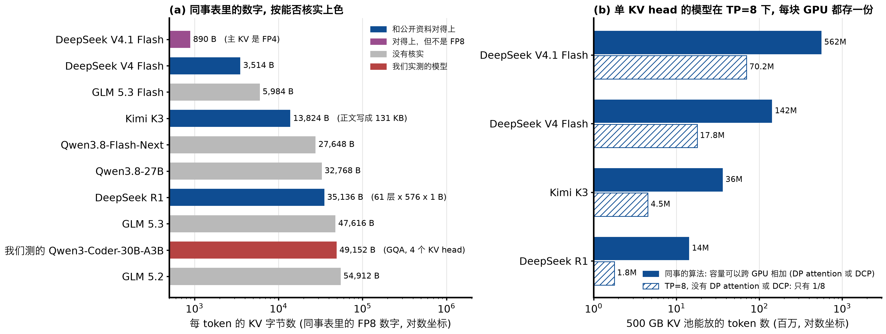
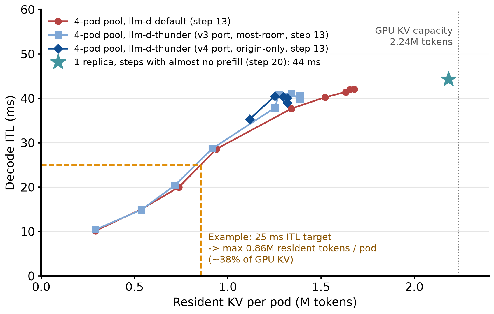
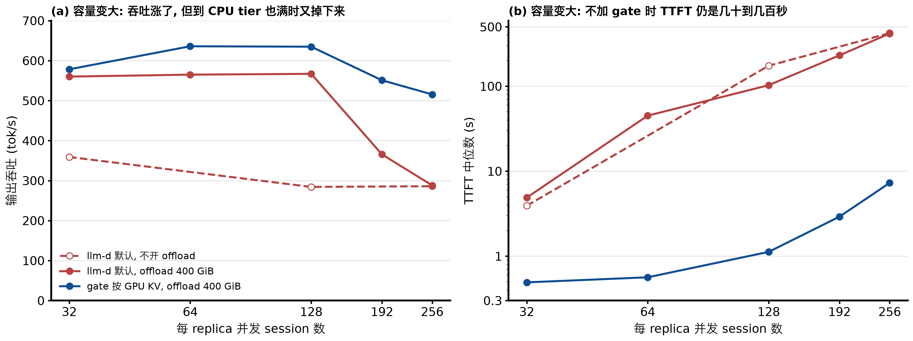
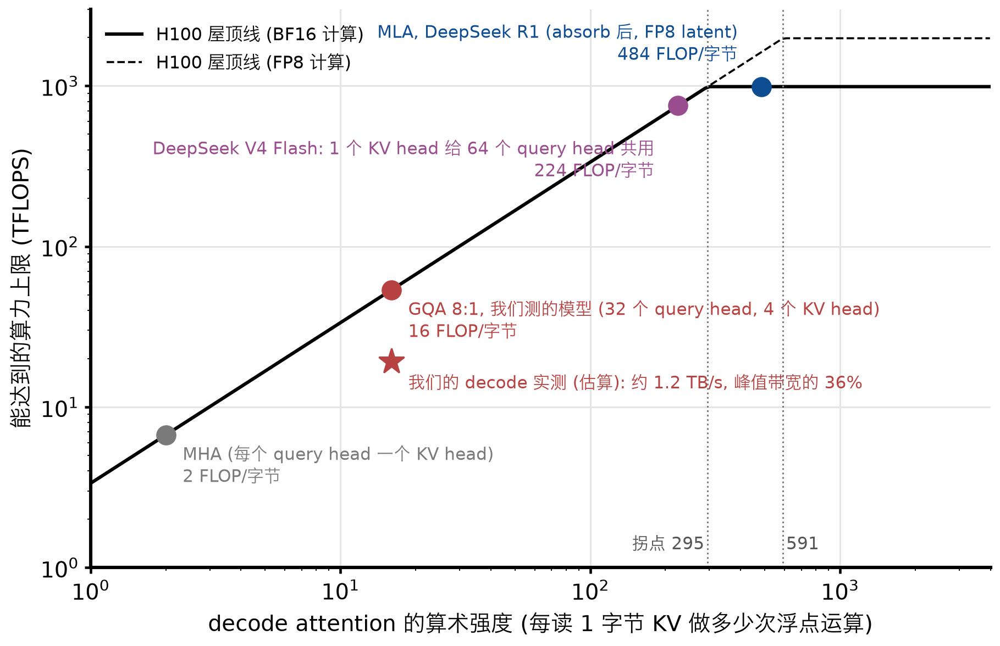
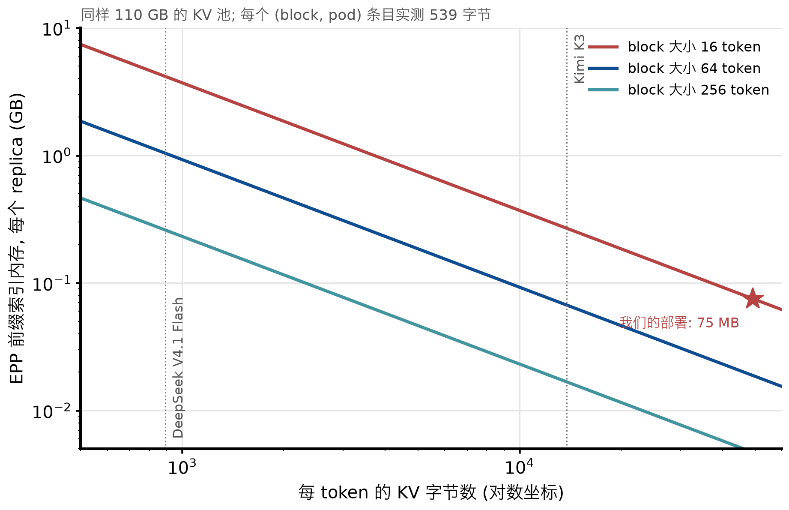
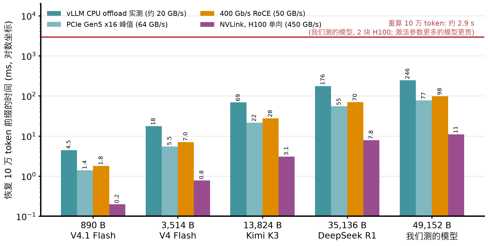

# 评《KV Cache Size/Compression Impact on llm-d and Serving Bottlenecks》：哪些对，哪些要改

审阅对象：`../../newAnalysis.md`（Jacob Murry，2026-10-05）。写于 2026-10-06。

依据有三类：

1. 我们自己的实验（本仓库 step 13 到 22，汇总见 `../summary-report/THUNDER-AGENT-SUMMARY.zh.md`）；
2. 在 llm-d-router 代码里做的一个小测量（EPP 前缀索引的内存）；
3. vLLM、SGLang、Dynamo 的公开文档和工程博客（链接在文末）。

图由本目录的 `make_figures.py` 生成。

## 0. 结论

**总体评价：方向大体对，但数据口径有错，瓶颈分析过于简单，offload 一节的前提不成立。**

同事说对的地方：

- KV 压缩确实是趋势：MLA、压缩注意力、稀疏注意力、线性注意力混合都在普及。
- 压缩后，"KV 装不下导致抖动" 这个问题会推迟很多。
- prefill 是算力问题。
- KV 的搬运（offload、P/D 传输、迁移）会便宜很多。
- EPP 要跟踪的 block 会变多。这一条我们实测了，影响比他写的还大。

需要改的地方：

1. **数据口径。**
   - DeepSeek V4.1 Flash 的 890 字节是 FP4，不是表头写的 FP8。
   - Kimi K3 在表里是 13,824 字节（对），正文却写成 131 KB（错了约 10 倍）。
   - "500 GB 显存池" 默认 KV 容量可以跨 GPU 相加。但 MLA 和单 KV head 的模型做 TP 时，每块 GPU 都要存一份完整的 KV，TP = 8 时实际只有 1/8。
   - 线性注意力层每个请求还有几十 MB 的固定状态，"每 token 字节数" 没有包含这部分。
2. **瓶颈分析。**
   - "过去是容量，现在是带宽" 不准确。我们用未压缩 KV 的模型测到：吞吐峰值时 KV 只用了 33% 到 42%，带宽本来就先到顶。
   - decode 是不是带宽受限，取决于注意力结构：GQA 是；MLA 每读 1 字节要做约 480 次运算，在大批量下是算力受限。
   - "显存不再是主要约束" 也和 vLLM、SGLang 在 Kimi K2.6、K3 上的经验不符。TP 下 KV 容量照样是墙：vLLM 开 decode context parallelism（DCP）后吞吐涨到 3.3 倍。这堵墙解决后，每请求状态又成了新的墙。
3. **offload。** 同事说 "未压缩 KV 的 offload 常常比重算还贵"，这不对。我们实测，即使每 token 48 KiB，从 CPU 拷回也比重算便宜约 10 倍；offload 让 llm-d 默认的吞吐提高 1.58 到 1.98 倍。SGLang HiCache 在 DeepSeek-R1（每 token 35 KB）上测到 TTFT 降 84%。

对 llm-d 的意义：

- EPP 前缀索引的内存会随压缩线性增长，要调 block 大小或者设上限。
- pause/resume 和 session 迁移会变便宜，thunder 的时间片和换 pod 策略值得重新评估。
- 准入控制仍然需要，但 "容量" 的单位要从 KV token 换成活跃字节（TPOT 预算）、每请求状态或 prefill 预算。

逐条判断：

| 节 | 同事的说法 | 判断 | 主要依据 |
|---|---|---|---|
| 1 | 表里的数字和算术 | 基本对 | 500 GB / 每 token 字节数都算对了；"完整上下文数" 混用 1,048,576 和 128,000 两种口径 |
| 1 | Kimi K3：表里 13,824 B，正文 131 KB | 表对，正文错 | 公开分析：24 个 MLA 层 × 576 × 1 B = 13,824 B；131,072 B 来自一份被指出算错 10 倍的显存指南 |
| 1 | 统一按 FP8 比较 | 不对 | V4.1 Flash 的主 KV 是 FP4 |
| 1 | 500 GB 池的容量可以直接相加 | 要看并行方式 | MLA 和单 KV head 模型在 TP 下每块 GPU 存一份（图 1b）|
| 2 | 压缩是行业趋势 | 对 | DeepSeek V4/V4.1、Kimi K3、GLM-5.3-Flash、Qwen3.8-Flash-Next 都是 |
| 2 | Qwen 和 GLM 的混合 = 压缩注意力 + 滑窗（SWA）| 不对 | 两者都是线性注意力（KDA、Gated DeltaNet）+ 稀疏注意力，不是滑窗 |
| 3 | 过去的瓶颈是容量和抖动，导致抢占换出到 CPU、丢请求 | 一半对 | 抖动对（命中率 0.93 → 0.04）；但抢占很少（每个 cell 0 到 23 次），vLLM V1 只重算不换出，请求也没被丢 |
| 3 | 显存不再是主要约束 | 太早 | Kimi K2.6：TP 下 64 个并发就用满 KV，DCP 后到 512；Kimi K3：DCP 后每请求状态成为墙 |
| 3 | prefill 受限于算力，TTFT 由 GEMM 吞吐决定 | 大体对，但不全 | 我们测到每千个 prefill token 让每一步慢 29 ms；vLLM 的自适应 token 预算让 Kimi K3 的 TTFT 降了 55% 到 65%，说明调度同样重要 |
| 3 | decode 受限于带宽，上千 session 压满 HBM | 部分对 | GQA 对（16 FLOP/字节）；MLA 和单 KV head 接近或超过算力拐点（图 2）；稀疏注意力每步只读一小部分 |
| 4 | EPP 要跟踪更多 block，内存增加 | 对，量级更大 | 实测每个 (block, pod) 条目 539 字节；890 B/token 时每个 replica 约 4 GB（图 4）|
| 4 | 10 万 token 的 KV 传输 < 90 MB、< 2 ms | 算术对，但只对 890 B/token 成立 | 400 Gb/s 线速 1.8 ms；5,984 B/token 要 12 ms，我们的模型要 98 ms（图 3）|
| 4 | 可以把 session 迁到别的 pod | 方向对，缺前提 | 需要 decode 之间能传 KV，或者有共享的 KV 层；没有它时，我们测到换 pod 让命中率减半 |
| 4 | 被驱逐的请求几乎零成本恢复 | 方向对，但不是免费 | 恢复便宜不等于不用排队：开了 offload 后，1800 s 强制准入的长尾仍然在；"10% 的 async 请求被驱逐" 无法核实 |
| 5 | 未压缩 KV 的 offload 常比重算贵 | 不对 | 实测拷回比重算便宜约 10 倍；step 20 吞吐 +58% 到 +98% |
| 5 | 50 到 200 ms 的传输卡住 decode | 不对 | 拷回是异步的，只占 2% 到 9% 的时间，步长完全可以用 prefill 量解释 |
| 5 | 几百 MB 只要几 ms | 部分对 | 按 PCIe 峰值对；按 vLLM 实测的约 20 GB/s，890 B/token 要 4.5 ms，5,984 B/token 要 30 ms |
| 5 | GPU 是 L1，主机内存是 L2 | 对 | vLLM、SGLang、Dynamo 都这样设计；但写穿式缓存要求 L2 比 L1 大，L2 也会抖动 |

## 1. 我们的实验能回答什么

- **我们测的模型在 "未压缩" 那一端。** Qwen3-Coder-30B-A3B（FP8）每 token 49,152 字节（48 层 × K、V × 4 个 KV head × 128 × 1 字节），和同事表里的 GLM 5.2、5.3 差不多（图 1a 红色）。所以我们的测量就是 "压缩之前" 的基线。
- **step 20 的 CPU tier 实验相当于 "KV 容量变成约 4 倍"。** 400 GiB 的 CPU tier 是 GPU KV 的 3.9 倍。它和 4 倍压缩的区别是：它只增加容量，不减少每步要读的字节。所以它能单独回答 "容量变大以后会怎样"。
- **单 replica 的吞吐公式**（`../summary-report/THUNDER-AGENT-SUMMARY.zh.md` 第 3.1 节，step 20、21 的 7618 个 10 秒间隔）：
  - 吞吐 = B / T，B 是每步同时 decode 的请求数，T 是每步耗时；
  - T ≈ 46 ms + 29 ms × (这一步的 prefill 千 token 数)，R² = 0.84；
  - B 被 GPU KV 卡在约 30（KV 占用平均 0.96，排队原因 99.8% 是等 KV 空间）；
  - 46 ms 的 decode 部分主要是读 KV：每块 GPU 每步读约 54 GB，约 1.2 TB/s，约为峰值带宽的 36%（估算）。

## 2. 逐节评论

### 2.1 第 1 节：表格



图 1：(a) 同事表里每 token 的 KV 字节数，按能否核实上色；(b) 单 KV head 的模型在 500 GB 池里能放多少 token：实心是同事的算法，斜线是 TP = 8 且没有 DP attention 或 DCP 时的实际值。

- **能核实的：**
  - DeepSeek R1 的 35,136 字节可以直接验证：61 层 × 576（512 维 latent + 64 维 RoPE）× 1 字节。
  - Kimi K3 的 13,824 字节和公开分析一致：93 层里只有 24 个 MLA 层存每 token 的 KV，24 × 576 × 1 字节。
  - DeepSeek V4 Flash 的 3,514 字节和第三方按论文结构算出的约 3.5 KB 一致。
  - V4.1 Flash 的 890 字节是官方说法，但主 KV 是 FP4（V4.1 Flash 的 KV 精度见文末链接）。
  - GLM 和 Qwen3.8 的数字我没有核实。另外，Z.ai 说 GLM-5.3-Flash 的 KV 比 GLM-5.3 小 4.4 倍，但表里两者相差约 8 倍（47,616 / 5,984），需要确认口径。
- **正文和表矛盾：** 第 3 节写 "Kimi K3 at 131KB/token"，第 5 节写 "32KB–130KB/token"。这个 131 KB 来自一份把 BF16 权重都算错的显存指南，应该删掉。
- **"500 GB 池" 默认容量能跨 GPU 相加，这对单 KV head 的模型不成立。**
  - MLA 只有一个 "KV head"，DeepSeek V4 Flash 也只有一个 KV head，按 head 切不开。
  - 只做 TP 时，每块 GPU 存一份完整的 KV。vLLM 的文档、vLLM 的 RFC #16037 和 SGLang v0.4 的博客都这么说。
  - 实际影响：vLLM 在 8 块 B200 上跑 Kimi K2.6，TP 下 64 个并发就把 KV 用满了；改用 DCP（按序列切 latent KV）后能跑 512 个并发，每 GPU 吞吐从 1,863 涨到 6,091 tok/s。Kimi K3 上，DCP 把 KV 容量从 193 万 token 提到 1975 万 token。
  - 所以表里的 "能放多少 token" 要注明并行方式。
- **"每 token 字节数" 漏掉了每请求的固定状态。**
  - Kimi K3、GLM-5.3-Flash 和 Qwen3.8-Flash-Next 都有 3/4 左右的层是线性注意力（KDA、Gated DeltaNet），这些层每个请求有一份固定大小的状态。
  - SGLang 给 Kimi K3 的数字是 TP8 下每请求约 54 MB。SGLang 说，DCP 解决 MLA 的容量墙以后，"同时运行的请求数变成了瓶颈"。
  - 所以对这类模型，"能放多少个完整上下文" 不能只用 token 容量除。

### 2.2 第 2 节：趋势

- **大方向对。** 2026 年几个主要开源模型都在压 KV：
  - DeepSeek V4 用压缩注意力（CSA、HCA）+ 滑窗；
  - V4.1 用 CSA2，加了跨层复用和 FP4 KV；
  - Kimi K3 是 KDA 线性注意力 + MLA；
  - GLM-5.3-Flash 是 KDA + MLA + 稀疏 indexer；
  - Qwen3.8-Flash-Next 是 Gated DeltaNet + 稀疏 GQA。
- **有一处写错了：** "Qwen & GLM Hybrid Attention" 不是 "压缩注意力 + 滑窗（SWA）"，而是 "线性注意力 + 稀疏注意力"。两家都不用滑窗；用滑窗的是 DeepSeek V4/V4.1。
- **漏了一个更重要的趋势：稀疏注意力**（DSA、CSA 的 indexer、QSA），即每个 query 只读 top-k 个位置。它让 "存了多少 KV" 和 "每步读多少 KV" 脱钩：例如 V4 Flash 在 1M 上下文时，一个 CSA 层每个 query 只读约 640 个条目。这直接影响第 3 节的带宽分析。
- **"不影响模型能力"**（Gemma 4 那一条）这类说法来自厂商，报告里最好注明出处。

### 2.3 第 3 节：瓶颈转移

**(1) "过去的瓶颈是容量" 只说对了一半。** 我们在未压缩 KV 的模型上测到两个不同的上限，顺序是：

- **先到的是带宽。** 4-pod 池里，吞吐在每 pod 12 到 16 个 session 时到峰值，这时 KV 只用了 33% 到 42%，vLLM 里也不排队；decode 间隔随 session 数线性变长（10、15、20、29 ms）。见 `../13-llm-d-router-sweep/SATURATION.md` 和下面的汇总报告图 5。
- **然后才是容量。** 每 pod 24 到 32 个 session 时工作集超过 KV，命中率从 0.93 掉到 0.04，prefill 暴涨，吞吐下降。
- **机制也和同事写的不同。** 抖动的原因是空闲 session 的前缀被 LRU 挤掉，下一轮要整段重算；并不是 "抢占换出到 CPU" 或 "丢请求"。step 13 每个 cell 只有 0 到 23 次抢占；vLLM V1 已经去掉了换出，只有重算；请求在 vLLM 里排队，没有被丢。



**(2) "显存不再是主要约束" 为时过早。**

- **压缩后容量还是会碰墙。**
  - 单 KV head 的模型做 TP 时会复制 KV（2.1 节）：vLLM 和 SGLang 都要靠 DP attention 或 DCP 解决。Kimi K2.6 上，解决之前就是容量受限。
  - 线性注意力的每请求状态限制同时运行的请求数（SGLang 的 Kimi K3 博客）。
  - 我们的实验也说明：容量变大是有用的。step 20 里，CPU tier 让 llm-d 默认的吞吐提高 1.58 到 1.98 倍（图 5a），直到 CPU tier 也装满。
- **但光有容量不够。** 同一组实验里，不加 gate 时 c = 128 的 TTFT 中位数仍是 103 s（gate：1.1 s），满足 TTFT <= 30 s 的 goodput 从 c = 64 起就是 0（step 22）。原因是同时能跑的请求数仍然有限，其余的都在 vLLM 里排队。"容量不再是约束" 不等于 "不需要决定谁先跑"。



图 5：step 20，单 replica。(a) 输出吞吐；(b) TTFT 中位数（对数坐标）。数据：`../20-cpu-offload-pool/results/figure-data.json`。

**(3) "prefill 受限于算力" 对，但还要加两点：**

- **prefill 会拖慢所有 decode。** chunked prefill 让 prefill 和 decode 共用一个引擎步：我们测到每千个 prefill token 让这一步慢 29 ms，所有正在 decode 的请求都跟着慢。这是 P/D 分离（llm-d P/D、SGLang PD、Dynamo）要解决的问题。
- **调度和算力一样重要。** vLLM 在 Kimi K3 上发现，请求少时 `max_num_batched_tokens` 用不满，改成按请求数自适应的 token 预算后，TTFT 降了 55% 到 65%，吞吐涨了 41.5%。

**(4) "decode 受限于带宽" 要看注意力结构。** 算术强度（每读 1 字节 KV 做多少次浮点运算）决定了 decode attention 是读字节受限还是算力受限：



图 2：按每个 key、每层的运算量和字节数计算（FP8 KV），屋顶线用 H100 SXM 的规格（3.35 TB/s，BF16 989 TFLOPS）。

- **GQA（我们的模型）：** 16 FLOP/字节，远低于拐点（约 295），所以是带宽受限。这和我们 46 ms 的 decode 步一致。
- **MLA（DeepSeek R1）：** 128 个 query head 共用一份 576 维的 latent，约 484 FLOP/字节，超过 BF16 拐点。批量大时是算力受限。FlashMLA 也是用 TFLOPS 来报 decode 性能的。
- **单 KV head（DeepSeek V4 Flash）：** 约 224 FLOP/字节，接近拐点。
- **稀疏注意力：** 每步只读 top-k 个条目，读取量远小于存储量，decode 更多受限于权重读取和算力。

所以 "压缩以后 decode 受限于带宽" 对 GQA 类模型成立，对 MLA 和稀疏注意力类模型不一定。

**(5) "上千个 session 压满 HBM、TPOT 变差" 换一个说法更准确：**

- **每步耗时 ≈ 活跃 KV 的字节数 / 有效带宽 + 读权重的时间。** Dynamo 的 Planner 文档也写明 "ITL 几乎随活跃 KV 线性增长"。
- **压缩改变的是同样的字节能装多少个 session，不改变满池时的步长。** 如果 KV 池装满且都在用，每步要读的字节和压缩前满池时一样，TPOT 也就一样（我们测到约 46 ms）；变化是每步多了很多 token，所以吞吐上去了。
- **真正的约束是 TPOT 目标。** 想要 TPOT 低，就要限制活跃字节数，这正是汇总报告第 5.4 节的 "按 ITL 目标定 token 预算"：ITL <= 25 ms 时，我们的模型每 pod 最多驻留约 86 万 token。KV 压缩 k 倍后，同样的字节预算能放 k 倍的 token。

### 2.4 第 4 节：对 llm-d-router 的影响

**(1) EPP 要跟踪更多 block：对，而且量级更大。**

- **容量自动跟着 KV 走：** llm-d-router 的 approximate prefix 插件默认开着 `autoTune`，每个 pod 的 LRU 容量直接取 vLLM 报告的 `num_gpu_blocks`（`pkg/epp/framework/plugins/requestcontrol/dataproducer/approximateprefix/plugin.go` 的 `makeserver`）。KV 压缩 k 倍，block 数就多 k 倍，索引也大 k 倍。
- **实测每个条目的内存：** 我在这个包里临时写了一个测试，往索引里插入 100 万个 block，量 Go 的堆内存，测完删除：
  - 每个 block 只在一个 pod 上时（sticky session 的常见情况）：每个 (block, pod) 条目 539 字节；
  - 4 个 pod 共享同一个 block 时：每个条目 211 字节。
  - 主要开销是每个 block 一个 `map[ServerID]struct{}`，加上每个 pod 一个 LRU。



图 4：同样 110 GB 的 KV 池（我们一个 replica 的大小），按实测的每条目 539 字节计算。

- **按图 4：**
  - 我们的部署每个 replica 约 75 MB；
  - 换成 890 B/token 的模型、block 大小 16 时约 4 GB；100 个 replica 就是约 400 GB，EPP 放不下。
- **缓解办法：**
  - block 大小和引擎对齐：vLLM 跑 DeepSeek V4 Flash 的推荐配置用 `--block-size 256`，这时只要约 0.26 GB；
  - 关掉 `autoTune`，用 `lruCapacityPerServer` 设上限；
  - 改用 precise prefix 索引（KV events）加外部存储；
  - 或者只索引前缀的前一部分。
- **thunder 不受影响：** thunder 的账本按 session 记，不按 block 记，内存和 KV 大小无关。

**(2) "传输 89 MB 只要 2 ms，可以灵活迁移 session"：算术对，但缺前提。**



图 3：按不同链路速度计算。红线是我们实测的重算时间（29 µs/token，2 块 H100）。

- **传输时间：** 400 Gb/s 的线速下 89 MB 要 1.8 ms，算对了。但只有 890 B/token 才这么快：5,984 B/token 要 12 ms，DeepSeek R1 要 70 ms，我们的模型要 98 ms。
- **迁移需要条件：** 要么 decode pod 之间能直接传 KV，要么有一个所有 pod 都能读的共享 KV 层，例如 LMCache、Mooncake 或 SGLang HiCache 的 L3。今天 llm-d 的 KV 传输主要用在 P/D 之间。
- **没有这个条件时，迁移很贵。** step 12、13 里，most-room 策略让 49% 到 71% 的恢复换了 pod，每次都要整段重算，池的命中率只有单 pod 的一半。如果传输变得便宜，这个结论会反过来：按负载换 pod 会比死等原来的 pod 更好。这值得重新测。

**(3) "被驱逐的请求可以几乎零成本恢复"：方向对，但不是免费。**

- **我们的数据支持 "恢复成本取决于前缀还在不在"：**
  - 不开 offload 时，每 pod 32 个 session 的负载下，暂停的前缀约 10 到 12 s 后就被挤掉（step 13 的 wait-cost 曲线）；
  - 开了 400 GiB offload 后，被暂停的 session 从 CPU 拷回，每个 cell 回载 0.4 到 1.7 TB；
  - 开 offload 后，vLLM 的抢占从每个 cell 个位数变成 24 到 434 次，但吞吐反而更高，因为被抢占的请求可以从 CPU 拷回前缀，不用整段重算。
  - 压缩以后前缀活得更久，恢复更便宜。
- **但 "恢复便宜" 不等于 "不用排队"。** 被恢复的请求仍然要抢算力和带宽。step 20、21 里开了 offload，gate 的 p99 TTFT 从 c = 128 起仍然顶到 1800 s 的强制准入。谁先恢复、最多等多久，仍然是调度问题；step 13 的几种 "等一会再换" 策略都失败了，说明这一步不简单。
- **"10% 的 async 请求被驱逐" 无法核实：** 这一条来自 llm-d-async 的一条 issue 评论，报告里最好说明测试条件。

### 2.5 第 5 节：CPU offload

- **"未压缩 KV 的 offload 常比重算还贵"：不对。**
  - 重算 10 万 token：我们实测约 2.9 s（2 块 H100，3B 激活参数；激活参数更多的模型更贵）。
  - 从 CPU 拷回 10 万 token × 48 KiB = 4.9 GB：按 vLLM 实测的 15 到 21 GB/s，只要 0.24 到 0.33 s，便宜约 10 倍（图 3）。
  - 按每 token 算也一样：拷回 2.4 µs，重算至少 29 µs。
  - step 20 的结果也一致：offload 让 llm-d 默认的吞吐提高 1.58 到 1.98 倍。
  - SGLang HiCache 的公开结果同样如此：DeepSeek-R1（35 KB/token）命中缓存后 TTFT 比重算低 84%；Qwen3-Coder-480B 的 coding agent 负载上 TTFT 降 56%、吞吐翻倍。
- **"50 到 200 ms 的传输卡住 decode"：不对。** vLLM 的 OffloadingConnector 是异步拷贝，我们测到回载时间只占 2% 到 9%；每步耗时用 prefill 量就能解释（R² = 0.84），看不到传输的影响。
- **"几百 MB 只要几 ms"：部分对。** 按 PCIe Gen5 x16 的 64 GB/s 峰值算是对的；按 vLLM 实测的约 20 GB/s，890 B/token 要 4.5 ms，5,984 B/token 要 30 ms。
- **"GPU 是 L1，主机内存是 L2"：对，但有两个条件。**
  - **写穿式要求 L2 比 L1 大。** vLLM 的 OffloadingConnector 是写穿式，所以覆盖范围约等于 CPU tier 的大小，不是 GPU + CPU（step 20）。Dynamo 的 KVBM 文档也提醒：CPU 层比 GPU 层小时会不停地换出。
  - **L2 也会抖动。** step 20 里工作集超过 CPU tier 后（c = 192 起），CPU 命中率从 0.84 掉到 0.07，吞吐回到不开 offload 的水平（图 5a）。
  - 压缩会把这个点推后很多，但不会消失。
- **实际部署要考虑主机内存。** 我们的 400 GiB tier 需要 450 Gi 的 pod 内存上限和 410 Gi 的 `/dev/shm`，峰值用到 445 GiB。

## 3. vLLM、SGLang、Dynamo 的经验

| 问题 | vLLM | SGLang | Dynamo | 对 llm-d 的启示 |
|---|---|---|---|---|
| 单 KV head 在 TP 下复制 KV | DP attention（v0.9 起）、Wide-EP、DCP（Kimi K2.6：64 → 512 并发，每 GPU 吞吐 3.3 倍；Kimi K3：193 万 → 1975 万 token）| DP attention（v0.4 起，decode 吞吐最多 1.9 倍）；大规模 EP | 使用引擎的并行方式 | EPP 读到的容量要按 DP rank 理解；路由要知道请求落在哪个 DP rank |
| 线性注意力的每请求状态 | KDA 前缀检查点；ReplaySSM（同样内存下容量 +11%）| 状态和 KV 共用一个内存池；前缀复用用 copy-on-write、snapshot、donate | - | 准入要同时看 token 数和请求数（每请求状态）|
| 多层缓存、offload | OffloadingConnector（我们用的）；LMCache | HiCache：GPU、主机内存、分布式存储三层（Mooncake、3FS、NIXL）| KVBM 四层（GPU、CPU、SSD、远端），v1.5.0 起弃用，建议用引擎自带的 offload | offload 很值得做；L2 要比 L1 大；共享的 L3 让迁移变便宜 |
| 缓存感知路由 | 提供 KV events（llm-d 的 precise prefix 用它）| cache-aware router（v0.4 起）| KV router：prefill 成本减去各层命中的折扣，再加 decode 负载；v1.5 新增的策略先按负载排序，再看前缀重叠 | 压缩后命中更容易，打分应该更重视负载 |
| 调度和 SLO | V1 只用重算方式抢占；自适应 token 预算（Kimi K3 TTFT -55% 到 -65%）| 多种调度策略和优先级 | SLA Planner：按 TTFT、ITL 目标给 prefill 和 decode 分别扩缩容；文档写明 ITL 随活跃 KV 线性增长 | 用 TTFT、ITL 目标来驱动准入和扩容，而不是只看 KV 容量 |
| P/D 分离 | NixlConnector（llm-d 的 P/D 用它）| PD 分离 + Mooncake 传输 | 分离式部署 + Planner | 压缩让 KV 传输便宜，但 prefill 的计算量不变 |

几点共同的经验：

1. **三个项目都在解决 "压缩后 KV 仍然装不下" 的问题**：DP attention、DCP、统一内存池。可见压缩之后，容量问题换了形式，并没有消失。
2. **大家都押注多层缓存，而且都发现 offload 比重算划算**（HiCache 的数据、Dynamo 的 KVBM、vLLM 的 OffloadingConnector）。这和同事第 5 节的前提相反，和我们 step 20 的结果一致。
3. **控制回路都在转向延迟目标**：Dynamo 按 TTFT、ITL 扩缩容；它的 router 新策略把负载放在前缀命中之前。这支持同事 "瓶颈在转移" 的大方向，但具体的约束是 TPOT 和每请求状态，不是 "HBM 带宽" 一个量。

## 4. 对我们（llm-d / thunder）的含义

1. **thunder 按 KV 容量准入，压缩后会很少触发。** 就像 step 20 开了 offload 以后，吞吐收益只剩 1.03 到 1.13 倍（工作集小于 CPU tier 时）。但 step 22 说明，即使容量变成 4 倍，不加 gate 时 TTFT <= 30 s 的 goodput 从 c = 64 起仍然是 0。所以准入控制仍然需要，只是 "容量" 要换成：
   - 活跃字节（TPOT 预算）；
   - 每请求状态（线性注意力模型）；
   - prefill 预算。
   汇总报告第 5 节已经写了怎么改代码、指标从哪里来。
2. **恢复和迁移变便宜，以前的两个结论要重测。**
   - step 17 里 lease 5 s 因为损失命中率而输给 30 s。如果恢复几乎不要钱，更短的 lease 或时间片就能缩短长尾，又不丢命中率。
   - step 12、13 里换 pod 很贵。如果有共享 KV 层，按负载换 pod 可能比 origin-only 更好。
3. **EPP 的前缀索引要按 KV 压缩来规划内存**（2.4 节）：block 大小和引擎对齐，设上限，或者改用外部索引。
4. **路由打分应该更重视负载和带宽**，前缀命中的权重可以降低。Dynamo v1.5 也朝这个方向改了。

## 5. 建议的实验

1. **在我们的环境跑一个 MLA 或混合线性注意力的模型**，例如 DeepSeek-V2-Lite（MLA）、Kimi-Linear-48B-A3B（KDA + MLA）或 Qwen3-Next-80B-A3B（Gated DeltaNet）。用同样的 weka 回放测：
   - TP、DP attention、DCP 三种方式下的 KV 容量；
   - decode 步长和活跃字节的关系（同时打开 vLLM 的算力、带宽统计，这次部署里它们一直是 0）；
   - thunder 的收益。
2. **测 offload 拷回的实际速度**，对比不同 KV 大小和 block 大小，检验 "几 ms" 的说法。
3. **在真实流量下测 EPP 的索引内存和查找延迟**：本文的 539 字节只是微基准。
4. **测迁移：** 共享 KV 层（LMCache 或 Mooncake）加按负载换 pod，对比 origin-only。

## 6. 局限

- 2026 年新模型的结构和每 token 字节数来自论文和第三方分析，GLM、Qwen3.8 的数字没有核实。
- 图 2 是按结构算出的理论算术强度，没有在这些模型上实测。
- 图 3 的重算时间用的是我们的模型；其他模型的激活参数、注意力结构不同，重算更贵或更便宜。
- 图 4 的每条目内存是 Go 堆的微基准，没有包含 GC 余量和真实流量下的共享情况。

## 参考资料

- vLLM：
  - [Data Parallel Deployment](https://docs.vllm.ai/en/latest/serving/data_parallel_deployment/)
  - [RFC #16037: DP attention + EP](https://github.com/vllm-project/vllm/issues/16037)
  - [Wide-EP 博客](https://vllm.ai/blog/2025-12-17-large-scale-serving)
  - [Decode Context Parallelism 博客](https://vllm.ai/blog/2026-08-07-decode-context-parallelism)
  - [Kimi K3 性能优化](https://vllm.ai/blog/2026-09-13-kimi-k3-performance-optimization)
  - [Kimi K3 day-0](https://vllm.ai/blog/2026-07-27-k3)
  - [Optimization（V1 抢占）](https://docs.vllm.ai/en/stable/configuration/optimization/)
  - [DeepSeek-V4-Flash recipe](https://recipes.vllm.ai/deepseek-ai/DeepSeek-V4-Flash)
- SGLang：
  - [v0.4（DP attention、cache-aware router）](https://www.lmsys.org/blog/2024-12-04-sglang-v0-4/)
  - [大规模 EP](https://www.lmsys.org/blog/2025-05-05-large-scale-ep/)
  - [HiCache](https://www.lmsys.org/blog/2025-09-10-sglang-hicache/)
  - [Kimi K3 day-0](https://www.lmsys.org/blog/2026-07-27-kimi-k3-day0-support/)
- Dynamo：
  - [KVBM 设计](https://docs.nvidia.com/dynamo/latest/kvbm/kvbm_design_deepdive.html)
  - [v1.5.0 发布说明（KVBM 弃用）](https://docs.nvidia.com/dynamo/dev/reference/releases/v1-5-0)
  - [Router](https://docs.nvidia.com/dynamo/components/router)
  - [Router 配置](https://docs.nvidia.com/dynamo/v1.2.1/components/router/configuration-and-tuning)
  - [SLA Planner](https://docs.nvidia.com/dynamo/latest/planner/sla_planner.html)
- 模型：
  - [DeepSeek-V4 论文](https://arxiv.org/html/2606.19348v1)
  - [DeepSeek-V4.1-Flash（FP4 KV、跨层复用）](https://www.marktechpost.com/2026/09/10/deepseek-ai-released-deepseek-v4-1-flash-with-1m-context-fp4-kv-cache-and-cross-layer-attention-reuse/)
  - [V4.1 Flash 结构分析（第三方）](https://zartbot.github.io/blog/model_arch/dsv41flash_arch/en.html)
  - [GLM-5.3-Flash 和 Qwen3.8-Flash-Next 的结构](https://www.marktechpost.com/2026/08/28/glm-5-3-flash-vs-qwen3-8-flash-next-two-chinese-ai-labs-independently-converge-on-the-same-model-architecture/)
- 其他：
  - [FlashMLA](https://github.com/deepseek-ai/FlashMLA)
  - [AMD 的 vLLM MoE 部署指南（TP 和 DP 的取舍）](https://rocm.blogs.amd.com/software-tools-optimization/vllm-moe-guide/README.html)
- 本仓库：
  - `../summary-report/THUNDER-AGENT-SUMMARY.zh.md`（吞吐公式、饱和点、准入怎么改）；
  - `../20-cpu-offload-pool/README.md`（offload 实验）；
  - `../22-slo-goodput/README.md`（goodput）；
  - `../13-llm-d-router-sweep/SATURATION.md`（饱和曲线）。

## 附录：重新生成图

```
cd kv-compression-review
uv run --with matplotlib --with numpy python make_figures.py
```

- 图 5 读 step 20 的 `results/figure-data.json`，其他图只用 `make_figures.py` 开头列出的常数，每个常数都注明了来源。
- EPP 索引内存的测量方法：在 `pkg/epp/framework/plugins/requestcontrol/dataproducer/approximateprefix/` 里临时加一个测试，用 `newIndexer` 插入 100 万个不同的 block（每批 4096 个），前后各做一次 `runtime.GC()` 并读 `HeapAlloc`。测量用的是 llm-d-router 的 `thunder-agent-lease-tier` 分支，测试文件测完已删除。
