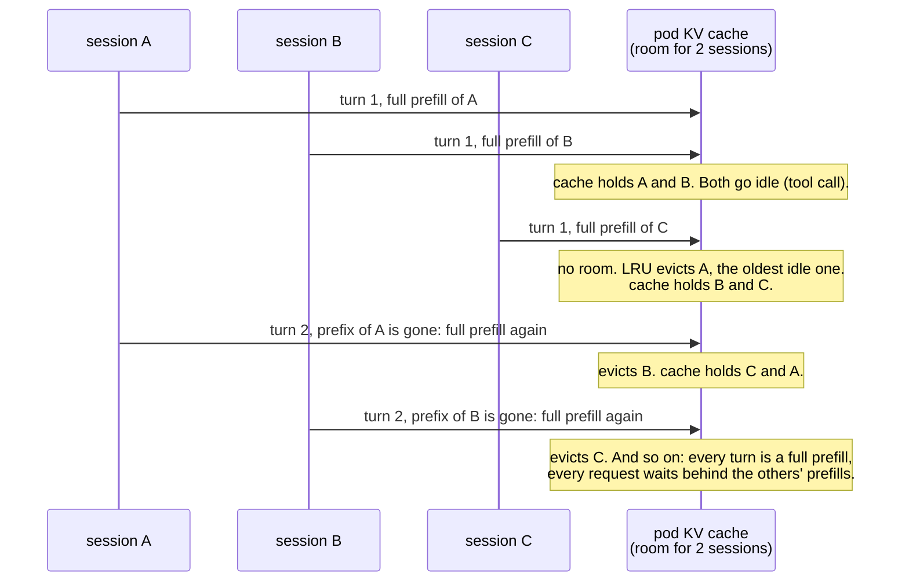
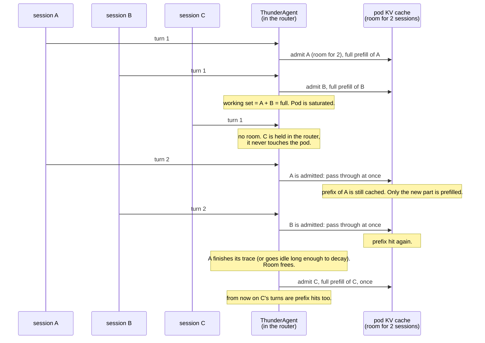
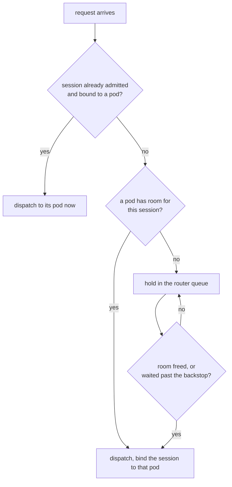
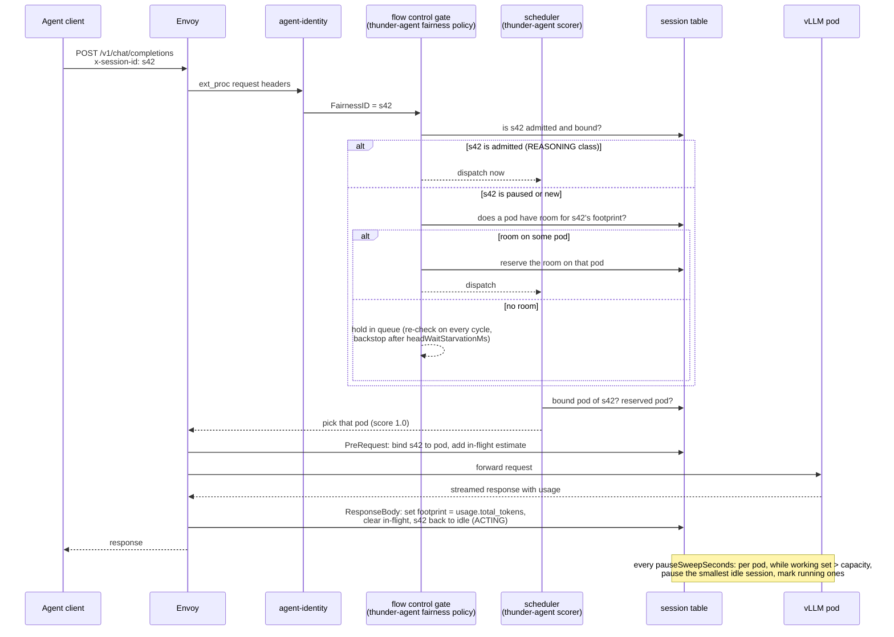
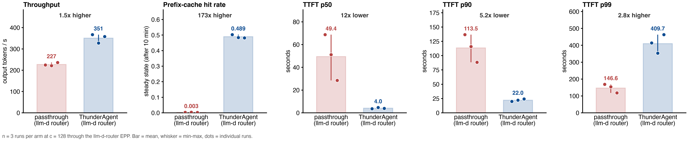

# Proposal: Session level admission control for agentic workload - adding ThunderAgent to llm-d-router

## Goal

Add ThunderAgent's session level admission control to llm-d-router, so that an agentic workload keeps its prefix cache hits when the pool is over-subscribed.

What we want to get:

- Higher throughput on the same GPUs, because less re-prefill.
- Much lower TTFT for most requests, because requests wait in the router instead of in the engine queue.
- No change for clients. A client only needs to send a session id header.
- No cost when the pool is not saturated. The gate should stay idle there.

## Background

### Agentic workload characteristics

- **High prefill to decode ratio.** In the Claude Code traces we replayed, one request has about 100 prompt tokens per output token (median request is about 170:1). Prefill is where the compute goes.
- **High prefix cache hit rate is possible.** One turn of a session reuses almost all of the previous turn's prompt. If the previous turn's KV blocks are still in the cache, the new turn only prefills the new part.
- **TTFT matters, but e2e latency per request matters more.** An agent can only continue after it receives the whole response. A slow request blocks the whole session.
- **ReAct loop.** A session follows a REASONING (request in flight on the GPU) then ACTING (agent runs a tool, no request in flight) loop. Between turns the session has no request in flight, because the agent is running a tool or waiting for the user. The engine sees it as idle, but its KV blocks are still valuable.

If we keep the prefix cache hit rate high, we save most of the re-prefill compute, and the workload becomes decode heavy. That is the whole idea.

### KV thrashing

When the sum of all active sessions' context is larger than the pod's KV pool, the engine must evict. vLLM's LRU evicts the blocks of idle sessions first, and idle sessions are exactly the sessions that are about to send their next turn.

What we measured on one pod (Benchmark A, 45 minutes, real Claude Code sessions):

- The live sessions needed 1.7x the KV pool.
- Steady state prefix cache hit rate fell to 0.008. Almost every turn was a full 50k+ token prefill.
- Median TTFT was 53 s, because every request waited in the engine queue behind full prefills.

A small example. One pod, room for two sessions' context. Three sessions A, B, C each send a turn, wait for a tool, then send the next turn.



Every session pays the full prompt again on every turn, and the engine queue fills with these prefills. This is what the 0.008 hit rate and the 53 s median TTFT look like from the inside.

Placement scoring does not fix this. On a four pod pool (Benchmark C), llm-d's default profile (prefix cache scorer, queue scorer, KV scorer) and plain session affinity gave the same 1020 tok/s and the same 0.002 hit rate. Keeping a session on one pod does not help if that pod's cache is gone before the next turn.

## ThunderAgent's algorithm

ThunderAgent (arXiv 2602.13692) has two parts: saturation detection and admission control.

### Saturation detection

- The router tracks every session's KV footprint in tokens (the `usage.total_tokens` of its last turn, or an estimate while the turn is in flight).
- A pod's working set is the sum of all its sessions, REASONING and ACTING together.
- A pod is **saturated** when its working set is larger than the pod's KV capacity (`block_size x num_gpu_blocks`, read from the engine).
- Engine reported KV utilization cannot be used for this, because it only counts blocks held by running requests. Idle sessions' blocks sit on the free list and look unused, while they are the blocks we want to protect.
- An ACTING session's footprint decays over time (`2^-t`, 1 s half life) in the admission view, so a session that finished and never said goodbye stops blocking admission after a few seconds.

In pseudo code:

```
for each pod:
    working_set = 0
    admission_view = 0
    for each session bound to this pod and not paused:
        footprint = max(last_usage_total_tokens, in_flight_estimate)
        working_set += footprint + buffer_per_session          # undecayed view
        if session has a request in flight:
            admission_view += footprint + buffer_per_session
        else:                                                  # ACTING, decays
            admission_view += footprint * 2^(-idle_seconds / half_life) + buffer_per_session
    capacity = block_size * num_gpu_blocks                     # scraped from the engine
    saturated[pod] = working_set > capacity * util_threshold
    room[pod]      = capacity * util_threshold - admission_view
```

The undecayed view decides when to pause. The decayed view decides how much room there is to admit.

### Admission control order

1. If a request's session is already admitted and bound to a pod, pass it to that pod immediately. Never block a running session; its turns are what free capacity.
2. If the pool is not saturated, place a request of a new session on the pod with the most free KV that can fit the session.
3. If a pod is saturated, pause its idle sessions (smallest first) until the working set fits. A paused session keeps its pod as origin but stops counting. If no idle session is left, mark the running ones; a mark becomes a pause when that turn ends.
4. A paused session's next request, or a new session's first request, is held in the router until a pod has room for it. When room frees, the order is: paused sessions first, then new sessions, smallest first.
5. A held request that waited too long (1800 s upstream) is admitted anyway. This is the backstop.

In pseudo code, two pieces. The pause sweep runs per pod on a timer; the gate runs on every dispatch cycle.

```
pause_sweep(pod):                                  # every pause_sweep_seconds
    while working_set[pod] > capacity * util_threshold:
        s = smallest session on pod with no request in flight
        if s exists:
            pause(s)                               # keeps pod as origin, leaves both views
        else:
            mark every in-flight session on pod    # pause when its turn ends
            break

gate(waiting requests):                            # every dispatch cycle
    for r in requests of admitted, unpaused sessions:
        dispatch(r, bound_pod(r))                  # never held
    for r in requests of paused sessions, smallest first, then new sessions, smallest first:
        if r waited longer than backstop:
            dispatch(r, origin_pod or most_room_pod)
        else if r fits room[origin_pod(r)]:
            reserve room; dispatch(r, origin_pod)
        else if r fits room[most_room_pod]:        # most-room resume; origin-only would keep waiting here
            reserve room; dispatch(r, most_room_pod)
        else:
            keep r in the queue                    # the hold
```

The same three sessions with ThunderAgent in front of the pod:



The same amount of work gets done with two full prefills instead of one per turn. C waits at the door, but A and B never lose their cache, and C's own turns are fast once it is in. The wait moved from inside the engine, where it destroys cache, to the router, where it costs nothing.



## Design in llm-d

llm-d-router already has the layers we need. A work-in-progress PR implements it as one plugin, `thunder-agent`, that plugs into four existing extension points. Nothing in the request path is new; only the decisions are.

| what ThunderAgent needs | llm-d-router extension point | what the plugin does there |
|---|---|---|
| session identity | `agent-identity` plugin fills the request `FairnessID` from the `x-session-id` header | session id becomes the flow key; anonymous requests are left alone |
| per session KV state ledger | `PreRequest` and `ResponseBody` hooks, one table in the plugin | one record per session: footprint in tokens, in-flight estimate, bound pod, paused flag, origin pod, last seen time. Written on request start, while streaming, and on response end; released on `x-session-final` or after an idle TTL. This is the same idea as the `session-state-producer` proposed in [llm-d-router issue 2524](https://github.com/llm-d/llm-d-router/issues/2524) (turns taken, duration, last seen). The ledger should become that shared producer, with the KV fields added, so other session-aware plugins can read it too |
| saturation detection | flow control `saturationDetector` | keeps the per pod fit view (working set against real scraped capacity) and runs the pause sweep. It reports "not saturated" to the flow controller on purpose: the controller's own gate would block every request, including turns of admitted sessions |
| admission gate | flow control `fairnessPolicy` (the `Pick` of the priority band) | admitted sessions always dispatch; paused and new sessions dispatch only when a pod has room, paused first, smallest first; backstop after `headWaitStarvationMs` |
| stickiness | scheduling profile `Scorer` | score 1.0 for the session's bound pod, or for the pod that just admitted it; least loaded pod for a new session |


Two things are simpler in llm-d than in the Python router:

- **Real time admission instead of a 5 s tick.** The Python router checks the waiting pool every 5 s. In llm-d the fairness policy runs on every dispatch cycle, so a hold ends as soon as room exists. Only the pause sweep keeps a timer (`pauseSweepSeconds`, 5 s by default).

- **How the pause sweep is implemented.** There is no background thread. The flow controller calls the plugin's `Saturation` hook on every dispatch cycle with the current endpoint list. On each call the plugin recomputes both views for every pod from the ledger. For a pod whose last sweep is older than `pauseSweepSeconds` and whose undecayed view is above the ceiling, it pauses that pod's idle sessions smallest first, then marks the in-flight ones; a mark turns into a pause when that turn's response ends. A paused session leaves both views at once, so the room is visible to the gate in the same cycle. `pauseSweepSeconds: 0` sweeps on every cycle.
- **Client disconnects are handled.** When a client gives up, Envoy cancels the request and the plugin sees end of stream, so the session goes back to idle and can be paused or evicted. The Python router keeps such sessions on its books forever.

### Request path



### Configuration

The shipped config, `deploy/config/thunderagent-config.yaml`, is what Benchmarks B and C ran:

```yaml
- type: agent-identity
  parameters:
    additionalSessionHeaders: [x-session-id]
- type: thunder-agent
  name: thunder
  parameters:
    capacityTokens: 2237040        # fallback only; real value is scraped from cache_config_info
    utilThreshold: 1.0
    actingHalfLifeSeconds: 1
    bufferTokensPerProgram: 100
    pauseSweepSeconds: 5
    headWaitStarvationMs: 1800000
    evictionTtlSeconds: 3600
    sessionFinalHeader: x-session-final
flowControl:
  defaultRequestTTL: "0s"          # never reject a held request
  saturationDetector: {pluginRef: thunder}
  defaultPriorityBand: {fairnessPolicyRef: thunder}
```

The values match upstream ThunderAgent so the port can be compared with the paper. `utilThreshold`, `headWaitStarvationMs` and `pauseSweepSeconds` are knobs upstream does not have.

## Initial benchmarking results

Three benchmarks are referenced below. The folder column points to the raw data and the full write-up in the verification repo.

| name | what it compares | replicas | folder |
|---|---|---|---|
| **Benchmark A: ThunderAgent, 1 replica** | the paper's Python router, passthrough vs ThunderAgent | 1 pod | `../08-weka-replicates` |
| **Benchmark B: llm-d-router + ThunderAgent, 1 replica** | the llm-d router, passthrough vs the ThunderAgent plugin | 1 pod | `../10-llm-d-router-replicates` |
| **Benchmark C: llm-d-router + ThunderAgent, 4 replicas** | the llm-d router over the pool, llm-d default vs session affinity vs the ThunderAgent plugin | 4 pods | `../12-llm-d-router-pool` |

All runs use the same serving side: `Qwen/Qwen3-Coder-30B-A3B-Instruct-FP8` on vLLM v0.28.0, TP=2 on two H100 80GB per pod, 2,237,040 tokens KV per pod. Workload: replay of real Claude Code sessions (weka trace set, 338 sessions), median prompt about 50k tokens, output about 350 tokens, real think times capped at 10 s, no release call from the client. 45 minute cells, three runs per arm, steady state is minutes 10 to 45.

### Benchmark A: ThunderAgent, 1 replica (the paper's Python router, reference)

| | passthrough | ThunderAgent (Python) |
|---|---|---|
| output tok/s | 221 | 469 (2.12x) |
| steady state hit rate | 0.008 | 0.685 |
| TTFT p50 / p99 | 52.7 s / 107 s | 3.0 s / 204 s |

The 2.12x carries two artifacts: the 600 s client timeout removed the largest held sessions from the workload, and the Python router keeps client-abandoned requests on its books forever, which throttled admission into a lighter, hotter engine late in the run. Under equal load (minutes 10 to 30) the number is 2.06x.

Figure A. Benchmark A, three runs per arm, one dot per run.


### Benchmark B: llm-d-router + ThunderAgent, 1 replica

| client timeout 1900 s | passthrough (llm-d router) | llm-d router implementation of ThunderAgent | ratio |
|---|---|---|---|
| output tok/s | 227 | 351 | 1.54x |
| requests completed | 979 | 1398 | 1.43x |
| steady state hit rate | 0.003 | 0.489 | 173x |
| TTFT p50 / p90 / p99 | 49 s / 114 s / 147 s | 4.0 s / 22 s / 410 s | |
| requests waiting inside vLLM, mean | 17.6 | 0.8 | |

- The llm-d path is free: the passthrough through Envoy and the EPP equals the Python passthrough (227 vs 221 tok/s).
- With Benchmark A's 600 s client the port gives 1.80x. Under equal load the port and the Python router are within 0.02 on hit rate and 10% on throughput. So the port is faithful; the gap to 2.12x is the two artifacts above.
- The tail is the cost: 8 to 11 sessions per run waited the full 1800 s, which is why p99 TTFT is worse.

Figure B. Benchmark B, three runs per arm, client timeout 1900 s.



### Benchmark C: llm-d-router + ThunderAgent, 4 replicas (all 338 sessions at once)

| | llm-d default | session affinity | llm-d router implementation of ThunderAgent |
|---|---|---|---|
| output tok/s | 1020 | 1023 | 1447 (1.42x) |
| requests completed | 4225 | 4227 | 6096 |
| steady state hit rate | 0.002 | 0.002 | 0.248 |
| TTFT p50 / p90 / p99 | 123 s / 217 s / 260 s | 126 s / 217 s / 256 s | 3.7 s / 113 s / 1231 s |
| requests waiting inside vLLM | 187 to 189 | 188 to 190 | 1.2 |
| requests held in the router | 0 | 0 | about 370 |
| forced admissions per run | - | - | 55 |
| resumes that moved to another pod | - | - | about 70% |

- Placement alone does nothing on an over-subscribed pool: llm-d default and session affinity are the same on every metric.
- Admission control is the whole effect and it survives the move to four pods. All three arms repeat within about 1% across runs.
- The port keeps its admitted footprint at 90% to 91% of each pod's capacity and about 180 sessions paused at any time.
- The pool hit rate (0.25) is half the single pod value (0.49). Cause: 70% of resumed sessions were placed on a different pod because their own pod had no room at that instant, and each move is a full re-prefill. This was seen in the calibration before the run and is the first improvement below.

Figure C1. Benchmark C, the three policies, three runs per arm.


Figure C2. Benchmark C time series, one row per run: hit rate, KV usage, requests in flight, paused programs and queue.


Figure C3. Benchmark C, where requests wait: inside vLLM for the two llm-d policies, inside the router for ThunderAgent.


### What the numbers mean for a user

- Operator view: 1.4x to 1.5x more work from the same GPUs.
- Single agent view: median TTFT 33x lower on the pool, but a few sessions wait minutes. In Benchmark A the same session got through about 1.3x as many turns, not 2x; the rest of the throughput gain is the router reaching more sessions.

## Known limitations and next improvements

Each limitation below comes from Benchmarks A to C. Each one has some improvements we would try next.

| # | limitation | what we measured | improvement |
|---|---|---|---|
| 1 | **Resumed sessions move between pods.** When a paused session's turn comes back, its own pod often has no room at that instant, so the router puts it on the pod with the most room. Every move is a full re-prefill. | On the four pod pool, about 70% of resumes moved pods (3100 of 4470 per run). Pool hit rate was 0.25 against 0.49 on one pod. | Add `resumePlacement: origin-only`: a paused session waits for its own pod, and moves only if that pod is gone or the backstop fires. New sessions still go to the pod with the most room. Second step: with precise per-session KV knowledge (row 3), decide by cost instead of by rule: wait when the session's prefix is still cached on its pod (a wait saves a re-prefill), move when it is already evicted (a wait then only adds delay). |
| 2 | **A few sessions wait very long.** Held sessions are resumed smallest first, with no aging, and the forced admission backstop is 1800 s. Large sessions lose every round to smaller newcomers. | Benchmark C: 55 forced admissions and 25 client timeouts per run; TTFT p99 1231 s against 260 s for llm-d default, while p50 was 3.7 s. | Make the wait cost part of the decision: hold a session only while its prefix is likely still cached, then let it move or go first. Start with a short origin wait cap; later read real residency from llm-d's KV block index. |
| 3 | **The KV footprint is an estimate.** Before the first usage report, footprint comes from request bytes. The fit view counts what the router admitted, not what the engine really holds. | The bytes-per-token estimator settled around 7 on this workload. One engine KV sample can differ from the model by about a session's worth of tokens. | Use precise prefix cache knowledge: combine the tracked footprint with the engine's KV usage (`kvUsageCorrection`), smoothed over a few samples, and later with the KV block index for exact per-session residency. |
| 4 | **No active-active EPP support.** llm-d can run several EPP replicas behind the gateway, but the session ledger lives in one EPP process. Two active replicas would each see part of the sessions, each believe the pods have more room than they do, and both admit too much. | Not measured; all runs used one EPP. | First step: pin a session id to one EPP replica at the gateway (consistent hashing on the session header), so each replica owns its sessions. Second step: a shared ledger, which is also what issue 2524's session-state-producer would need. |
| 5 | **Chat and agentic traffic are not separated.** Requests without a session id are invisible to the fit view, and chat with a session id is gated behind agentic resumes and then paused for nothing. | Not measured; all runs were pure agentic. | Give chat its own priority band with a plain first-come policy, count its KV through `kvUsageCorrection`, and add a general load scorer so anonymous requests are placed by load. |
| 6 | **Benchmarks so far are narrow.** One model (a 30B mixture-of-experts with 3B active), one trace corpus, and request-level metrics. Request percentiles hide who pays: under overload the router makes most requests fast and a few sessions very slow, and a TTFT p50 or p90 does not show that. | Benchmark C: p50 3.7 s, p99 1231 s for the same arm. | Two more benchmark families: goodput and session SLO metrics (turns per second within a TTFT SLO, share of sessions that met the SLO on every turn, turns per session; capacity stated as sessions per pod at a target attainment; the load generator now writes the session id per request), and a large dense model (70B class or bigger, where a re-prefill costs more and the gain should be larger). |
| 7 | **Not tested with CPU KV offloading.** The fit view assumes a session's KV is either on the GPU or gone. With vLLM's native offloading connector (shipped in v0.28.0, not enabled here) an evicted prefix can come back from host memory over PCIe instead of a re-prefill, which changes the cost of a pause and of a move. | Not measured; every run was GPU-only. | Benchmark the same workload with the CPU tier on, with and without the gate. Then make the ledger aware of the tier: a session offloaded to CPU counts as cheap to resume, not as gone, and the capacity used for admission includes the CPU tier. |
| 8 | **Not tested with prefill/decode disaggregation.** The plugin binds a session to one pod and gates on that pod's KV. In a P/D setup a turn's prefill runs on one pod and its KV lives on the decode pod, so the binding and the fit view need a home. | Not measured; every run was a single-role pool. | Bind the session to its decode pod and gate on decode-side KV, treat the prefill pod as stateless, and benchmark the pair. P/D does not reduce the KV residency problem, so the gate is still needed there. |
| 9 | **Held demand only waits; the pool does not grow.** When the working set is larger than the pool, the gate holds sessions, and that is the right thing for the next seconds. But nothing tells the autoscaler that the pool is too small, and the engine's own KV utilization cannot: it read 0.86 for llm-d default and 0.79 for the gated arm in Benchmark C, both "nearly full", while one was thrashing and the other was healthy. | Benchmark C: about 180 of 338 sessions paused at any moment, about 9M tokens of demand waiting, which is 4 more pods' worth of KV. | **Autoscaling signal from ThunderAgent.** The ledger knows the footprint of every session, admitted or held, so it can export what an autoscaler needs: `held_tokens` (footprint of sessions waiting in the queue) and `demand_pods` (total tracked footprint divided by KV capacity per pod; about 8 for Benchmark C against 4 pods). Feed them to llm-d's Workload Variant Autoscaler. Scale up when held demand stays above one pod's capacity for about a minute, not on the first pause (the sweep pauses a few sessions in normal operation too). Scale down by draining: stop admitting new sessions to a pod and let its sessions finish. The gate stays for the seconds to minutes a new pod needs to start. |


