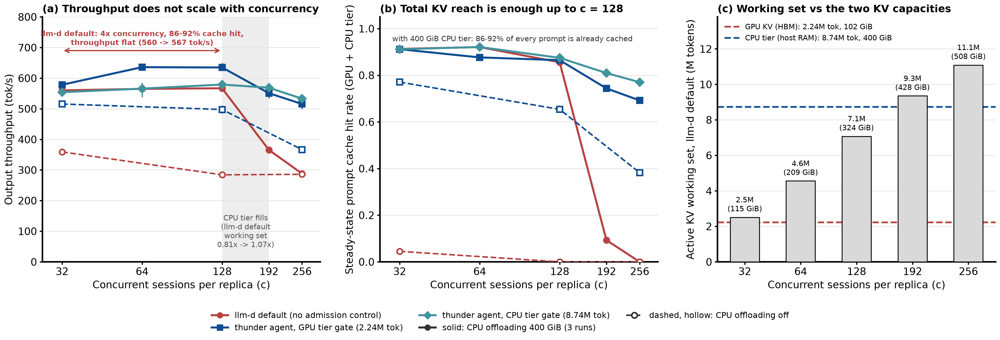
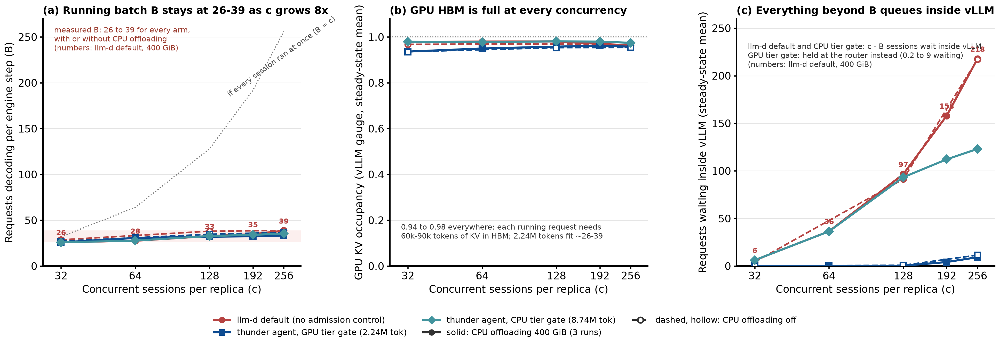
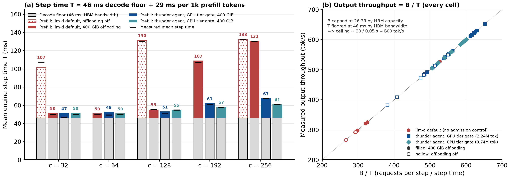
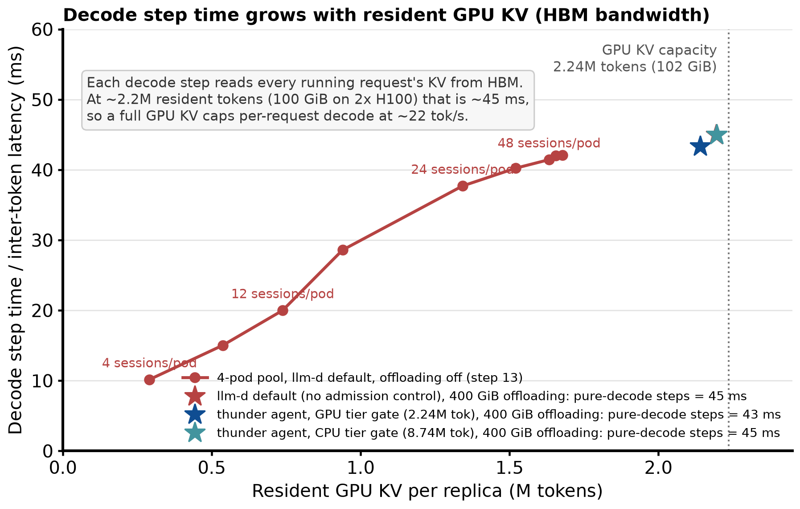
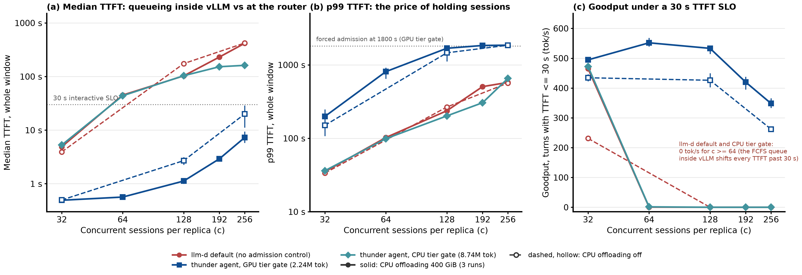
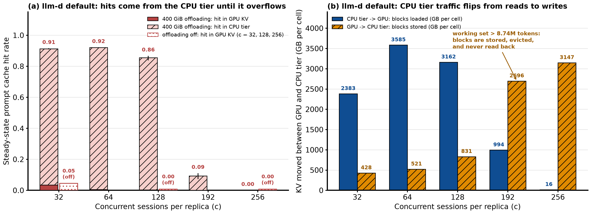

# CPU KV Offloading: Where Is the Bottleneck?

Summary of the CPU KV offloading benchmarks (`20-cpu-offload-pool`, `22-slo-goodput`, plus the `13-llm-d-router-sweep` decode curve) with one question in mind: once vLLM has a 400 GiB CPU KV tier, what actually limits the system?

## 0. The short answer

The hypothesis under test: *"with KV cache offloading the bottleneck is no longer KV cache capacity; concurrency goes up but throughput does not, which proves KV capacity is not the limit. The real limit is KV in HBM, because the number of running requests does not grow with concurrency."*

The data supports it, with two refinements:

| Claim | Verdict | Evidence |
|---|---|---|
| Total KV capacity (GPU + CPU tier) is not what caps throughput at `c = 32..128` | **Correct** | 86-92% of every prompt is already cached, prefill is 190-300 tokens per step, yet `llm-d default` throughput is flat at 560 -> 565 -> 567 tok/s while concurrency grows 4x (Finding 1) |
| GPU HBM capacity is the binding limit because the running batch does not grow with concurrency | **Correct** | Requests decoding per step `B` stays at 26-39 for every arm from `c = 32` to `256`, GPU KV occupancy is 0.94-0.98 everywhere, everything beyond `B` queues (Finding 2) |
| Refinement 1: HBM limits throughput twice, capacity *and* bandwidth | - | Throughput is `B / T`. HBM capacity caps `B` at ~30, HBM bandwidth floors step time `T` at 46 ms (reading ~2.2M resident tokens per step), so the ceiling is ~30 / 0.05 s = ~600 tok/s (Findings 3 and 4) |
| Refinement 2: total KV capacity *does* come back as the bottleneck when the working set outgrows the CPU tier | - | At `c >= 192` the `llm-d default` working set (9.3M to 11.1M tokens) exceeds the 8.74M-token CPU tier, hit rate falls from 86% to 9% to 0%, throughput halves to 288 tok/s. Bounding the admitted working set (`thunder agent, CPU tier gate`) avoids it (Finding 5) |

What CPU offloading buys: it removes prefill recomputation (1.56x to 1.99x throughput at `c = 32..128`). What it cannot buy: more requests decoding at once, a shorter decode step, or lower TTFT once `c` exceeds `B`.

## 1. Benchmark setup

| Component | Configuration |
|---|---|
| Model | `Qwen3-Coder-30B-A3B-Instruct-FP8` (MoE, 3B active, 48 layers, 4 KV heads); FP8 KV = **48 KiB per token** |
| Replica | vLLM v0.28.0, TP=2 on **2 x H100 80GB**; `max-num-seqs 1024`, `max-num-batched-tokens 8192` |
| GPU KV (HBM) | **2,237,040 tokens = 102 GiB** per replica |
| CPU tier | vLLM native `OffloadingConnector`, `--kv-offloading-size 400`: **8,738,133 tokens = 400 GiB** of pinned host RAM (3.9x GPU KV). Write-through: every new GPU block is also copied to CPU, so total unique KV reach is ~8.74M tokens, not GPU + CPU |
| Workload | weka agentic coding traces replayed by inference-perf; each turn resends the whole history (60k-90k prompt tokens, ~600 output tokens), think time capped at 10 s; `c = 32, 64, 128, 192, 256` concurrent sessions per replica |
| Arms | **`llm-d default (no admission control)`**: every session goes straight to vLLM. **`thunder agent, GPU tier gate (2.24M tok)`**: router admits sessions until their summed context reaches GPU KV size, 30 s lease. **`thunder agent, CPU tier gate (8.74M tok)`**: same gate sized to the CPU tier |
| Runs | CPU offloading 400 GiB: 3 runs per point, all arms. Offloading off: 1 run at `c = 32, 128, 256` (`llm-d default` and GPU tier gate) |
| Windows | 30 min (10 warm-up) at `c <= 128`; 45 min (15 warm-up) at `c >= 192`. All numbers below are steady-state unless marked whole-window |

In every figure: solid lines and filled markers = CPU offloading 400 GiB; dashed lines and hollow markers = offloading off. Red = `llm-d default`, blue = `thunder agent, GPU tier gate`, teal = `thunder agent, CPU tier gate`.

## 2. Findings

### Finding 1: Total KV capacity is not what limits throughput at `c = 32..128`



| `llm-d default`, 400 GiB offloading | `c = 32` | `c = 64` | `c = 128` |
|---|---|---|---|
| Active working set (M tokens, share of CPU tier) | 2.51 (0.29x) | 4.56 (0.52x) | 7.07 (0.81x) |
| Prompt cache hit rate, GPU + CPU tier | **0.913** | **0.921** | **0.856** |
| Prefill computed per engine step (tokens) | 177 | 161 | 300 |
| Output throughput (tok/s) | **560** | **565** | **567** |
| Same point with offloading off | 359 (hit 0.045) | - | 284 (hit 0.000) |

- With the CPU tier, the whole working set fits (0.29x to 0.81x of 8.74M tokens) and 86-92% of every prompt is served from cache. Prefill per step is 160-300 tokens, so cache misses are not the cost. Compared with offloading off, that is what lifts throughput from 359/284 tok/s to 560/567 tok/s (1.56x / 1.99x).
- Concurrency then grows 4x (`32 -> 128`) and throughput moves by 1%. Adding sessions adds no output. If KV reach were the limit, hit rate would fall as `c` grows; it does not until the tier overflows at `c = 192` (Finding 5).
- The admission-gated arms sit on the same plateau: `thunder agent, GPU tier gate` 578 -> 636 -> 635 tok/s, `thunder agent, CPU tier gate` 554 -> 566 -> 579 tok/s. Three different policies, one ceiling, which points at the engine rather than at the cache.

### Finding 2: GPU HBM capacity caps the running batch, and that is what does not scale



Steady-state means per replica (3 runs, CPU offloading 400 GiB; offloading off in brackets):

| Metric | Arm | `c = 32` | `c = 64` | `c = 128` | `c = 192` | `c = 256` |
|---|---|---|---|---|---|---|
| Requests decoding per step, `B` | `llm-d default` | 26.0 [28.6] | 27.6 | 32.7 [38.1] | 34.8 | 38.5 [38.8] |
| | `thunder agent, GPU tier gate` | 25.9 [27.1] | 30.6 | 32.0 [34.7] | 32.5 | 33.4 [36.7] |
| | `thunder agent, CPU tier gate` | 25.9 | 27.8 | 32.8 | 34.1 | 35.5 |
| GPU KV occupancy (vLLM gauge) | `llm-d default` | 0.98 [0.97] | 0.98 | 0.98 [0.97] | 0.97 | 0.96 [0.97] |
| | `thunder agent, GPU tier gate` | 0.94 [0.94] | 0.95 | 0.96 [0.95] | 0.96 | 0.96 [0.95] |
| | `thunder agent, CPU tier gate` | 0.98 | 0.98 | 0.98 | 0.98 | 0.97 |
| Requests waiting inside vLLM | `llm-d default` | 6 [4] | 36 | 97 [91] | 158 | 218 [217] |
| | `thunder agent, GPU tier gate` | 0.2 [0.2] | 0.2 | 0.3 [0.8] | 4 | 9 [12] |
| | `thunder agent, CPU tier gate` | 6 | 36 | 93 | 112 | 123 |

- A running request must have its *entire* context in HBM for every forward pass; the CPU tier only holds blocks of requests that are not running. At 60k-90k tokens per request, 2.24M tokens of GPU KV hold about 26-39 of them. That is `B`, and it is the same 26-39 for every arm, with and without offloading, from `c = 32` to `c = 256` (8x).
- GPU KV occupancy is 0.94-0.98 at every point. The HBM is full; the only way to admit another request is for one to finish.
- Everything above `B` waits. For `llm-d default` the vLLM waiting queue is `c - B`: 6, 36, 97, 158, 218. The GPU tier gate moves that queue to the router (0.2 to 9 waiting inside vLLM) but cannot raise `B` either; it only decides *who* waits and *where*.
- The 400 GiB of host RAM is therefore idle for throughput purposes once `B` is saturated: it changes what a newly admitted request has to recompute, not how many requests can decode at once.

### Finding 3: Throughput is `B / T`, and the gate on `B` is why the plateau sits at ~560-640 tok/s



Every engine step produces one token for each of the `B` decoding requests, so output throughput is exactly `B / T` with `T` the mean step time (panel b, every cell on the diagonal). Across 7,618 ten-second intervals, `T` fits

`T = 46 ms + 29 ms x (k prefill tokens computed in the step)`, R2 = 0.84.

| Mean step time `T` (ms), 400 GiB offloading [offloading off] | `c = 32` | `c = 64` | `c = 128` | `c = 192` | `c = 256` |
|---|---|---|---|---|---|
| `llm-d default` | 50 [107] | 50 | 55 [130] | 107 | 131 [133] |
| `thunder agent, GPU tier gate` | 47 [55] | 49 | 51 [67] | 61 | 67 [93] |
| `thunder agent, CPU tier gate` | 50 | 50 | 55 | 57 | 61 |

- With the cache hitting (`c <= 128`, offloading on), prefill adds only 4-9 ms to the 46 ms floor: `T` is 47-55 ms. With `B` = 26-33, `B / T` is 520-640 tok/s, which is the plateau in Finding 1.
- Without offloading (or once the CPU tier thrashes), prefill adds 60-85 ms per step: `T` is 107-133 ms at the same `B`, so throughput halves to 284-295 tok/s. That is the whole effect of CPU offloading, expressed in one variable.
- The GPU tier gate is 10-12% above `llm-d default` at `c = 64..128` (636 vs 565 tok/s) for the same reason in miniature: 69-78% of its hits are in GPU rather than CPU, it preempts 3-5x less (24-82 vs 141-265 preemptions per cell) and spends 13-22 s instead of 96-110 s per cell loading blocks from host RAM, so `T` is 47-51 ms instead of 50-55 ms and `B` is 1-3 requests higher.
- Nothing in the data moves `B` above ~39 or `T` below ~46 ms. Those two numbers are the ceiling.

### Finding 4: HBM bandwidth sets the 46 ms decode floor



| Resident GPU KV per replica | 0.29M tok (4 sessions/pod) | 0.74M (12/pod) | 1.34M (24/pod) | 1.68M (48/pod) | ~2.2M, full (step 20, pure-decode steps) |
|---|---|---|---|---|---|
| Decode step time / ITL p50 | 10 ms | 20 ms | 38 ms | 42 ms | **43-45 ms** |

- Each decode step reads the KV of every running request out of HBM. The step 13 pool sweep (offloading off, `llm-d default`) shows step time rising almost linearly with resident KV, from 10 ms at 0.29M tokens to 42 ms at 1.68M. The pure-decode steps of all three step 20 arms land at 43-45 ms with ~2.2M tokens resident: ~100 GiB of KV per step across 2 GPUs, about 1.2 TB/s per H100.
- This is the second HBM limit. Capacity fixes `B`; bandwidth fixes the time it takes to serve those `B` requests one token. CPU offloading touches neither: a full HBM is read every step regardless of what sits in host RAM.
- Consequence for the per-user experience: with HBM full, each request decodes at ~22 tok/s. Keeping resident KV near 0.85M tokens would give ~25 ms ITL, but that means admitting fewer sessions, not adding more cache.

### Finding 5: Extra concurrency becomes queueing, and the CPU tier does not help latency



Whole-window TTFT and steady-state goodput, CPU offloading 400 GiB (3 runs):

| Metric | Arm | `c = 32` | `c = 64` | `c = 128` | `c = 192` | `c = 256` |
|---|---|---|---|---|---|---|
| TTFT p50 (s) | `llm-d default` | 4.9 | 45.1 | 102.8 | 230.9 | 416.8 |
| | `thunder agent, GPU tier gate` | 0.5 | 0.6 | 1.1 | 2.9 | 7.3 |
| | `thunder agent, CPU tier gate` | 5.3 | 43.8 | 103.5 | 152.3 | 161.7 |
| TTFT p99 (s) | `llm-d default` | 35 | 102 | 237 | 505 | 576 |
| | `thunder agent, GPU tier gate` | 198 | 809 | 1681 | 1835 | 1852 |
| | `thunder agent, CPU tier gate` | 36 | 99 | 202 | 305 | 653 |
| Goodput, TTFT <= 30 s (tok/s) | `llm-d default` | 465 | 0 | 0 | 0 | 0 |
| | `thunder agent, GPU tier gate` | 495 | 552 | 533 | 420 | 348 |
| | `thunder agent, CPU tier gate` | 472 | 1 | 0 | 0 | 0 |

- Because `B` is fixed, every session beyond it waits for a slot. A slot frees when a running turn finishes (~600 tokens at ~50 ms per step, 25-30 s). With `c - B` = 36 requests ahead at `c = 64`, the median wait is already 45 s even though 92% of the arriving prompt is in the CPU tier; at `c = 128` it is 103 s. The queue is FCFS, so the whole TTFT distribution shifts past the 30 s line and goodput goes to zero at `c >= 64` for both arms that let vLLM queue.
- The CPU tier gate has the same TTFT as `llm-d default` at `c <= 128` because its gate (8.74M tokens) is wider than HBM: it admits everything that fits in host RAM, which still queues inside vLLM behind the ~30 that fit in HBM.
- The GPU tier gate keeps the median at 0.5-7 s and goodput at 420-552 tok/s up to `c = 192` by admitting only what HBM can run; the sessions it holds pay instead at the tail (p99 of 809-1852 s, forced admission at 1800 s). It does not create capacity; it chooses which sessions get the fixed `B`.

### Finding 6: Total KV capacity returns as the bottleneck when the working set outgrows the CPU tier



| `llm-d default`, 400 GiB offloading | `c = 128` | `c = 192` | `c = 256` |
|---|---|---|---|
| Active working set (M tokens, share of CPU tier) | 7.07 (0.81x) | 9.35 (1.07x) | 11.09 (1.27x) |
| CPU tier hit rate | 0.853 | **0.093** | **0.000** |
| GPU -> CPU stored / CPU -> GPU loaded per cell (GB) | 831 / 3,162 | 2,696 / 994 | 3,147 / 16 |
| Prefill per engine step (tokens), step time | 300, 55 ms | 2,139, 107 ms | 2,872, 131 ms |
| Output throughput (tok/s) | 567 | 366 | 288 (offloading off: 286) |

- The CPU tier is an LRU cache like the GPU one, only 3.9x bigger. When the summed context of live sessions passes 8.74M tokens (between `c = 128` and `192`), blocks are evicted before the owning session's next turn arrives: the tier stores 2.7-3.1 TB per cell and reads back 1 TB, then 16 GB. Hit rate collapses, prefill per step goes back to 2,100-2,900 tokens, `T` goes back to 107-131 ms, and throughput is the same as having no CPU tier at all.
- This is the one regime where "KV capacity is the bottleneck" is literally true again, and it is a capacity-vs-working-set problem rather than an HBM one. `thunder agent, CPU tier gate` bounds the admitted working set to the tier and keeps hit rate at 0.81 / 0.77 and throughput at 569 / 533 tok/s at `c = 192 / 256` (1.55x / 1.85x `llm-d default`), at the TTFT cost shown in Finding 5.

## 3. Bottleneck summary

| Layer | Limit | What it fixes in the data | Does CPU offloading move it? |
|---|---|---|---|
| GPU HBM capacity, 2.24M tokens | Every running request fully resident | `B` = 26-39 at every `c`, occupancy 0.94-0.98 | No |
| GPU HBM bandwidth, ~1.2 TB/s per GPU achieved | Full KV read every step | Decode floor `T` >= 46 ms, ITL ~22 tok/s per request | No |
| Prefill compute, +29 ms per 1k miss tokens | Misses stretch every step for all `B` requests | `T` = 107-133 ms when the cache misses, 47-55 ms when it hits | **Yes**, while the working set fits in the tier (`c <= 128`): 1.56x-1.99x throughput |
| CPU tier capacity, 8.74M tokens | LRU over the admitted working set | Hit rate 0.86 -> 0.09 -> 0.00 at `c = 128 -> 192 -> 256` | It *is* this limit; sizing or admission control moves it |
| FCFS queue in front of the fixed `B` | `c - B` sessions wait 25-30 s per slot turnover | TTFT p50 45 s at `c = 64`, 103 s at `c = 128`; goodput 0 for `c >= 64` | No; only admission at the router changes who waits |

What would raise the ceiling: more HBM per replica or shorter contexts (raises `B`), higher-bandwidth HBM or smaller KV per token than FP8 (lowers the 46 ms floor), or more replicas. What raises goodput at the same hardware: admitting only what HBM can run (`thunder agent, GPU tier gate`) and accepting the tail cost on held sessions.

## 4. Reproducing the figures

```bash
uv run --with matplotlib --with numpy python thunderagent-original-setup/summary-report/make_bottleneck_figures.py
```

Inputs: `20-cpu-offload-pool/results/figure-data.json` and `results/analysis.md`, `22-slo-goodput/results/goodput-data.json`, `summary-report/data/engine-cells.json`, `summary-report/data/engine-intervals.json`, `summary-report/data/pool-sweep.json`, `13-llm-d-router-sweep/results/sweep-20260918-134248-t1900/sweep.md`. Output: `summary-report/figures/bottleneck-fig1..6.png`.
