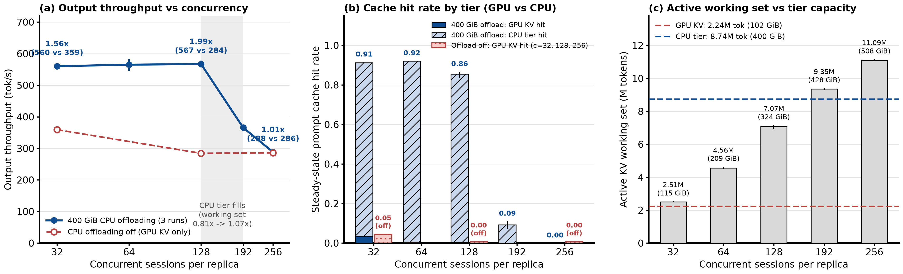
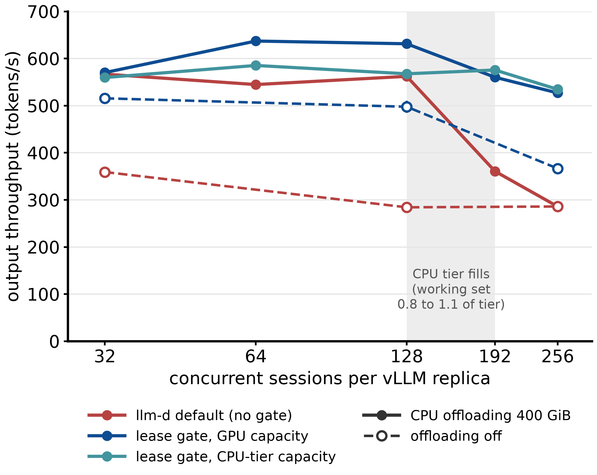
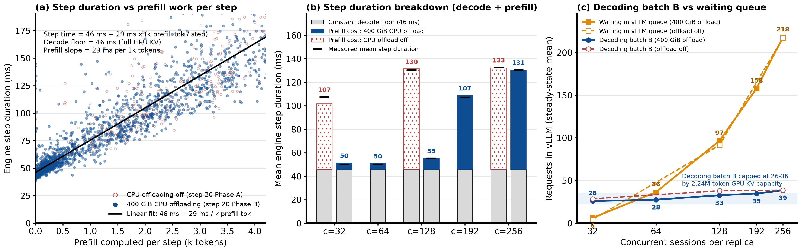
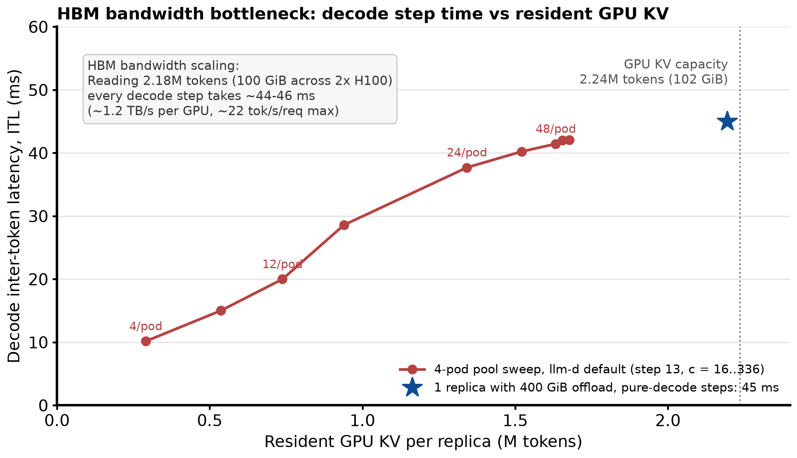
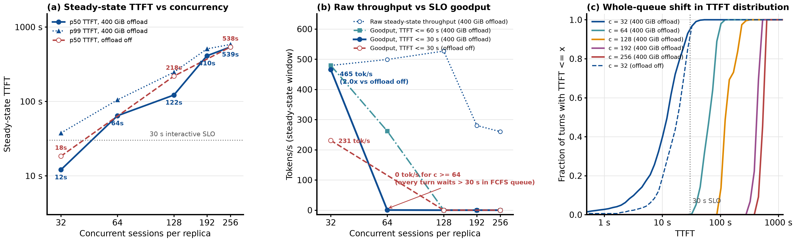

# CPU KV Offloading and System Bottleneck Summary

This report summarizes the benchmark setup and key findings for **vLLM native CPU KV offloading (`OffloadingConnector`, 400 GiB)** under long-context agentic coding workloads.

---

## 1. Testbed and CPU Offloading Architecture (Benchmark Setup)

| Component | Configuration |
|---|---|
| **Model** | `Qwen/Qwen3-Coder-30B-A3B-Instruct-FP8` (MoE: 30B total / 3B active parameters, 48 layers, 4 KV heads, head dim 128) |
| **KV Cache Precision & Size** | FP8 (`fp8_e4m3`), **48 KiB per token** ($48 \times 2 \times 4 \times 128 \times 1\text{ B} = 49,152\text{ B}$), block size = 16 tokens (768 KiB/block) |
| **Serving Replica** | `vLLM v0.28.0`, TP=2 on **2 x NVIDIA H100 80GB HBM3** per replica (`--gpu-memory-utilization=0.90`, `--max-num-seqs=1024`, `--max-num-batched-tokens=8192`) |
| **GPU KV Capacity** | **2,237,040 tokens (~102.4 GiB)** across the 2 H100 GPUs per replica |
| **CPU Offload Tier** | `vLLM OffloadingConnector` (`--kv-offloading-size=400`, `--kv-offloading-backend=native`), **400 GiB = 8,738,133 tokens (3.91x GPU KV)** backed by `/dev/shm` mmap pinned via `cudaHostRegister` |
| **Write-Through Semantics** | Every newly computed GPU KV block is copied to the CPU tier each step (`_build_store_jobs`). Because CPU blocks duplicate GPU blocks before eviction, **total unique KV reach is ~8.74M tokens (400 GiB), not GPU + CPU (502 GiB)** |
| **Workload** | `inference-perf` replaying `weka` multi-turn agentic coding traces (`c = 32, 64, 128, 192, 256` concurrent sessions per replica; each turn resends the full conversation history; client think time capped at 10 s; 60k-90k mean prompt tokens; ~600 output tokens/turn) |
| **Measurement Windows** | `c = 32, 64, 128`: 30-min run (10-min warm-up + 20-min steady state). `c = 192, 256`: 45-min run (15-min warm-up + 30-min steady state). `400 GiB CPU offloading` (Phase B) runs 3 replicates per concurrency; `CPU offloading off` (Phase A) runs at `c = 32, 128, 256`. |

---

## 2. Key Findings

### Finding 1: CPU offloading expands KV cache reach by 3.9x and boosts throughput by 1.56x-1.99x (`c <= 128`), but collapses once the 400 GiB CPU tier fills (`c = 192..256`)

- **Without CPU offloading (`GPU KV only`, `2.24M` tokens)**: Even at `c = 32`, the active session working set (`2.23-2.51M` tokens) exceeds GPU KV capacity. Steady-state cache hit rate drops to **4.5%** at `c = 32` and **0.0%** at `c = 128, 256`, limiting output throughput to **359 tok/s** (`c = 32`) and **284-286 tok/s** (`c = 128..256`).
- **With 400 GiB CPU offloading (`8.74M` tokens) at `c = 32..128`**: While the working set fits inside the CPU tier (`2.51M` tokens / `0.29x` at `c = 32`; `4.56M` / `0.52x` at `c = 64`; `7.07M` / `0.81x` at `c = 128`), evicted prefixes are recovered from host RAM. Steady-state cache reuse reaches **91.3%**, **92.1%**, and **85.6%**, cutting prefill recomputation by **2.6x-3.3x** and raising output throughput to **560 tok/s (1.56x)** at `c = 32`, **565 tok/s** at `c = 64`, and **567 tok/s (1.99x)** at `c = 128`.
- **CPU tier thrashing knee (`c = 128 -> 192 -> 256`)**: Once the active working set crosses the 8.74M-token CPU tier (**9.35M tokens / `1.07x`** at `c = 192` and **11.09M tokens / `1.27x`** at `c = 256`), the CPU tier itself thrashes under LRU eviction before sessions return from their 10 s think time. Steady-state cache hit rate plunges to **9.3%** (`c = 192`) and **0.0%** (`c = 256`), and throughput falls back to **366 tok/s** (`c = 192`) and **288 tok/s** (`c = 256`, **1.01x** vs. offloading off).
- **Confirmation via working-set admission gates (second figure below)**: Bounding the admitted working set to the CPU tier (`llm-d-thunder-simplified (CPU tier)`, teal) or GPU tier (`llm-d-thunder-simplified (GPU tier)`, blue) prevents the CPU tier from overflowing at `c = 192..256` and sustains **516-569 tok/s** instead of collapsing to **288 tok/s**.

---

### Finding 2: Output throughput plateaus at ~565 tok/s (`c = 32..128`) because GPU KV capacity caps the running batch size ($B = 26\text{ to }36$) and prefill misses stretch every engine step

- **Engine step equation**: Output throughput is governed by $\text{Output Throughput} = B / T$, where $B$ is the number of requests decoding per step and $T$ is the step duration. Across 7,618 steady-state intervals, step duration follows:
  $$T \approx 46\text{ ms} + 29\text{ ms} \times (\text{k prefill tokens computed per step}) \quad (R^2 = 0.84)$$
- **How CPU offloading speeds up engine steps (`c <= 128`)**: By serving 86-92% of prompt tokens from host RAM, CPU offloading reduces prefill compute per step from **~2,100-2,950 tokens** (`+61 to +87 ms`) to **~190-310 tokens** (`+4 to +9 ms`), shrinking mean step duration from **107-133 ms** (`offload off`) down to **50-55 ms** (`400 GiB offload`).
- **Why throughput cannot scale past ~565 tok/s (`GPU KV capacity bottleneck`)**: Every *running* request must hold its full 60k-90k token KV context in **GPU HBM (`2.24M` tokens / `102 GiB`)**. GPU HBM physically fits only **$B = 26\text{ to }36$ concurrent decoding requests** (85-91% GPU KV occupancy), forcing all remaining `c - B` sessions (**6 -> 36 -> 97 -> 158 -> 218 requests**) to wait in vLLM's queue. With $B$ capped at ~28 and $T$ floored at ~50 ms, output throughput hits a hard ceiling of $28 / 0.050\text{ s} \approx 560\text{ tok/s}$.

---

### Finding 3: HBM memory bandwidth sets the ~45-46 ms decode floor per step whenever GPU KV is full

- During every decode step, attention kernels must read the resident GPU KV cache of all running requests from HBM.
- Decode inter-token latency (ITL) grows linearly with resident GPU KV volume per replica: from **10.1 ms** at `0.29M` tokens (`4` sessions/pod) to **20.0 ms** at `0.74M` tokens (`12` sessions/pod), **37.7 ms** at `1.34M` tokens (`24` sessions/pod), and **45.0 ms** on pure-decode steps when GPU KV is full (**2.18M tokens / 100 GiB** across 2 x H100 GPUs, or ~1.2 TB/s achieved KV bandwidth per GPU).
- Because `llm-d default` keeps GPU KV 85-97% full at all `c >= 32` (both with and without CPU offloading), every decode step pays the full **45-46 ms** HBM bandwidth cost, capping single-request streaming speed at **~20-22 tok/s**.

---

### Finding 4: CPU offloading cannot prevent TTFT or SLO goodput collapse at `c >= 64` (`0 tok/s` for `TTFT <= 30 s`) because FCFS queueing inside vLLM dominates latency

- Because GPU HBM can only run $B \approx 22\text{ to }36$ requests concurrently, the remaining **31** (`c = 64`) to **87** (`c = 128`) active sessions sit in vLLM's internal `WAITING` queue behind running requests that each take **~25-30 seconds** to finish decoding (~600 output tokens at ~50 ms/step).
- Under vLLM's first-come-first-served (FCFS) queue, every arriving turn at `c = 64` or `128` must wait for the entire queue ahead of it to drain before its cached KV blocks are even loaded from CPU RAM.
- Consequently, despite **92.1%** (`c = 64`) and **85.6%** (`c = 128`) cache hit rates in the CPU tier, steady-state median (`p50`) TTFT jumps from **12 s** (`c = 32`, whole-window `4.9 s`) to **64 s** (`c = 64`, whole-window `45.1 s`) and **122 s** (`c = 128`, whole-window `102.8 s`).
- Under an interactive **TTFT <= 30 s SLO**, 400 GiB CPU offloading doubles goodput at `c = 32` (**465 tok/s** vs. **231 tok/s** with offloading off), but **SLO goodput drops to 0 tok/s at `c = 64, 128, 192, 256`** because FCFS queueing shifts the entire TTFT distribution past 30 seconds.

