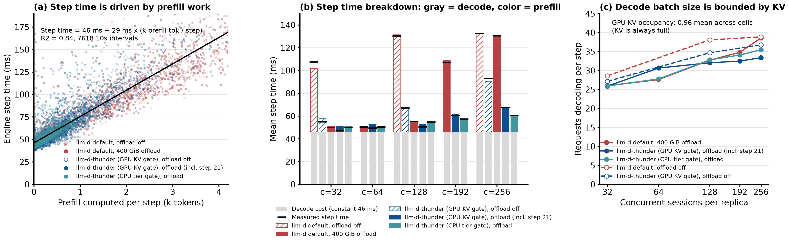
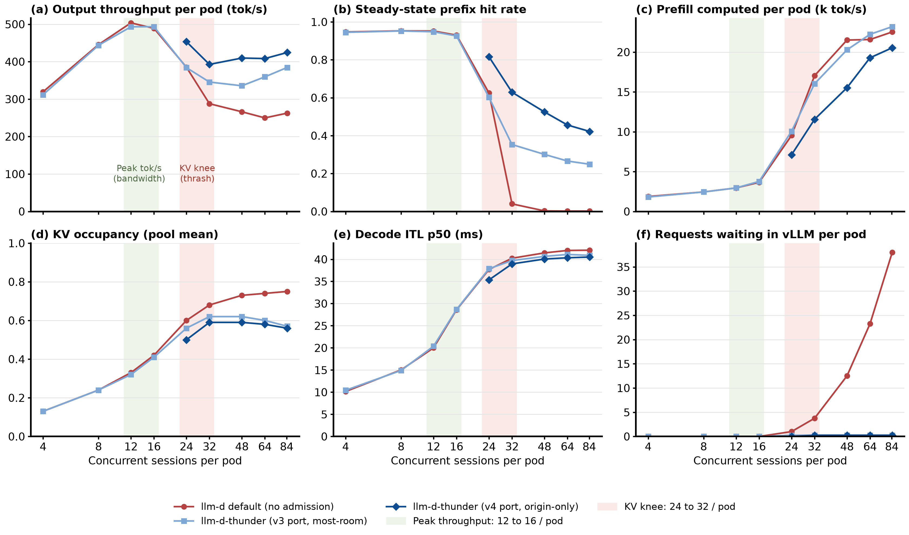
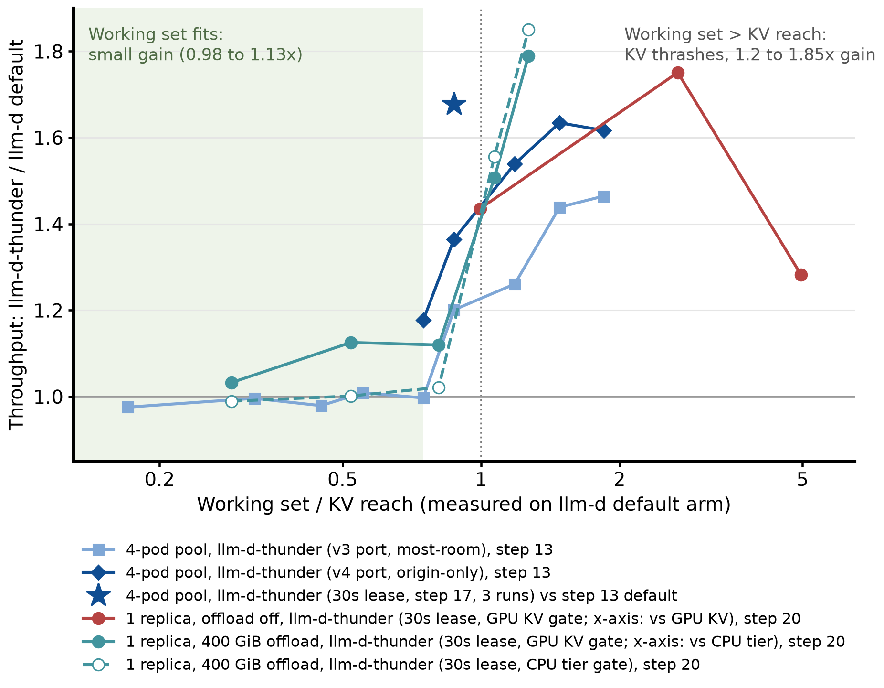
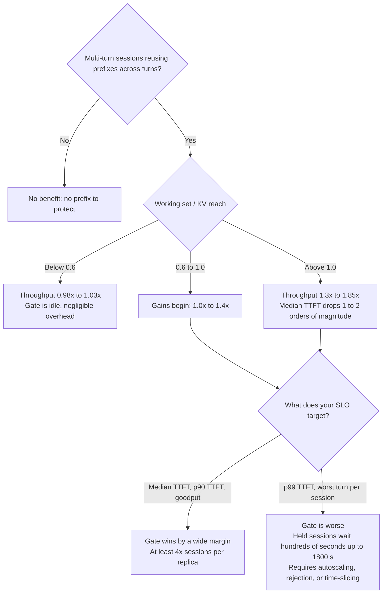
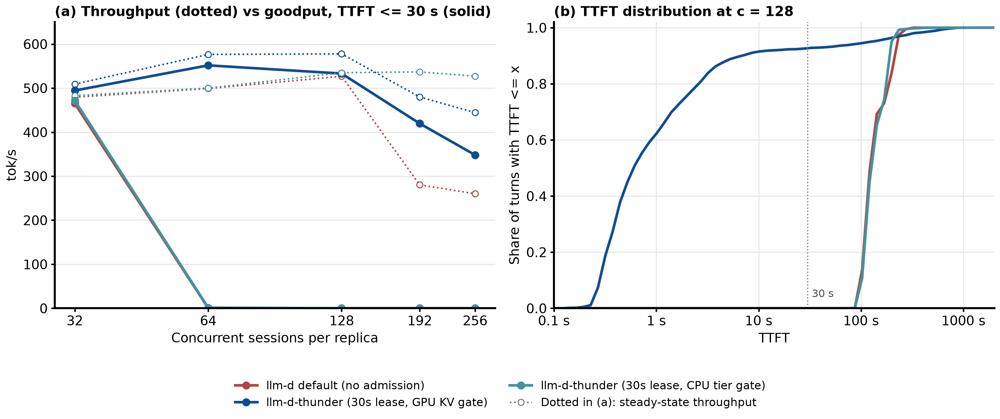

# Thunder Agent Benchmark Summary: When It Helps and Where the System Bottlenecks Are

Written on 2026-10-05, covering all results from step 04 through step 22 in this repository. Each finding cites its source experiment (paths relative to this directory). Figures are generated by `make_figures.py` in this directory, and engine data is extracted from each step's raw metrics by `extract.py` (see the appendix for details).

## 0. Takeaways

1. **`llm-d-thunder` helps significantly in only one regime: when the working set of multi-turn agent sessions exceeds the KV cache reach.** In that regime, `llm-d default` scheduling lets the KV cache thrash, dropping the prefix-cache hit rate near 0 and forcing every turn to recompute the entire conversation history. `llm-d-thunder` holds excess sessions at the gate so admitted sessions keep their prefixes in KV. Output throughput improves by 1.2x to 1.85x, and median TTFT drops by one to two orders of magnitude (Figure 1; steps 12, 13, 17, 20).
2. **When the working set fits comfortably, `llm-d-thunder` provides almost no gain and incurs almost no overhead**: 0.98x to 1.03x throughput, with the gate mostly idle (step 13 at 4 to 16 sessions per pod; step 20 at c = 32).
3. **It cannot raise the throughput ceiling.** One replica (2 x H100) tops out at ~650 tok/s on this workload for two reasons: GPU KV fits only ~30 requests of 60k to 90k tokens, capping the decode batch size per step at ~30; and every decode step reads the full KV of all running requests, taking ~46 ms. `llm-d-thunder` and CPU offloading can only reduce prefill recomputation (Figure 3; step 20).
4. **With 400 GiB CPU offloading enabled, most of the raw throughput gain disappears** (1.03x to 1.13x while the working set fits inside the CPU tier). **Under a TTFT SLO, however, the gate still wins by a wide margin**: for p90 TTFT <= 30 s, the sessions supported per replica increase from 32 to 128, at least 4x (Figure 4; steps 20, 22).
5. **The cost is the wait tail.** The gate does not eliminate waiting; it concentrates waiting onto a smaller set of held sessions. p99 TTFT rises from tens of seconds to hundreds of seconds, and under heavy overload some sessions wait until the 1800 s forced-admission backstop (`versions-report`; steps 17, 20, 22).
6. **Gate capacity must be sized to the true bottleneck.** Sizing to GPU KV (`llm-d-thunder (GPU KV gate)`) is right; sizing to the CPU tier (`llm-d-thunder (CPU tier gate)`) is equivalent to turning the gate off until the CPU tier thrashes (step 20). If the goal is decode speed (ITL), capacity must be derived from memory bandwidth, which is much smaller than full GPU KV (Figure 5, Section 5).
7. **Role in production**: Below saturation, the gate stays idle. When demand exceeds capacity (autoscaling lag, exhausted GPU quota, or traffic bursts), it protects SLOs; the held demand itself is also a direct autoscaling signal.

## 1. Testbed and Terminology

| | |
|---|---|
| Model | Qwen3-Coder-30B-A3B-Instruct-FP8 (MoE, 48 layers, 4 KV heads) |
| Engine | vLLM v0.28.0, TP = 2, 2 x H100 80GB per replica (GKE `a3-highgpu-4g`, spot nodes) |
| GPU KV | 2,237,040 tokens per replica (FP8 KV, 48 KiB/token), ~8.5 contexts of 262k |
| Scheduler limits | `max_num_batched_tokens` 8192, `max_num_seqs` 1024 (neither is a bottleneck; see 3.1) |
| CPU offload (steps 20, 21) | vLLM native `OffloadingConnector`, 400 GiB = 8,738,133 tokens |
| Workload | Weka trace replay: real Claude Code sessions, tool-call gaps capped at 10 s; closed-loop, at most one in-flight request per session |
| Detailed config | `../model-server/README.md` |

### Terminology and Labels

- **Session**: One agent trajectory. Every turn resends the full history, so a turn is cheap only while its prefix remains in KV cache.
- **c**: Number of concurrent sessions. Single-replica experiments report `c` per replica; 4-pod pool experiments often convert this to concurrent sessions per pod (`c / 4`).
- **Working set**: Sum of the latest context lengths across all live sessions (how many tokens are needed to keep all active sessions in KV).
- **KV reach**: Equal to GPU KV when offloading is off. Approximately equal to the CPU tier size when offloading is on: vLLM's offload connector is write-through, so blocks in GPU KV also occupy a copy in the CPU tier.
- **Gate, hold, pause**: `llm-d-thunder` admission control. Sessions that do not fit wait in the EPP queue (**hold**); to free room, idle sessions are **paused**, and their next turn must pass admission again.
- **Hit rate**: Fraction of prompt tokens served from prefix cache.
- **Goodput**: Output tokens per second from turns that meet the SLO (TTFT <= 30 s in this report).
- **Version and arm labels used in figures and tables**:
  - **`llm-d default (no admission)`**: Upstream `llm-d-router` default scheduling (weighted `prefix-cache-scorer`, `queue-scorer`, and `kv-cache-utilization-scorer`) with no admission gate.
  - **`llm-d-thunder (v3 port, most-room)`**: First Go port of ThunderAgent into `llm-d-router` EPP (`ae371354`), with exponential idle decay (1 s half-life), a 5 s pause sweep, and `most-room` resume placement (resumes on origin pod if it fits, otherwise the pod with the most free room).
  - **`llm-d-thunder (v4 port, origin-only)`**: `v3 port` with `resumePlacement: origin-only` (`8ee881c2`), so a paused session only resumes on the pod holding its warm prefix.
  - **`llm-d-thunder (minimal, 1s half-life)` / `(minimal, 10s half-life)` / `(minimal, 10s half-life, 1s sweep)`**: Simplified rewrite of `v4 port` (`33dde5d2`, step 16) that always uses `origin-only` placement and only pauses idle sessions during the background sweep.
  - **`llm-d-thunder (30s lease)` / `llm-d-thunder (5s lease)`**: On-demand lease gate (`20e3b1ee` / `44544c04`, steps 17 to 22) with no background sweep and no exponential decay. Unpaused sessions count at full footprint; when a waiting session needs room, sessions idle for at least the lease duration (`30s` default or `5s`) are paused on demand (longest-idle first).
  - **`llm-d-thunder (30s lease, GPU KV gate)` vs `(30s lease, CPU tier gate)`**: The 30 s lease gate with per-pod admission capacity sized to GPU KV (2.24M tokens) vs. sized to the 400 GiB CPU offload tier (8.74M tokens).

## 2. Overview of All Experiments

| Step | Location | Question | Finding (Key Numbers) |
|---|---|---|---|
| 04 to 05 | `../04-benchmark/results.md`, `../05-saturation/results.md` | Does upstream Python ThunderAgent work, and does pause/resume function on synthetic load? | Works; at 2.2x over-subscription up to 186 programs are paused concurrently and all complete |
| 06 | `../06-single-node-ab/results.md` | Single pod, upstream `tr` mode vs. plain proxy (synthetic load, no client release) | 1.45x faster with decay; **8x slower without decay** (capacity is never released, hitting the 1800 s backstop) |
| 07 | `../07-inference-perf-weka/RESULTS.md` | Real Weka trace, single pod, upstream Python proxy | 2.0x to 2.4x throughput, hit rate 0.04-0.10 -> 0.54-0.69; however, the benchmark tool only launched about half the sessions |
| 08 | `../08-weka-replicates/RESULTS.md` | Same as step 07, 3 replicates | 2.12x (±1.3%); later found that a 600 s client timeout truncated many turns, inflating the ratio (see its appendix) |
| 09 | `../09-llm-d-router-smoke/README.md` | Smoke test after porting to `llm-d-router` EPP | All 20 checks pass |
| 10 | `../10-llm-d-router-replicates/RESULTS.md` | Single-pod EPP port (`v3 port`), same protocol as step 08 | EPP path adds zero overhead; 1.54x with 1900 s client timeout, 1.80x with 600 s timeout |
| 12 | `../12-llm-d-router-pool/RESULTS.md` | 4-pod pool, c = 338 (84 per pod) | `llm-d default` matches session affinity (1020 tok/s, hit rate 0.002); `llm-d-thunder (v3 port, most-room)` reaches 1.42x, but 70% of resumes switch pods, keeping hit rate at 0.25 |
| 13 | `../13-llm-d-router-sweep/RESULTS.md`, `SATURATION.md`, `README.md` | 4-pod pool sweep from 4 to 84 sessions/pod; `origin-only`; SLO and session-level metrics | No difference at <= 24 sessions/pod (0.98x to 1.01x); `v3 port, most-room` gives 1.20x to 1.46x; `v4 port, origin-only` gives 1.18x to 1.63x; "wait briefly then switch pods" variants fail; idle prefixes are evicted after 10 to 12 s |
| 14 | `../14-turn-priority/README.md` | Upstream turn-priority scheduler (PR 2116) | Only 1.16x over sticky (vs. 1.54x for `llm-d-thunder`), and drops 44 sessions per cell with HTTP 429: reordering without bounding residency cannot protect the cache |
| 15 to 16 | `../15-thunder-minimal-single-pod/README.md`, `../16-thunder-minimal-pool/README.md` | Minimal rewrite (`llm-d-thunder (minimal)`) | 1770 to 1945 tok/s on the pool, matching or beating `v4 port, origin-only` (1693) |
| 17 | `../17-thunder-lease-pool/README.md`, `tail.md` | Lease gate (`llm-d-thunder (30s lease)` and `(5s lease)`, 3 config keys) | `30s lease`: 1931 tok/s, hit rate 0.819, p99 TTFT 242 s; the p99 tail consists entirely of paused sessions waiting in the gate |
| 18 to 19 | `../18-thunder-lease-main-pool/README.md`, `../19-thunder-lease-fix-pool/README.md` | Rebuilding the lease gate on the PR ledger | Counting only one in-flight request per session underestimates occupancy and drops throughput to 1477 tok/s; fixing it restores 2042 tok/s and 0.844 hit rate |
| 20 | `../20-cpu-offload-pool/README.md` | Single replica + 400 GiB CPU offload, 3 arms, 3 replicates | Offloading boosts `llm-d default` by 1.58x to 1.98x until the CPU tier fills; `llm-d-thunder (GPU KV gate)` gains 1.03x to 1.13x before the tier fills, and 1.51x to 1.85x once it thrashes |
| 21 | `../21-thunder-tier-budget/README.md` | Dual budget: GPU admission + CPU tier resident budget | No effect: forced admissions and growth of admitted sessions bypass the tier budget |
| 22 | `../22-slo-goodput/README.md` | Goodput analysis under TTFT SLOs using step 20/21 data | For p90 TTFT <= 30 s, sessions per replica rise from 32 to 128; the trade-off is p99 TTFT |
| Versions comparison | `../versions-report/README.md` | One cell (r1) per version on the 4-pod pool at c = 128 | `llm-d default` 1151 -> `v3 port` 1382 -> `v4 port` 1571 -> `minimal` 1752-1867 -> `30s/5s lease` 1863-1871 tok/s; p99 TTFT rises from 50 s to 164-227 s |


## 3. System Bottlenecks and Saturation Points

### 3.1 Single Replica: Throughput = Decoding Requests per Step / Step Time

In each vLLM engine step, every decoding request produces 1 token, and the step can also piggyback prefill chunks. Therefore:

**Output throughput = B / T** (`B`: concurrent decoding requests per step; `T`: step duration)

Fitting all 7618 10-second steady-state intervals across the 66 cells of steps 20 and 21 (using vLLM's `iteration_tokens_total` and `generation_tokens_total`) gives:

**T ≈ 46 ms + 29 ms × (k prefill tokens in the step)**, R² = 0.84



Figure 3: (a) Each dot is one 10-second interval, with the linear fit in black; (b) mean step duration per arm and concurrency, decomposed into the constant decode cost (gray, 46 ms) and prefill cost (colored, 29 ms × k prefill tokens/step), with black horizontal ticks showing measured step time; (c) concurrent decoding requests per step. Data: `results/raw-vllm-metrics.txt.gz` from steps 20 and 21.

How to read this:

- **B is bounded by GPU KV.** Mean KV occupancy across all cells is 0.96. Inside vLLM, 99.8% of queued requests wait for `capacity` (KV blocks), not `max_num_seqs`. With 60k to 90k token contexts, GPU KV holds only ~30 requests, so B = 26 to 39.
- **The decode term is ~46 ms and nearly constant.** Because KV is always full (~2.18M tokens), every step reads the entire resident KV cache: ~54 GB per GPU over ~44 ms equals ~1.2 TB/s, or ~36% of H100 peak HBM bandwidth (3.35 TB/s, estimated). Decode is memory-bandwidth-bound on KV reads, and bandwidth utilization is well below peak because optimizations like DeepGEMM are disabled in this deployment (`../model-server/README.md`). Only engine-level improvements can speed this up; the router cannot change it.
- **Prefill adds 29 ms per 1k tokens.** This is the only major difference between scheduling arms: when KV thrashes, `llm-d default` computes ~2900 prefill tokens per step, stretching step time to 130 ms; `llm-d-thunder` computes only 200 to 700 tokens per step.
- **Ceiling:** With zero prefill, throughput is roughly 30 / 46 ms = 650 to 690 tok/s. Best measured values are 636 tok/s (step 20, mean of 3 runs) and 650 tok/s (step 21, single run).

Example (step 20, c = 128, steady state, engine counters):

| Arm | Prefill / step | Step time T | Batch size B | Throughput B / T |
|---|---|---|---|---|
| `llm-d default (no admission)`, offload off | 2.91k tokens | 130 ms | 38 | 292 tok/s |
| `llm-d-thunder (30s lease, GPU KV gate)`, offload off | 0.75k | 67 ms | 35 | 516 tok/s |
| `llm-d default (no admission)`, 400 GiB offload | 0.30k | 55 ms | 33 | 591 tok/s |
| `llm-d-thunder (30s lease, GPU KV gate)`, 400 GiB offload | 0.23k | 51 ms | 32 | 633 tok/s |

The following are **not** bottlenecks (backed by measurements):

- `max_num_seqs` (1024): at most 61 requests run concurrently on any pod (`../model-server/README.md`).
- `max_num_batched_tokens` (8192): mean prefill per step is at most ~2.9k tokens (Figure 3).
- CPU tier PCIe transfer: 15 to 21 GB/s during loads; averaged per arm and concurrency, it is <= 1.9 GB/s, and load time accounts for at most 9% of elapsed time (steps 20, 21 raw metrics).
- Router CPU: the upstream Python router uses 0.06 to 0.11 cores (step 08); EPP uses ~2 cores, and a 1 s pause sweep adds no measurable CPU (step 16).
- Benchmark load generator: `inference-perf` v0.7.0 had a permit bug where only half the sessions ran in steps 07 to 10; steps 12 onward use the fixed image (`../INFERENCE-PERF-BUGS.md` issue 4).

### 3.2 4-Pod Pool: Three Saturation Points Appear in Sequence (Step 13)



Figure 2: X-axis is concurrent sessions per pod on the 4-pod pool (each point is a 30-minute cell). Data: `../13-llm-d-router-sweep/results/sweep-20260918-134248-t1900/` (`sweep.md` and per-request reports).

1. **Peak throughput (12 to 16 sessions/pod, ~500 tok/s/pod): memory-bandwidth-bound.** Here KV occupancy is only 33% to 42% and vLLM has no queue, but decode inter-token latency (ITL p50) grows linearly with concurrency: 10, 15, 20, and 29 ms at 4, 8, 12, and 16 sessions/pod. Larger batches make each step proportionally slower, so total throughput plateaus. `llm-d-thunder` matches `llm-d default` (0.98x to 1.01x) because no gating is needed.
2. **KV knee (24 to 32 sessions/pod, working set = 0.75x to 0.87x of KV): KV-capacity-bound.** `llm-d default` hit rate collapses from 0.93 to 0.63 and then 0.04; computed prefill jumps from ~4k to 17k tok/s per pod, and output throughput drops. This is where `llm-d-thunder` starts winning.
3. **Engine queueing (from 24 sessions/pod upward).** Requests waiting inside vLLM under `llm-d default` rise to 4, 15, 50, 93, and 152 across the pool, and median TTFT grows linearly to 101 s. `llm-d-thunder` moves that queue into the EPP, keeping vLLM waiting at ~1 request per pod.

From c = 192 (48 sessions/pod) upward, total token processing across the pool (prefill + decode) plateaus at 87k to 94k tok/s, which is the hardware ceiling on this workload (`../13-llm-d-router-sweep/RESULTS.md`).

Summary of the three saturation points (definitions from `../13-llm-d-router-sweep/SATURATION.md`):

| Saturation Point | Meaning | 4-Pod Pool (Step 13, per pod) | Single Replica + 400 GiB Offload (Step 20) |
|---|---|---|---|
| Peak throughput | Adding sessions no longer increases output tok/s | 12 to 16 sessions, ~500 tok/s, bandwidth-bound | `llm-d-thunder (GPU KV gate)`: c = 64 to 128, 636 tok/s; `llm-d default`: c = 32 to 128, ~565 tok/s |
| KV knee / collapse | Working set exceeds KV reach; hit rate collapses and prefill spikes | `llm-d default` at 24 to 32 sessions (offload off) | `llm-d default` at c = 128 to 192 (working set / CPU tier goes from 0.81 to 1.07; CPU hit rate drops from 0.84 to 0.07) |
| SLO capacity (p90 TTFT <= 30 s) | Maximum load meeting the latency SLO | Per turn: `llm-d default` 24 to 32, `llm-d-thunder` ~64; per session (75% of sessions have every turn <= 30 s): `llm-d default` < 24, `llm-d-thunder` ~32 | `llm-d default`: 32; `llm-d-thunder (30s lease, GPU KV gate)`: 128 (step 22) |

CPU offloading pushes the KV knee out by ~4x (the 400 GiB CPU tier is 3.9x GPU KV). Without offloading, a single replica already thrashes at c = 32: in step 20 phase A, the working set at c = 32 equals GPU KV.

### 3.3 What `llm-d-thunder` Can and Cannot Change

| | Can Change | Cannot Change |
|---|---|---|
| `llm-d-thunder` (admission gate) | Prefill recomputation (by preserving prefixes); where requests queue (moved from vLLM to EPP); dispatch ordering | How many requests fit in GPU KV (`B`); how much KV each decode step reads (46 ms); peak throughput ceiling |
| CPU offloading | Prefill recomputation (loading from CPU instead of recomputing) | `B` and decode step time: every actively running request must still hold its KV in GPU memory |
| Raising the ceiling requires | More GPUs / replicas, models with smaller KV per token, faster attention kernels, or shorter contexts | |

## 4. When It Helps and When It Does Not



Figure 1: X-axis is the working set of the `llm-d default` arm divided by KV reach (divided by pool GPU KV on the 4-pod pool; by GPU KV on a single replica without offload; by CPU tier size with 400 GiB offload). Y-axis is the output throughput ratio of `llm-d-thunder` to `llm-d default` at the same concurrency. The star marks `llm-d-thunder (30s lease)` from step 17 (mean of 3 runs) against step 13's default cell at c = 128 (run on different days). Data: step 13 `sweep.md` and per-request reports, step 17 `README.md`, step 20 `results/figure-data.json`.

How to read Figure 1:

- When working set / KV reach is below ~0.6, every curve sits near 1.0x.
- As the ratio approaches 1.0, the gain rises sharply, reaching 1.3x to 1.85x above 1.0.
- Two notable exceptions:
  - With 400 GiB offload, when the working set is smaller than the CPU tier but larger than GPU KV (c = 64 to 128), `llm-d-thunder (30s lease, GPU KV gate)` still achieves 1.12x to 1.13x. At c = 64 this comes from a slightly larger decode batch (31 vs. 28 requests/step); at c = 128 it comes from less prefill (0.23k vs. 0.30k tokens/step), and both points do fewer CPU tier loads. Why the decode batch is larger at c = 64 is not yet resolved.
  - Without offload, when the working set reaches 5x GPU KV (c = 256), the gain drops back to 1.28x. Each cell hits 153 forced admissions (at the 1800 s backstop), pushing the gate's own admitted working set to 1.27x capacity so it starts thrashing too (`../20-cpu-offload-pool/results/analysis.md`).



### 4.1 Where `llm-d-thunder` Helps

| Scenario | Effect | Source |
|---|---|---|
| Single pod, offload off, working set > GPU KV | 1.28x to 1.75x (`30s lease`); 1.54x (`v3 port`) | step 20 phase A; step 10 |
| 4-pod pool, 32 to 84 sessions/pod | `v3 port, most-room`: 1.20x to 1.46x; `v4 port, origin-only`: 1.37x to 1.63x; `30s lease` at 32/pod: ~1.68x | steps 12, 13, 17 |
| 400 GiB offload on, working set > CPU tier (c = 192 to 256) | 1.51x to 1.85x | step 20 |
| Under a TTFT SLO (any load past the knee) | Goodput rises from 0 to 350-550 tok/s; at least 4x sessions per replica; on the 4-pod pool at 32 sessions/pod, strict session attainment is 0.70 to 0.76 vs. 0.08 for `llm-d default` | step 22; step 13 |
| Keeping the engine queue empty | vLLM waiting drops from 15-152 requests to ~1; queueing moves to the EPP where dispatch order can be controlled | steps 12, 13 |

### 4.2 Where It Does Not Help or Hurts

| Scenario | Behavior | Source |
|---|---|---|
| Working set fits comfortably | 0.98x to 1.03x; gate is idle | step 13 at 4 to 16/pod; step 20 at c = 32 |
| Raising peak throughput | Cannot: pool peak is 2014 tok/s (`llm-d default`) vs. 1972 (`llm-d-thunder`); single replica peaks at 500 to 650 tok/s across all gated arms | step 13; steps 20, 21 |
| Large CPU offload tier, working set < CPU tier | Only 1.03x to 1.13x raw throughput (though goodput still wins) | step 20 |
| Optimizing p99 TTFT or per-session worst turn | p99 TTFT on pool at c = 128 rises from 50 s to 164-242 s; on single replica from c = 128 upward, p99 hits 1800 s | `versions-report`; steps 17, 20 |
| Extreme overload (working set = 5x KV) | 1800 s forced admissions push the gate over capacity, reducing gain to 1.28x | step 20 phase A at c = 256 |
| Single-turn requests with no prefix reuse | No theoretical gain (untested); anonymous traffic bypasses the gate | `DefaultFairnessID` branch in `fairness.go` |

### 4.3 Implementation Pitfalls Encountered

| Pitfall | Consequence | Source |
|---|---|---|
| Never releasing idle session capacity (no decay or lease) | 8x slower: held sessions wait the full 1800 s | step 06 |
| Resuming paused sessions on a different pod (`most-room`) | 49% to 71% of resumes switch pods and recompute the full prefix; hit rate is 0.25 to 0.35 at 32-84 sessions/pod vs. 0.42 to 0.63 for `origin-only` | steps 12, 13 |
| Waiting briefly before switching pods (`urgent` 15 s) | 1300 tok/s (vs. 1693 for `origin-only`), session attainment 0.33 | step 13 Option B |
| Reordering without bounding residency (`turn-priority`, `age-only`) | 1.16x (`turn-priority`); 1461 tok/s (`age-only`) | step 14; step 13 |
| Ledger under-counting concurrent in-flight requests per session | Drops to 1477 tok/s; fixing it restores 2042 tok/s | steps 18, 19 |
| Client timeout shorter than the 1800 s starvation backstop | Truncated turns artificially inflate throughput ratios (2.12x) | steps 08, 10 |
| Sizing the gate to the CPU offload tier (`CPU tier gate`) | Acts like no gate until the tier thrashes: 30 to 110 requests queue in vLLM, median TTFT 44 to 167 s | step 20 |
| Adding a second CPU tier resident budget | No effect: forced admissions and growth of admitted sessions bypass it | step 21 |

### 4.4 Through an SLO Lens: Same Throughput, Drastically Different Goodput



Figure 4: Single replica, 400 GiB CPU offload, mean of 3 runs. (a) Dotted lines show steady-state output throughput; solid lines show goodput for turns with TTFT <= 30 s. (b) Cumulative distribution of TTFT at c = 128. Data: `../22-slo-goodput/results/goodput-data.json`.

All three arms produce similar total output tokens (dotted lines); the difference is **where waiting happens**. Without a GPU-sized gate (`llm-d default (no admission)` and `llm-d-thunder (30s lease, CPU tier gate)`), every session queues inside vLLM and every turn waits 1 to 2 minutes, collapsing goodput to 0. With `llm-d-thunder (30s lease, GPU KV gate)`, admitted sessions experience almost no queue (90% of turns start within 10 s), while held sessions absorb the long wait (the upper tail on the right of Figure 4b).

### 4.5 Production Perspective

- **Normal operation (below saturation):** The gate is idle and stays out of the way.
- **When demand exceeds capacity:** This is where the gate earns its keep - for example, when autoscaling lags (this deployment re-downloads weights on restart, with a startup probe allowing up to 1 hour; `../model-server/README.md`), when GPU quota is exhausted, or during traffic spikes. The gate preserves prefixes and TTFT for admitted sessions at the cost of holding excess sessions at the door.
- **As an autoscaling signal:** Held demand (rate of `thunder_agent_holds_total`, EPP queue depth, or forced admissions) directly indicates that demand exceeds the pool's SLO capacity and can drive autoscaling (`../13-llm-d-router-sweep/SATURATION.md`).
- **Recommended configuration:** `llm-d-thunder (30s lease)` (`idleLeaseSeconds: 30`), capacity scraped from vLLM (`cache_config_info`), and client timeout above the 1800 s forced-admission backstop.

## 5. What If the Bottleneck Is Not KV Tokens? Writing Admission Criteria

### 5.1 Current Rule (`thunder-agent-lease-main` Branch)

- **Capacity:** `endpointCapacity()` in `accounting.go`. Uses `block_size × num_gpu_blocks` from vLLM's `cache_config_info` when available, falling back to `capacityTokens` in the config.
- **Session footprint:** `ResponseBody` in `accounting.go` records the previous turn's `usage.total_tokens` as the committed size; an in-flight turn adds an estimate of request body bytes divided by 4 (`bytesPerToken` in `manager.go`).
- **Admission check:** `Pick` in `fairness.go`. Computes `room = capacity × utilThreshold − occupancy`; if a waiting session does not fit, it pauses sessions idle for at least `idleLeaseSeconds` (longest-idle first) to reclaim room, and holds the session if room is still insufficient.
- **Per-cycle refresh:** `Saturation()` in `saturation.go`. Receives the endpoint list every dispatch cycle to update per-pod capacity, then always returns `0` (bypassing flow control's band-wide saturation stop; see code comments for why).

**Every check is expressed in tokens because the design assumes KV capacity is the bottleneck.** Adapting to another bottleneck only requires changing two things: "how much a session demands" and "how much capacity a pod has."

### 5.2 Three Design Patterns

| Pattern | How It Works | Pros | Cons |
|---|---|---|---|
| A. Convert to a token budget (recommended first step) | Keep the token ledger unchanged, and replace pod capacity with the token limit implied by the true bottleneck - e.g., the resident token cap derived from an ITL target (5.4) | Config-only change (`capacityTokens` or `utilThreshold`), testable immediately | Only works for bottlenecks proportional to resident tokens (KV capacity, decode bandwidth) |
| B. Multi-resource ledgers | Track one ledger per resource (session demand and pod capacity); admit only when all resources fit | Handles multiple bottlenecks simultaneously (e.g., KV capacity + prefill rate) | Requires estimating per-session demand for each resource |
| C. Feedback control | Instead of predicting, scale each pod's effective capacity using measured saturation signals (vLLM waiting queue, ITL) via AIMD (multiplicative decrease, additive increase) | No need to model the bottleneck ahead of time | Reacts with lag and can oscillate; `llm-d`'s built-in saturation detector (queue >= 5 or KV >= 80%) is a simple version of this, but it halts the whole priority band and blocks admitted sessions' turns (step 14, `saturation.go`) |

### 5.3 Candidate Bottlenecks and Metric Sources

| Bottleneck | When It Dominates | Session Demand | Pod Capacity | vLLM Metric | Directly Scraped by EPP Today? |
|---|---|---|---|---|---|
| GPU KV capacity (current) | Working set > KV (KV knee in 3.2) | Context tokens | `block_size × num_gpu_blocks` | `vllm:cache_config_info`, `vllm:kv_cache_usage_perc` | Yes, scraped by default |
| Decode bandwidth (ITL) | Under an ITL target; at peak throughput (point 1 in 3.2) | Resident tokens (read every step) | Token budget derived from the ITL target (5.4) | `vllm:inter_token_latency_seconds` (histogram) | Static budget can be set in config; reading ITL online requires code changes (see 5.7) |
| Concurrent running requests | When per-request cost is roughly uniform | 1 | Empirically measured knee | `vllm:num_requests_running`, `vllm:num_requests_waiting_by_reason{reason=capacity}` | Yes (`running` by default; waiting-by-reason via `customMetrics`) |
| Prefill compute | Bursts of cold starts or resumes stretching step time | Prompt tokens that must be computed on this turn | Prefill token budget per second (5.5) | `vllm:prompt_tokens_by_source_total{source=local_compute}` | Yes (counter via `customMetrics`; plugin computes the rate) |
| CPU tier capacity | Too many paused sessions overflowing the CPU tier | Context tokens of paused sessions | Tokens converted from `kv-offloading-size` | `vllm:kv_offload_*` (does not export tier capacity) | Capacity must be set in config; tested in step 21 with no benefit |
| TTFT / queue time | Directly targeting a latency SLO | Not needed (use feedback) | SLO target | `vllm:request_queue_time_seconds`, `vllm:time_to_first_token_seconds` (histograms) | Requires extractor support for histograms, or EPP-side timing in response callbacks |

### 5.4 Example 1: Token Budget from an ITL Target (Config-Only)


Figure 5: Decode inter-token latency grows with resident KV per pod - the more KV read per step, the slower the step. Data: step 13 `sweep.md` (pool mean KV occupancy) and per-request reports (ITL p50), plus step 20 engine intervals with near-zero prefill (star).

- **How to read it:** To keep ITL <= 25 ms, reading off the `llm-d default` curve caps resident KV at ~0.86M tokens per pod, or ~38% of GPU KV.
- **Configuration:** Set `utilThreshold: 0.38`, or disable `cacheInfoSpec` and set `capacityTokens: 860000` (as done for the CPU tier arm in step 20).
- **Trade-off (estimated):** Batch size drops to ~860k / 70k ≈ 12 requests, giving ~12 / 25 ms ≈ 480 tok/s (~25% below 650 tok/s), while per-request token generation runs ~1.8x faster. This matches the measured peak-throughput point in step 13 (~500 tok/s per pod at 20 to 29 ms ITL).
- **How to choose:** This is a product trade-off between cost (tok/s per GPU) and interactivity (ITL). A `utilThreshold` sweep can verify the exact curve on live traffic.

### 5.5 Example 2: Rate-Limiting Prefill Compute (Multi-Resource Ledgers)

- **Computing the budget:** From the step-time formula in 3.1, keeping step time <= 60 ms requires prefill per step <= (60 − 46) / 29 ≈ 0.48k tokens. At ~16.7 steps/s, a replica's prefill budget is ~8k tokens/s.
- **Per-session demand** (prompt tokens that must actually be computed on this turn):
  - Already admitted session: only the newly appended tokens (small);
  - Paused session whose prefix was evicted: the full context (e.g., 70k tokens, ~9 seconds of budget);
  - New session: the full initial prompt;
  - Paused session with CPU offload whose prefix is still in the CPU tier: near 0 compute demand (PCIe load only).
- **Implementation:** Maintain a token bucket per pod refilled at the budget rate, deducting each turn's uncached prompt demand at admission.
- **Calibration source:** Calibrate against the rate of `vllm:prompt_tokens_by_source_total{source=local_compute}`.
- **Why this matters:** This is the principled way to make the gate offload-aware. Offloading does not increase GPU capacity; it makes resuming a paused session cheap. Step 21 treated the CPU tier as a second capacity budget, which is why it had no effect.

### 5.6 Example 3: Feedback Control (AIMD)

Inside `Saturation()` (called every dispatch cycle), adjust each pod's effective capacity scale based on measured engine signals:

```go
// Every dispatch cycle, for each pod p:
saturated := waitingCapacity(p) > 0 || itl(p) > itlTarget // from scraped vLLM metrics
switch {
case saturated:
	p.scale = max(p.scale*0.9, 0.2) // engine is saturated: multiplicative decrease
case p.held > 0:
	p.scale = min(p.scale+0.02, 1.0) // sessions are waiting and engine has headroom: additive increase
}
room := p.capacity*p.scale*utilThreshold - p.occupancy(now) // used by Pick
```

Regardless of whether the bottleneck is KV capacity, memory bandwidth, or prefill compute, as soon as it manifests as vLLM queueing or elevated ITL, the gate automatically tightens. `vllm:num_requests_waiting_by_reason{reason=capacity}` is a particularly clean signal: in step 20, 99.8% of engine queueing was for `capacity`.

### 5.7 Code Changes Required

| What to Change | Where |
|---|---|
| Capacity source (converted token limit, or multi-resource capacities) | `endpointCapacity()` in `accounting.go` |
| Session resource demand | `session.size()`, `footprint()` in `manager.go`; `ResponseBody` in `accounting.go` |
| Admission fit check | `sizeAndFitLocked()`, `fitTokens()`, `newSessionPod()` in `fairness.go` |
| Reading new metrics and scaling capacity each cycle (Pattern C) | `Saturation()` in `saturation.go` |
| New config fields (e.g., `itlTargetMs`, `prefillTokensPerSecond`) | `config.go` |
| Exporting observability metrics for new budgets | `metrics.go` (following `thunder_agent_endpoint_capacity_tokens`) |

To scrape additional vLLM metrics into the EPP, use `customMetrics` in `core-metrics-extractor` (`pkg/epp/framework/plugins/datalayer/extractor/metrics/factories.go`). Extracted values are stored as endpoint attributes and read inside `Saturation()`. Two important caveats:

- **Restate all five default vLLM metrics.** Explicitly declaring `name: vllm` replaces the entire built-in vLLM entry (documented in `../10-llm-d-router-replicates/thunder-lease-main-tier-plugins.yaml` in step 20).
- **Only gauges and counters are supported today** (`extractValue` in `spec.go`). For counters, the plugin must compute deltas across scrapes. Histograms (ITL, TTFT, queue time, tokens per step) cannot be read without extending the extractor to read histogram `_sum` and `_count`, or timing requests directly inside the EPP response callbacks.

```yaml
- type: core-metrics-extractor
  parameters:
    engineConfigs:
    - name: vllm
      queuedRequestsSpec: "vllm:num_requests_waiting"
      runningRequestsSpec: "vllm:num_requests_running"
      kvUsageSpec: "vllm:kv_cache_usage_perc"
      loraSpec: "vllm:lora_requests_info"
      cacheInfoSpec: "vllm:cache_config_info"
      customMetrics:
      - attributeKey: waiting_capacity
        metricSpec: "vllm:num_requests_waiting_by_reason{reason=capacity}"
      - attributeKey: prefill_computed_tokens
        metricSpec: "vllm:prompt_tokens_by_source_total{source=local_compute}"
      - attributeKey: generation_tokens
        metricSpec: "vllm:generation_tokens_total"
```

## 6. Where the Metrics Come From

The table below lists the raw data sources in each cell directory. Per-request reports and raw Prometheus scrapes are large and git-ignored (`../.gitignore`), living on local disk; the subsets used in this summary are extracted into `data/`.

| Metric | Raw Source and Name | File Location |
|---|---|---|
| Output throughput, TTFT, ITL | `inference-perf` report: `computed_metrics.time_to_first_token`, `info.response_metrics.output_token_times` | `results/report/summary_lifecycle_metrics.json`, `per_request_lifecycle_metrics.json` |
| Per-request cache hits | Same report: `server_usage.prompt_tokens_details.cached_tokens` (requires vLLM `--enable-prompt-tokens-details`) | Same as above |
| GPU and CPU hit rates | `vllm:prefix_cache_queries/hits`, `vllm:external_prefix_cache_queries/hits` | `results/raw-vllm-metrics.txt.gz` (full scrape every 10 s in steps 20, 21), `results/vllm-metrics.csv` |
| KV occupancy, running requests, waiting requests by reason | `vllm:kv_cache_usage_perc`, `vllm:num_requests_running`, `vllm:num_requests_waiting_by_reason` | Same as above |
| Step duration and prefill per step | `vllm:iteration_tokens_total` (histogram count and sum), `vllm:generation_tokens_total` | `raw-vllm-metrics.txt.gz`; extracted to `data/engine-*.json` |
| Prefill source breakdown (local compute, GPU hit, CPU load) | `vllm:prompt_tokens_by_source_total{source=...}` | Same as above |
| CPU tier transfer volume and time | `vllm:kv_offload_load_bytes_total`, `vllm:kv_offload_load_time_total`, `vllm:kv_offload_store_bytes_total` | Same as above |
| KV capacity | `vllm:cache_config_info` (`block_size × num_gpu_blocks`) | Scraped automatically by EPP; `../model-server/README.md` |
| Compute and bandwidth utilization | `vllm:estimated_flops_per_gpu_total`, `vllm:estimated_read_bytes_per_gpu_total` | Always 0 in this deployment (requires enabling vLLM utilization counters) |
| Gate behavior | EPP: `thunder_agent_holds_total`, `_pauses_total`, `_releases_total`, `_resumes_total`, `_starvation_promotions_total`, `_endpoint_capacity_tokens`, `_endpoint_working_set_tokens`, `_sessions` | `results/raw-epp-metrics.txt.gz`, `results/epp-metrics.csv` |
| Working set | Computed from per-request reports: sum of latest prompt sizes across active sessions | `working_set()` in `../20-cpu-offload-pool/analyze.py` |

When evaluating `llm-d-thunder`, do not look at output tok/s alone. Always check at least:

- Goodput (output tokens/s meeting the latency SLO);
- Strict session SLO attainment (share of sessions where every turn meets the SLO);
- Prefill compute ratio (prefill tokens computed per output token);
- TTFT p99 and per-session worst-turn TTFT;
- Hold counts and forced admissions (1800 s starvation promotions).

All of these can be computed from the files above (`../22-slo-goodput/goodput.py`, `../13-llm-d-router-sweep/analyze_replicates.py`).

## 7. Limitations

- **Single workload, model, and hardware:** All runs use the Weka trace replay (tool-call gaps capped at 10 s) on Qwen3-Coder-30B-A3B-FP8 (an MoE model with cheap compute and long contexts, making KV capacity the earliest bottleneck).
- **Closed-loop benchmarking:** Demand never exceeds what the system can eventually drain, so unbounded queue growth under sustained arrival overload is not measured.
- **Single cell at many points:** Cell-to-cell variance is 2% to 6%; differences under ~5% should be read as ties.
- **Cross-day / cross-node comparisons:** Different steps ran on different days and spot nodes. Cross-step ratios (such as the step 17 star vs. step 13 in Figure 1) indicate broad trends only.
- **Estimated memory bandwidth:** HBM bandwidth utilization in 3.1 is estimated from resident KV size rather than hardware counters (vLLM utilization counters were disabled).

## 8. Recommended Next Steps

1. **Pinpoint the SLO knees:** Run `llm-d default` at c = 40, 48, 56 and `llm-d-thunder (30s lease, GPU KV gate)` at c = 144, 160, 176 to turn the "at least 4x capacity" bound from step 22 into an exact ratio.
2. **Open-loop arrivals:** Drive new sessions at a fixed arrival rate so held demand manifests as a growing queue, directly testing hold-driven autoscaling.
3. **`utilThreshold` sweep:** Validate the bandwidth budget in 5.4 by measuring how ITL, throughput, and goodput vary with `utilThreshold`.
4. **Time-slicing:** When sessions are held in the gate, pause admitted sessions between turns after they consume a time slice, bounding maximum wait time without relying on the 1800 s starvation backstop.
5. **Engine profiling:** Enable vLLM utilization counters or run the PyTorch profiler to break down the 46 ms decode step across attention, MoE layers, and TP all-reduce.
6. **Test a KV-heavier dense model** (e.g., dense 32B or 70B): verify whether the "gate helps when working set exceeds KV reach" rule holds across model architectures.

## Appendix: How to Regenerate Data and Figures

```bash
cd summary-report
uv run --with numpy --with orjson python extract.py              # writes data/ (deleting files recomputes in ~10 min; requires local per-request reports)
uv run --with matplotlib --with numpy python make_figures.py     # writes figures/ (reads only data/ and committed step results)
```

- Raw inputs read by `extract.py`:
  - `results/raw-vllm-metrics.txt.gz` from each cell of steps 20 and 21 (steady state: 10 s intervals after warm-up and before window end);
  - Per-request and summary lifecycle reports from each cell of step 13.
- Additional inputs read by `make_figures.py`:
  - `sweep.md` from step 13;
  - `results/figure-data.json` from step 20;
  - `results/goodput-data.json` from step 22.
- The step-time linear fit uses all steady-state 10 s intervals with more than 50 engine steps and at least 1 running request.
