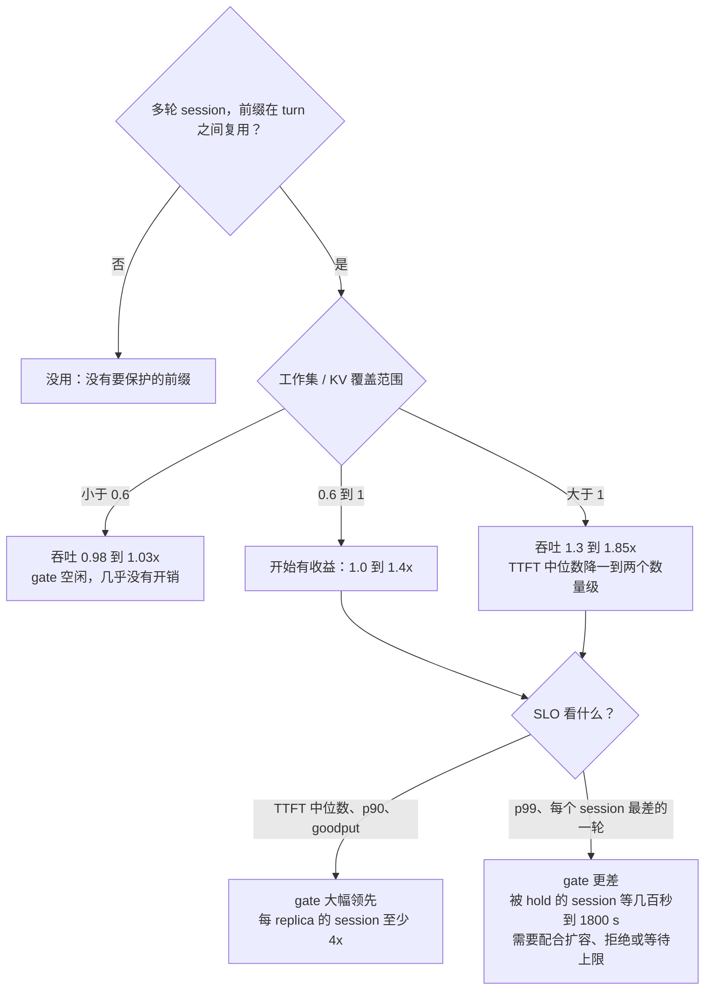

# Thunder Agent benchmark 总结：什么时候有用，系统瓶颈在哪里

写于 2026-10-05，覆盖本仓库 step 04 到 step 22 的全部结果。每个结论后面都标了原实验的位置（相对本目录的路径）。图由本目录的 `make_figures.py` 生成，引擎数据由 `extract.py` 从各 step 的原始指标里提取，方法见文末附录。

## 0. 结论

1. **thunder agent 只在一种情况下明显有用：多轮 agent session 的工作集超过了 KV 能覆盖的容量。** 这时 llm-d 默认调度让 KV 抖动（thrash），前缀命中率掉到接近 0，每一轮都要重算整个历史。thunder 把放不下的 session 挡在门外，放进来的 session 前缀就能留在 KV 里。吞吐提升 1.2 到 1.85 倍，TTFT 中位数降一到两个数量级（图 1；step 12、13、17、20）。
2. **工作集明显放得下时，它几乎没用，也几乎没有开销**：0.98 到 1.03 倍，gate 基本不动（step 13 每 pod 4 到 16 个 session；step 20 c = 32）。
3. **它不能提高吞吐上限。** 一个 replica（2 块 H100）在这个负载上最多约 650 tok/s。原因有两个：GPU KV 只放得下约 30 个 6 到 9 万 token 的请求，所以每步 decode 的批大小被卡在约 30；每个 decode 步都要把这些请求的 KV 读一遍，约 46 ms。thunder 和 CPU offload 能减少的只有 prefill 重算这一项（图 3；step 20）。
4. **开了 400 GiB CPU offload 后，吞吐收益大部分消失**（工作集小于 CPU tier 时只有 1.03 到 1.13 倍）。**但按 TTFT SLO 算，gate 仍然大幅领先**：要求 p90 TTFT <= 30 s 时，每个 replica 能撑的 session 从 32 提高到 128，至少 4 倍（图 4；step 20、22）。
5. **代价是长尾。** gate 没有消除等待，只是把等待集中到少数被 hold 的 session 上。p99 TTFT 从几十秒变成几百秒；负载很高时，有的 session 要等满 1800 s 的强制准入（versions report；step 17、20、22）。
6. **gate 的容量必须对准真正的瓶颈。** 按 GPU KV 定容量是对的；按 CPU tier 定容量等于关掉 gate（step 20）；如果目标是 decode 速度（ITL），容量要按显存带宽推算，会比 KV 小很多（图 5，第 5 节）。
7. **生产中的定位**：低于饱和点时 gate 空闲。需求超过容量时（扩容来不及、GPU 配额用完、突发流量），它保护 SLO；"被 hold 的需求"本身也是很好的扩容信号。

## 1. 测试环境和术语

| | |
|---|---|
| 模型 | Qwen3-Coder-30B-A3B-Instruct-FP8（MoE，48 层，4 个 KV head）|
| 引擎 | vLLM v0.28.0，TP = 2，每个 replica 2 块 H100 80GB（GKE `a3-highgpu-4g`，spot 节点）|
| GPU KV | 每个 replica 2,237,040 token（FP8 KV，每 token 48 KiB），约等于 8.5 个 262k 的上下文 |
| 调度上限 | `max_num_batched_tokens` 8192，`max_num_seqs` 1024（都没有成为瓶颈，见 3.1）|
| CPU offload（step 20、21）| vLLM 原生 OffloadingConnector，400 GiB = 8,738,133 token |
| 负载 | weka trace 回放：真实的 Claude Code 会话，tool call 间隔最长 10 s；闭环，每个 session 同时最多一个请求 |
| 详细配置 | `../model-server/README.md` |

术语：

- **session**：一条 agent 轨迹。每一轮都重发完整历史，所以只有前缀还在 KV 里时才便宜。
- **c**：同时在跑的 session 数。单 replica 实验按 replica 算；4-pod 实验常换算成"每 pod session 数"（c / 4）。
- **工作集**：所有活跃 session 最新上下文长度之和，也就是想把它们全部留在 KV 里需要多少 token。
- **KV 覆盖范围（reach）**：不开 offload 时等于 GPU KV。开 offload 时约等于 CPU tier 大小：vLLM 的 offload 是写穿式，GPU 里的内容在 CPU tier 里也有一份。
- **gate、hold、pause**：thunder 的准入控制。放不下的 session 在 EPP 里排队（hold）；为了腾地方，空闲的 session 会被暂停（pause），它的下一轮要重新排队。
- **命中率**：prompt token 里命中前缀缓存的比例。
- **goodput**：满足 SLO（本文是 TTFT <= 30 s）的那部分输出 token 每秒。
- **llm-d 默认**：llm-d-router 的默认调度（prefix-cache、queue、KV 三个 scorer），没有准入控制。

## 2. 所有实验一览

| step | 原实验位置 | 问题 | 结论（关键数字）|
|---|---|---|---|
| 04 到 05 | `../04-benchmark/results.md`、`../05-saturation/results.md` | 原版 Python ThunderAgent 能不能跑，pause/resume 是否工作（合成负载）| 能跑；2.2 倍超订时最多 186 个程序同时被暂停，全部完成 |
| 06 | `../06-single-node-ab/results.md` | 单 pod，原版 tr 模式 vs 纯代理（合成负载，客户端不发 release）| 有 decay 时快 1.45 倍；**没有 decay 时慢 8 倍**（容量永远不释放，等满 1800 s）|
| 07 | `../07-inference-perf-weka/RESULTS.md` | 真实 weka trace，单 pod，原版 | 吞吐 2.0 到 2.4 倍，命中率 0.04 到 0.10 → 0.54 到 0.69；但压测工具只跑起来约一半 session |
| 08 | `../08-weka-replicates/RESULTS.md` | 同上，重复 3 次 | 2.12 倍（±1.3%）；后来发现 600 s 客户端超时砍掉了大量 turn，数字偏高（见该文件附录）|
| 09 | `../09-llm-d-router-smoke/README.md` | 移植到 llm-d-router EPP 后的冒烟测试 | 20 项检查全部通过 |
| 10 | `../10-llm-d-router-replicates/RESULTS.md` | 移植版单 pod，和原版同协议 | EPP 路径本身没有开销；移植版 1.54 倍（1900 s 客户端）、1.80 倍（600 s 客户端）|
| 12 | `../12-llm-d-router-pool/RESULTS.md` | 4-pod 池，c = 338（每 pod 84）| llm-d 默认 = session 亲和（1020 tok/s，命中率 0.002）；移植版 1.42 倍；70% 的恢复换了 pod，命中率只有 0.25 |
| 13 | `../13-llm-d-router-sweep/RESULTS.md`、`SATURATION.md`、`README.md` | 4-pod 池，每 pod 4 到 84 个 session 扫描；origin-only；SLO 和 session 级指标 | 每 pod 24 个以下没有差别（0.98 到 1.01 倍）；most-room 1.20 到 1.46 倍；origin-only 1.18 到 1.63 倍；"等一会再换 pod"的变体都失败；前缀空闲 10 到 12 s 后就被挤掉 |
| 14 | `../14-turn-priority/README.md` | llm-d 合入的 turn-priority（PR 2116）| 只比 sticky 高 1.16 倍（移植版 1.54 倍），每个 cell 用 429 丢掉 44 个 session：只排序不限制驻留，保护不了缓存 |
| 15 到 16 | `../15-thunder-minimal-single-pod/README.md`、`../16-thunder-minimal-pool/README.md` | 精简重写（minimal）| 池上 1770 到 1945 tok/s，持平或超过 origin-only（1693）|
| 17 | `../17-thunder-lease-pool/README.md`、`tail.md` | lease 版（3 个配置项）| lease 30 s：1931 tok/s，命中率 0.819，p99 242 s；p99 的长尾全是在 gate 里等待的被暂停 session |
| 18 到 19 | `../18-thunder-lease-main-pool/README.md`、`../19-thunder-lease-fix-pool/README.md` | lease 版换成 PR 用的账本 | 每个 session 只记一个在途请求导致低估，掉到 1477；修复后 2042 tok/s，命中率 0.844 |
| 20 | `../20-cpu-offload-pool/README.md` | 单 replica + 400 GiB CPU offload，三种调度，3 次 | offload 让 llm-d 默认提高 1.58 到 1.98 倍，直到 CPU tier 满；gate 收益在 tier 没满时只有 1.03 到 1.13 倍，满了以后 1.51 到 1.85 倍 |
| 21 | `../21-thunder-tier-budget/README.md` | GPU 准入 + CPU tier 预算（两个预算）| 没有效果：强制准入绕过了预算 |
| 22 | `../22-slo-goodput/README.md` | 用 step 20/21 的数据按 TTFT SLO 算 goodput | p90 TTFT <= 30 s 时，每 replica 的 session 从 32 提高到 128；代价是 p99 |
| 版本对比 | `../versions-report/README.md` | 每个版本在 4-pod c = 128 下各取一个 cell | 默认 1151 → v3 1382 → v4 1571 → minimal 1752 到 1867 → lease 1863 到 1871 tok/s；p99 从 50 s 涨到 164 到 227 s |


## 3. 系统瓶颈和饱和点

### 3.1 单个 replica：吞吐 = 每步 decode 的请求数 / 每步耗时

vLLM 每走一个引擎步（step），每个正在 decode 的请求产出 1 个 token，同一步里还可以夹带一段 prefill。所以：

**输出吞吐 = B / T**（B：每步同时 decode 的请求数；T：每步耗时）

用 step 20 和 21 全部 66 个 cell 的 7618 个 10 秒间隔拟合（vLLM 的 `iteration_tokens_total` 和 `generation_tokens_total`），得到：

**T ≈ 46 ms + 29 ms × (这一步的 prefill 千 token 数)**，R² = 0.84


图 3：(a) 每个点是一个 10 秒间隔，黑线是拟合；(b) 每个 arm 和并发下的平均步长，灰色是 decode 部分（常数 46 ms），彩色是 prefill 部分（29 ms × 每步 prefill 千 token），黑色短线是实测值；(c) 每步同时 decode 的请求数。数据：step 20、21 的 `results/raw-vllm-metrics.txt.gz`。

怎么读：

- **B 被 GPU KV 卡住。** 所有 cell 的 KV 占用平均 0.96。vLLM 里排队的请求，99.8% 的原因是 `capacity`（等 KV 空间），不是 `max_num_seqs`。上下文有 6 到 9 万 token 时，KV 只放得下约 30 个请求，所以 B = 26 到 39。
- **decode 部分约 46 ms，基本是常数。** KV 一直是满的（约 218 万 token），每一步都要把这些 KV 读一遍：每块 GPU 约 54 GB，按 44 ms 算约 1.2 TB/s，约为 H100 显存带宽峰值（3.35 TB/s）的 36%（估算）。所以 decode 受限于"读 KV"，而且带宽没用满。这个部署关掉了 DeepGEMM 等优化（`../model-server/README.md`），这部分只能在引擎侧改进，调度器管不到。
- **prefill 每千 token 加 29 ms。** 这是不同调度之间唯一的大差别：llm-d 默认在 KV 抖动时每步要算约 2900 个 prefill token，步长变成 130 ms；gate 每步只算 200 到 700 个。
- **上限：** prefill 为 0 时约 30 / 46 ms，即 650 到 690 tok/s。实测最好是 636（step 20，3 次平均）和 650（step 21，单次）。

例子（step 20，c = 128，稳态，引擎计数）：

| | 每步 prefill | 每步耗时 T | 批大小 B | 吞吐 B / T |
|---|---|---|---|---|
| llm-d 默认，不开 offload | 2.91k token | 130 ms | 38 | 292 tok/s |
| gate，不开 offload | 0.75k | 67 ms | 35 | 516 tok/s |
| llm-d 默认，offload 400 GiB | 0.30k | 55 ms | 33 | 591 tok/s |
| gate，offload 400 GiB | 0.23k | 51 ms | 32 | 633 tok/s |

下面这些**不是**瓶颈（都有数据）：

- `max_num_seqs`（1024）：任何 pod 上同时运行的请求最多 61 个（`../model-server/README.md`）。
- `max_num_batched_tokens`（8192）：每步平均 prefill 最多约 2.9k token（图 3）。
- CPU tier 的传输：回载时 15 到 21 GB/s；按 arm 和并发平均，不超过 1.9 GB/s，回载时间最多占 9%（step 20、21 原始指标）。
- 路由器：原版 Python router 只用 0.06 到 0.11 核（step 08）；EPP 约 2 核，1 秒一次的 sweep 也不增加（step 16）。
- 压测工具：inference-perf v0.7.0 有 permit bug，step 07 到 10 只有约一半 session 真正在跑。step 12 起用修好的镜像（`../INFERENCE-PERF-BUGS.md` issue 4）。

### 3.2 4-pod 池：三个饱和点依次出现（step 13）


图 2：横轴是每 pod 的并发 session 数（4-pod 池，每个 30 分钟 cell）。数据：`../13-llm-d-router-sweep/results/sweep-20260918-134248-t1900/`（`sweep.md` 和每个 cell 的逐请求报告）。

1. **吞吐峰值（每 pod 12 到 16 个 session，约 500 tok/s/pod）：受限于显存带宽。** 这时 KV 只用了 33% 到 42%，vLLM 不排队，但 decode 间隔（ITL p50）随 session 数线性增长：每 pod 4、8、12、16 个 session 时分别是 10、15、20、29 ms。批变大了，每步也变慢了，所以吞吐不再增长。thunder 在这里和默认完全一样（0.98 到 1.01 倍），因为它什么也不用做。
2. **KV 拐点（每 pod 24 到 32 个 session，工作集是 KV 的 0.75 到 0.87 倍）：受限于 KV 容量。** llm-d 默认的命中率从 0.93 掉到 0.63 再到 0.04，每 pod 实际计算的 prefill 从约 4k 涨到 17k tok/s，吞吐下降。thunder 从这里开始有收益。
3. **引擎排队（每 pod 24 个起）。** llm-d 默认在 vLLM 里排队的请求是 4、15、50、93、152 个（整个池），TTFT 中位数随负载线性增长到 101 s。thunder 把排队移到 EPP，vLLM 里一直只有约 1 个。

从 c = 192 起，池的总 token 计算量（prefill + decode）停在 87k 到 94k tok/s，这是这套硬件在这个负载上的天花板（`../13-llm-d-router-sweep/RESULTS.md`）。

三个饱和点（定义来自 `../13-llm-d-router-sweep/SATURATION.md`）：

| 饱和点 | 含义 | 4-pod 池（step 13，每 pod）| 单 replica + 400 GiB offload（step 20）|
|---|---|---|---|
| 吞吐峰值 | 再加 session，总吞吐不再增加 | 12 到 16 个 session，约 500 tok/s，带宽受限 | gate：c = 64 到 128，636 tok/s；llm-d 默认：c = 32 到 128，约 565 tok/s |
| KV 拐点 / 崩溃点 | 工作集超过 KV 覆盖范围，命中率塌，prefill 暴涨 | llm-d 默认 24 到 32 个 session（不开 offload）| llm-d 默认 c = 128 到 192（工作集 / CPU tier 从 0.81 到 1.07，CPU 命中率从 0.84 到 0.07）|
| SLO 容量（p90 TTFT <= 30 s）| 满足 SLO 的最大负载 | llm-d 默认 24 到 32，thunder 约 64（按请求统计）；按 session 统计（75% 的 session 每一轮都 <= 30 s）：默认不到 24，thunder 约 32 | llm-d 默认 32，gate 128（step 22）|

offload 把 KV 拐点推后了约 4 倍（CPU tier 是 GPU KV 的 3.9 倍）。不开 offload 时，单 replica 在 c = 32 就已经抖动：step 20 phase A 的工作集正好等于 GPU KV。

### 3.3 thunder 能改变什么，不能改变什么

| | 能改变 | 不能改变 |
|---|---|---|
| thunder（gate）| prefill 重算量（保住前缀）；排队的位置（从 vLLM 移到 EPP）；谁先被服务 | KV 能放多少请求（B）；decode 每步要读多少 KV（46 ms）；吞吐上限 |
| CPU offload | prefill 重算量（从 CPU 拷回代替重算）| B 和 decode 步长：正在跑的请求，它的 KV 必须在 GPU 上 |
| 要提高上限只能靠 | 更多 GPU / replica、每 token KV 更小的模型、更快的 attention kernel、更短的上下文 | |

## 4. 什么时候有用，什么时候没用


图 1：横轴是 llm-d 默认 arm 的工作集除以 KV 覆盖范围（4-pod 池除以池的 GPU KV；单 replica 不开 offload 除以 GPU KV；开 offload 除以 CPU tier），纵轴是同一负载下 thunder 和 llm-d 默认的吞吐之比。星号是 step 17 的 lease 版（3 次平均）对 step 13 的默认 cell，不是同一天跑的。数据：step 13 的 `sweep.md` 和逐请求报告，step 17 的 `README.md`，step 20 的 `results/figure-data.json`。

图 1 的读法：

- 横轴小于约 0.6 时，所有线都在 1.0 附近。
- 横轴接近 1 时，收益迅速上升；超过 1 以后是 1.3 到 1.85 倍。
- 两个例外：
  - 开 offload、工作集小于 CPU tier 但大于 GPU KV（c = 64 到 128）时，gate 还有 1.12 到 1.13 倍。c = 64 时主要来自更大的 decode 批（每步 31 对 28 个请求），c = 128 时主要来自更少的 prefill（每步 0.23k 对 0.30k token），两种情况下 CPU 回载都更少。为什么 c = 64 时批更大，还没查清。
  - 不开 offload、工作集是 GPU KV 的 5 倍（c = 256）时，收益掉到 1.28 倍。每个 cell 有 153 次 1800 s 强制准入，gate 自己的工作集到了容量的 1.27 倍，又开始抖动（`../20-cpu-offload-pool/results/analysis.md`）。



### 4.1 有用的场景

| 场景 | 效果 | 原实验位置 |
|---|---|---|
| 单 pod，不开 offload，工作集超过 GPU KV | 1.28 到 1.75 倍；移植版 1.54 倍 | step 20 phase A；step 10 |
| 4-pod 池，每 pod 32 到 84 个 session | most-room 1.20 到 1.46 倍；origin-only 1.37 到 1.63 倍；lease 版在每 pod 32 个时约 1.68 倍 | step 12、13、17 |
| 开 offload，工作集超过 CPU tier（c = 192 到 256）| 1.51 到 1.85 倍 | step 20 |
| 有 TTFT SLO（任何超过拐点的负载）| goodput 从 0 提高到 350 到 550 tok/s；每 replica 的 session 至少 4 倍；池里每 pod 32 个 session 时，session 达标率 0.70 到 0.76，默认只有 0.08 | step 22；step 13 |
| 想让引擎里不排队 | vLLM 排队从 15 到 152 个降到约 1 个；排队移到 EPP，在那里可以决定谁先走 | step 12、13 |

### 4.2 没用或有害的场景

| 场景 | 现象 | 原实验位置 |
|---|---|---|
| 工作集明显放得下 | 0.98 到 1.03 倍，gate 空闲 | step 13 每 pod 4 到 16 个；step 20 c = 32 |
| 想提高吞吐峰值 | 做不到：池的峰值默认 2014、thunder 1972 tok/s；单 replica 所有 gate 都在 500 到 650 tok/s | step 13；step 20、21 |
| 开了大的 CPU offload，工作集小于 CPU tier | 吞吐只多 1.03 到 1.13 倍（但 goodput 仍然领先）| step 20 |
| 看 p99 或每个 session 最差的一轮 | p99 TTFT：池 c = 128 时 50 s → 164 到 242 s；单 replica 从 c = 128 起 p99 到 1800 s | versions report；step 17、20 |
| 极端过载（工作集 5 倍 KV）| 强制准入让 gate 超过容量，收益降到 1.28 倍 | step 20 phase A c = 256 |
| 单轮对话、没有前缀复用 | 理论上没有收益（没测），匿名流量直接放行 | `fairness.go` 的 `DefaultFairnessID` 分支 |

### 4.3 实现上踩过的坑

| 坑 | 后果 | 原实验位置 |
|---|---|---|
| 空闲 session 的容量从不释放（没有 decay 或 lease）| 慢 8 倍：被 hold 的 session 要等满 1800 s | step 06 |
| 暂停后在别的 pod 恢复（most-room）| 49% 到 71% 的恢复换了 pod，每次都要重算整个前缀；每 pod 32 到 84 个 session 时命中率 0.25 到 0.35，origin-only 是 0.42 到 0.63 | step 12、13 |
| 等一会再换 pod（urgent 15 s）| 1300 tok/s（origin-only 1693），session 达标率 0.33 | step 13 Option B |
| 只排序不限制驻留（turn-priority、age-only）| 1.16 倍；age-only 1461 tok/s | step 14；step 13 |
| 账本少算并发的在途请求 | 1477 tok/s，修复后 2042 | step 18、19 |
| 客户端超时短于 1800 s 的兜底 | 被砍掉的 turn 让数字虚高（2.12 倍）| step 08、10 |
| 用 CPU tier 大小当 gate 容量 | 等于不加 gate：vLLM 排队 30 到 110 个，TTFT 中位数 44 到 167 s | step 20 |
| 再加一个 CPU tier 预算 | 没效果：强制准入和已准入 session 的增长都绕过它 | step 21 |

### 4.4 按 SLO 看：吞吐一样，goodput 差很多


图 4：单 replica，400 GiB offload，3 次平均。(a) 虚线是稳态吞吐，实线是 TTFT <= 30 s 的 goodput；(b) c = 128 时 TTFT 的累积分布。数据：`../22-slo-goodput/results/goodput-data.json`。

三个 arm 做的总工作差不多（虚线），区别在于**等待发生在哪里**。不加 gate 时（llm-d 默认，以及按 CPU tier 定容量的 gate），所有 session 都在 vLLM 里排队，每一轮都要等 1 到 2 分钟，goodput 掉到 0。gate 按 GPU KV 准入时，放进来的 session 几乎不排队（90% 的 turn 在 10 s 以内），被 hold 的 session 等很久（图 4b 右边的尾巴）。

### 4.5 生产中怎么看

- **平时（低于饱和点）：** gate 空闲，不帮忙也不添乱。
- **需求超过容量时：** 它最有价值。例如扩容来不及：这个部署每次重启都要重新下载权重，启动探针允许最长 1 小时（`../model-server/README.md`）。又如 GPU 配额用完，或者突发流量。这时它保住前缀和 TTFT，代价是一部分 session 在门口等。
- **作为扩容信号：** 被 hold 的需求（`thunder_agent_holds_total` 的增长、EPP 队列长度、强制准入）说明需求已经超过当前池的 SLO 容量，可以直接驱动扩容（`../13-llm-d-router-sweep/SATURATION.md` 的建议）。
- **推荐配置：** lease 30 s，容量从 vLLM 抓取（`cache_config_info`），客户端超时大于 1800 s 的兜底。

## 5. 如果瓶颈不是 KV token：准入标准怎么写

### 5.1 现在的规则（`thunder-agent-lease-main` 分支）

- **容量：** `accounting.go` 的 `endpointCapacity()`。优先用 vLLM `cache_config_info` 的 `block_size × num_gpu_blocks`，读不到时用配置项 `capacityTokens`。
- **session 占用：** `accounting.go` 的 `ResponseBody` 把上一轮的 `usage.total_tokens` 记为已提交大小；进行中的那一轮按请求体字节数除以 4 估算（`manager.go` 的 `bytesPerToken`）。
- **准入判断：** `fairness.go` 的 `Pick`。`room = capacity × utilThreshold − occupancy`；放不下时，暂停空闲超过 `idleLeaseSeconds` 的 session 来腾地方，还是不够就 hold。
- **每个调度周期刷新：** `saturation.go` 的 `Saturation()`。它每个周期都会拿到 endpoint 列表，用来更新每个 pod 的容量，然后永远返回 0（不用 flow control 整个 band 一起停的机制，原因见代码注释）。

**所有判断都以 token 为单位，因为这里假设瓶颈是 KV 容量。** 换成别的瓶颈，要改的就是两件事："一个 session 占多少"和"一个 pod 有多少"。

### 5.2 三种写法

| 写法 | 做法 | 优点 | 缺点 |
|---|---|---|---|
| A. 换算成 token（建议先做）| 账本不变，只把容量换成"真正瓶颈允许的 token 数"，例如按 ITL 目标算出的驻留 token 上限（5.4）| 只改配置（`capacityTokens` 或 `utilThreshold`），马上能做实验 | 只适合和驻留 token 成正比的瓶颈（KV 容量、decode 带宽）|
| B. 多个账本 | 每种资源一个账本：session 的需求和 pod 的容量；所有资源都放得下才准入 | 同时管几种瓶颈（例如 KV 和 prefill 速率）| 要估计每个 session 对每种资源的需求 |
| C. 反馈控制 | 不预测，按测到的饱和信号（vLLM 排队、ITL）调整每个 pod 的有效容量（乘性减、加性增）| 不用事先知道瓶颈是什么 | 有滞后，可能振荡；llm-d 自带的 saturation detector（排队 >= 5 或 KV >= 80%）是这种的简单版，但它让整个 band 一起停，会挡住已准入 session 的 turn（step 14、`saturation.go`）|

### 5.3 候选瓶颈和 metrics 来源

| 瓶颈 | 什么时候是瓶颈 | session 的需求 | pod 的容量 | vLLM 指标 | EPP 能直接拿到吗 |
|---|---|---|---|---|---|
| GPU KV 容量（现在）| 工作集超过 KV（3.2 的 KV 拐点）| 上下文 token 数 | `block_size × num_gpu_blocks` | `vllm:cache_config_info`、`vllm:kv_cache_usage_perc` | 能，默认就抓 |
| decode 带宽（ITL）| 有 ITL 目标时；吞吐峰值点（3.2 的第 1 点）| 驻留 token 数（每步都要读）| 按 ITL 目标换算的 token 上限（5.4）| `vllm:inter_token_latency_seconds`（histogram）| 容量可以离线算好写进配置；在线读 ITL 要改代码（见 5.7）|
| 同时运行的请求数 | 每个请求的开销差不多时 | 1 | 实测的拐点 | `vllm:num_requests_running`、`vllm:num_requests_waiting_by_reason{reason=capacity}` | 能（running 默认抓；按原因的排队数用 `customMetrics`）|
| prefill 算力 | 大量冷启动或恢复，步长被 prefill 拉长时 | 这一轮要实际计算的 prompt token 数 | 每秒 prefill 预算（5.5）| `vllm:prompt_tokens_by_source_total{source=local_compute}` | 能（counter，用 `customMetrics`，插件自己算速率）|
| CPU tier | 被暂停的 session 太多，CPU tier 放不下时 | 被暂停 session 的上下文 | `kv-offloading-size` 换算的 token 数 | `vllm:kv_offload_*`（不导出 tier 容量）| 容量只能写配置；step 21 试过，没有效果 |
| TTFT / 排队时间 | 直接以 SLO 为目标时 | 不需要（用反馈）| SLO 目标 | `vllm:request_queue_time_seconds`、`vllm:time_to_first_token_seconds`（histogram）| 要改代码；或者由 EPP 自己在响应回调里计时 |

### 5.4 例子 1：按 ITL 目标定 token 预算（只改配置）


图 5：decode 间隔随每 pod 驻留的 KV 增长，读 KV 越多，每步越慢。数据：step 13 的 `sweep.md`（池平均 KV 占用）和逐请求报告（ITL p50），step 20 的引擎数据（星号）。

- **读法：** 如果要求 ITL <= 25 ms，从 llm-d 默认的曲线读出每 pod 最多驻留约 86 万 token，约为 GPU KV 的 38%。
- **配置：** 把 `utilThreshold` 设成 0.38，或者像 step 20 的 CPU tier arm 那样关掉 `cacheInfoSpec`、把 `capacityTokens` 设成 860000。
- **代价（估算）：** 批大小变成约 86 万 / 7 万 ≈ 12 个请求，吞吐约 12 / 25 ms ≈ 480 tok/s，比 650 少约 25%；但每个请求的生成速度快约 1.8 倍。这和 step 13 吞吐峰值点的实测（每 pod 约 500 tok/s，ITL 20 到 29 ms）一致。
- **怎么选：** 这是成本和 ITL 之间的产品选择。需要的话可以直接跑一组 `utilThreshold` 扫描来验证。

### 5.5 例子 2：按 prefill 速率限流（多个账本）

- **算预算：** 由 3.1 的公式，要把步长控制在 60 ms 以内，每步 prefill 不能超过 (60 − 46) / 29 ≈ 0.48k token。每秒约 16.7 步，所以每个 replica 每秒的 prefill 预算约 8k token。
- **每个 session 的需求**（这一轮要实际计算的 token）：
  - 已准入的 session：只有新增的那段，很小；
  - 前缀已被挤掉的暂停 session：整个上下文（例如 7 万 token，约占 9 秒的预算）；
  - 新 session：整个 prompt；
  - 开 offload 时，前缀还在 CPU tier 的暂停 session：需求接近 0，只要拷回。
- **实现：** 每个 pod 一个"令牌桶"，按预算的速率补充，准入时扣掉这一轮的需求。
- **数据来源：** 用 `vllm:prompt_tokens_by_source_total{source=local_compute}` 的增长速度校准预算。
- **意义：** 这才是"考虑 CPU offload"的正确方式。offload 不增加容量，而是让恢复变便宜。step 21 把 CPU tier 当成第二个容量预算，所以没有效果。

### 5.6 例子 3：反馈控制

在 `Saturation()` 里（每个调度周期都会调用）按测到的信号调整每个 pod 的有效容量：

```go
// 每个调度周期，对每个 pod
saturated := waitingCapacity(p) > 0 || itl(p) > itlTarget // 来自抓取的 vLLM 指标
switch {
case saturated:
	p.scale = max(p.scale*0.9, 0.2) // 引擎已经饱和：乘性减
case p.held > 0:
	p.scale = min(p.scale+0.02, 1.0) // 有人在等，引擎还有余量：加性增
}
room := p.capacity*p.scale*utilThreshold - p.occupancy(now) // Pick 里用这个 room
```

这样不管瓶颈是 KV、带宽还是 prefill，只要它表现为"vLLM 里开始排队"或"ITL 变慢"，gate 就会自动收紧。`vllm:num_requests_waiting_by_reason{reason=capacity}` 是很干净的信号：在 step 20 里，99.8% 的排队都是这个原因。

### 5.7 需要改哪些代码

| 改什么 | 位置 |
|---|---|
| 容量来源（换算后的 token 上限，或多个资源的容量）| `accounting.go` 的 `endpointCapacity()` |
| session 的需求 | `manager.go` 的 `session.size()`、`footprint()`；`accounting.go` 的 `ResponseBody` |
| 放不放得下 | `fairness.go` 的 `sizeAndFitLocked()`、`fitTokens()`、`newSessionPod()` |
| 每周期读新指标、调整容量（写法 C）| `saturation.go` 的 `Saturation()` |
| 新配置项（例如 `itlTargetMs`、`prefillTokensPerSecond`）| `config.go` |
| 观察新预算的指标 | `metrics.go`（参照 `thunder_agent_endpoint_capacity_tokens`）|

EPP 抓新的 vLLM 指标，靠 `core-metrics-extractor` 的 `customMetrics`（`pkg/epp/framework/plugins/datalayer/extractor/metrics/factories.go`）。结果存成 endpoint 属性，插件在 `Saturation()` 里读。注意两点：

- **要重写 vllm 的五个默认指标。** 显式写出 `name: vllm` 会替换整个内置配置（step 20 的 `../10-llm-d-router-replicates/thunder-lease-main-tier-plugins.yaml` 里有说明）。
- **只能读 gauge 和 counter**（`spec.go` 的 `extractValue`）。counter 要插件自己按两次抓取的差算速率。histogram（ITL、TTFT、排队时间、每步 token 数）现在读不到，要给提取器加读 histogram sum 和 count 的功能，或者由 EPP 在响应回调里自己计时。

```yaml
- type: core-metrics-extractor
  parameters:
    engineConfigs:
    - name: vllm
      queuedRequestsSpec: "vllm:num_requests_waiting"
      runningRequestsSpec: "vllm:num_requests_running"
      kvUsageSpec: "vllm:kv_cache_usage_perc"
      loraSpec: "vllm:lora_requests_info"
      cacheInfoSpec: "vllm:cache_config_info"
      customMetrics:
      - attributeKey: waiting_capacity
        metricSpec: "vllm:num_requests_waiting_by_reason{reason=capacity}"
      - attributeKey: prefill_computed_tokens
        metricSpec: "vllm:prompt_tokens_by_source_total{source=local_compute}"
      - attributeKey: generation_tokens
        metricSpec: "vllm:generation_tokens_total"
```

## 6. metrics 从哪里来

下表是每个 cell 目录下的原始数据。逐请求报告和 EPP 原始抓取文件太大，没有进 git（见 `../.gitignore`），只在本地；本报告用到的部分已经提取到 `data/`。

| 指标 | 原始来源和名字 | 存在哪个文件 |
|---|---|---|
| 输出吞吐、TTFT、ITL | inference-perf 报告：`computed_metrics.time_to_first_token`、`info.response_metrics.output_token_times` | `results/report/summary_lifecycle_metrics.json`、`per_request_lifecycle_metrics.json` |
| 每个请求的缓存命中 | 同上：`server_usage.prompt_tokens_details.cached_tokens`（需要 vLLM 的 `--enable-prompt-tokens-details`）| 同上 |
| GPU 和 CPU 命中率 | `vllm:prefix_cache_queries/hits`、`vllm:external_prefix_cache_queries/hits` | `results/raw-vllm-metrics.txt.gz`（step 20、21 的每个 cell，每 10 秒一份完整抓取）、`results/vllm-metrics.csv` |
| KV 占用、运行数、排队数和原因 | `vllm:kv_cache_usage_perc`、`vllm:num_requests_running`、`vllm:num_requests_waiting_by_reason` | 同上 |
| 每步耗时、每步 prefill | `vllm:iteration_tokens_total`（histogram 的 count 和 sum）、`vllm:generation_tokens_total` | `raw-vllm-metrics.txt.gz`；本报告提取到 `data/engine-*.json` |
| prefill 来源（本地计算、本地命中、CPU 拷回）| `vllm:prompt_tokens_by_source_total{source=...}` | 同上 |
| CPU tier 传输 | `vllm:kv_offload_load_bytes_total`、`vllm:kv_offload_load_time_total`、`vllm:kv_offload_store_bytes_total` | 同上 |
| KV 容量 | `vllm:cache_config_info`（`block_size × num_gpu_blocks`）| EPP 自动抓取；`../model-server/README.md` |
| 算力、带宽利用率 | `vllm:estimated_flops_per_gpu_total`、`vllm:estimated_read_bytes_per_gpu_total` | 这次部署里一直是 0，需要在 vLLM 里打开相应统计 |
| gate 的行为 | EPP：`thunder_agent_holds_total`、`_pauses_total`、`_releases_total`、`_resumes_total`、`_starvation_promotions_total`、`_endpoint_capacity_tokens`、`_endpoint_working_set_tokens`、`_sessions` | `results/raw-epp-metrics.txt.gz`、`results/epp-metrics.csv` |
| 工作集 | 由逐请求报告算出：活跃 session 最新 prompt 长度之和 | `../20-cpu-offload-pool/analyze.py` 的 `working_set()` |

评估 thunder 时，不要只看输出 tok/s。至少同时看：

- goodput（满足 SLO 的输出 token 每秒）；
- session 达标率（每一轮都满足 SLO 的 session 比例）；
- prefill 计算量（每个输出 token 要算多少 prefill）；
- TTFT 的 p99 和每个 session 最差的一轮；
- hold 和强制准入的次数。

这些都能从上表的数据算出来（`../22-slo-goodput/goodput.py`、`../13-llm-d-router-sweep/analyze_replicates.py`）。

## 7. 局限

- 只有一种负载（weka trace，tool call 间隔最长 10 s）和一种模型、硬件。上下文长、计算便宜的 MoE 模型，让 KV 很早就成为瓶颈。
- 都是闭环压测：负载不会超过系统能处理的量，所以"需求持续超过容量"时的排队增长没有测到。
- 很多点只有一个 cell。cell 之间的差别有 2% 到 6%，小于 5% 的差别应该看成持平。
- 不同 step 跑在不同天、不同的 spot pod 上。跨 step 比较（例如图 1 的星号）只能看大方向。
- 3.1 的显存带宽利用率是按 KV 大小估算的，没有直接测（vLLM 的利用率计数器没打开）。

## 8. 下一步建议

1. **找准拐点：** llm-d 默认在 c = 40、48、56，gate 在 c = 144、160、176，把 "至少 4 倍" 变成实测值（step 22 的后续）。
2. **开环压测：** 按固定速率到达新 session。这样被 hold 的需求会表现为不断增长的队列，可以直接测 "用 hold 驱动扩容" 的效果。
3. **`utilThreshold` 扫描：** 验证 5.4 的带宽预算：ITL、吞吐和 goodput 怎么随它变化。
4. **时间片：** 有 session 被 hold 时，让已准入的 session 用完一个时间片后在两轮之间暂停，给等待时间一个上界，不再依赖 1800 s 的兜底。
5. **profiling（性能剖析）：** 打开 vLLM 的利用率计数器或用 torch profiler，确认 46 ms 的 decode 步里时间花在哪里（attention、MoE、TP 通信）。
6. **换一个 KV 更紧张的模型**（dense 32B 或更大）：检验 "KV 是瓶颈时 gate 才有用" 这个结论是否依赖模型。

## 附录：怎么重新生成

```
cd summary-report
uv run --with numpy --with orjson python extract.py              # 写 data/（删掉文件会重算，约 10 分钟；需要本地的逐请求报告）
uv run --with matplotlib --with numpy python make_figures.py     # 写 figures/（只读 data/ 和各 step 已提交的结果）
```

- `extract.py` 读的原始数据：
  - step 20、21 每个 cell 的 `results/raw-vllm-metrics.txt.gz`，取稳态，即 warm-up 之后、窗口结束之前，每 10 秒一个间隔；
  - step 13 每个 cell 的逐请求报告和汇总报告。
- `make_figures.py` 另外读：
  - step 13 的 `sweep.md`；
  - step 20 的 `results/figure-data.json`；
  - step 22 的 `results/goodput-data.json`。
- 拟合用了所有每 10 秒步数超过 50 的间隔。
