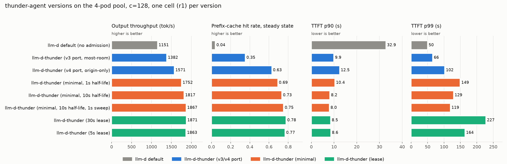
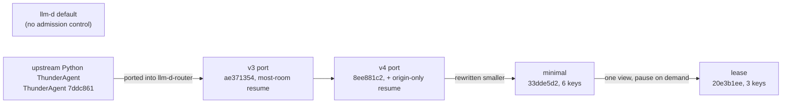

# thunder-agent versions: what each one is, and what it achieved

This report defines every version of ThunderAgent tested in this repo and compares the ones that ran on the whole 4-pod pool under the same protocol. **Each version is represented by one cell: its first cell (r1).** A fixed rule instead of a best or median cell, so nothing is picked by hand. The mean over three cells, where it exists, is in the step READMEs linked below.

`versions.png` and `versions-table.md` are written by `make_report.py` (`uv run --with matplotlib --with numpy python make_report.py`), which reads each cell with step 16's analyzer, so every number matches the per-cell values in the step READMEs.

## Glossary

### Versions

The names below match the labels in the figure and the table.

- **llm-d default (no admission)**: upstream llm-d-router scheduling, with no thunder-agent. Every request is sent at once to the pod with the best mix of short queue, free KV cache and prefix-cache match. Nothing is held back, so the KV cache of every session competes on every pod.
- **upstream Python ThunderAgent**: the original ThunderAgent from the paper, a separate proxy in front of vLLM. It was tested only on single pods in this repo, so it is not in the figure.
- **v3 port, most-room**: the first port of ThunderAgent into llm-d-router (commit `ae371354`), faithful to upstream. Admission counts idle sessions as shrinking over time (idle decay), a sweep every 5 s pauses sessions when a pod is over its limit, and a paused session comes back on its own pod if it fits there, otherwise on the pod with the most room.
- **v4 port, origin-only**: v3 with one change (`8ee881c2`): a paused session comes back **only** on its own pod, where its KV cache still is.
- **minimal**: a smaller rewrite of v4 (`33dde5d2`, step 16). Same idea with fewer parts: origin-only is the only placement, and the sweep pauses only idle sessions. Three settings are shown:
  - **half-life 1 s**: the default; an idle session counts half after 1 s.
  - **half-life 10 s**: idle sessions keep counting longer.
  - **half-life 10 s, sweep 1 s**: the same, with the pause sweep every 1 s instead of 5 s.
- **lease**: the minimal gate with a different way for idle sessions to give up room (`20e3b1ee`, step 17). There is no decay and no sweep. When a waiting session does not fit, idle sessions are paused right then, longest idle first, but only those idle for at least the **idle lease**; when an admitted session's own turn outgrows its pod, any idle session may give up room. Two settings are shown: **lease 30 s** (the default) and **lease 5 s**.
  - Later builds of the same gate are not in the figure. It was rebuilt on another ledger (`1a98a6c5`, step 18), which counted only one in-flight request per session and fell to 1477 tok/s; the fix that counts every in-flight request (`44544c04`, step 19) brought it back to 2042 tok/s and hit rate 0.844, in line with the lease 30 s version shown here.

### Terms

- **Session**: one agent trajectory, identified by its session id. Each turn resends the whole history, so a session is cheap only while its KV cache stays on one pod.
- **Admission**: deciding whether a waiting session's next request may go to a pod now or must wait in the queue.
- **Pause**: the session stops counting against its pod, and its next request must pass admission again. Its KV cache is not deleted, but other sessions may overwrite it.
- **Most-room / origin-only**: where a paused session comes back. Most-room: its own pod if it fits, else the pod with the most free room. Origin-only: its own pod only.
- **Idle decay, half-life**: for admission, an idle session's size is multiplied by `2^(-idle time / half-life)`, so it counts less the longer it waits on a tool.
- **Pause sweep**: a background check every few seconds that pauses idle sessions on pods that are over their limit.
- **Idle lease**: how long after its last response an idle session keeps its room against waiting sessions.
- **c=128**: 128 agent sessions replayed at once over the 4-pod pool, 32 per pod.
- **Cell, r1**: one 30-minute benchmark run. r1 is a version's first run.

## How the versions relate

## Version definitions

Common to every thunder-agent version in llm-d-router: a session (agent trajectory, identified by the `x-session-id` header through the `agent-identity` plugin) is tracked with its KV token footprint (`usage.total_tokens` of the last turn, or the byte estimate of a turn in flight); one plugin instance is the scorer (pins a session to its pod), the flow-control saturation detector (reads the pool every dispatch cycle, always reports unsaturated) and the fairness policy (the admission gate); turns of admitted sessions always dispatch; paused and new sessions wait in the flow-control queue until they fit; any head waiting 1800 s is force-admitted.

| version | code | what it does | config in the r1 cell |
|---|---|---|---|
| **llm-d default** | upstream llm-d-router scheduling profile (image `thunder-agent-v3`, thunder plugin not configured) | No admission control, no session tracking. Each request goes to the pod with the best weighted score of queue length, KV utilization and prefix-cache match. Every request is dispatched at once. | `queue-scorer` 2, `kv-cache-utilization-scorer` 2, `prefix-cache-scorer` 3 (`12-llm-d-router-pool/baseline-plugins.yaml`) |
| **upstream Python ThunderAgent** | `ThunderAgent/` at `7ddc861`, a FastAPI proxy in front of vLLM | A program is REASONING from the moment its request reaches the proxy until the response carries usage, then ACTING. Every 5 s a scheduler pauses ACTING programs smallest first while a backend is over capacity, and marks REASONING ones to pause when their turn ends; paused programs wait in one global pool and are resumed by best-fit-decreasing bin packing, REASONING (request waiting) first, then new, then ACTING. Optional `2^-t` decay of ACTING tokens (1 s half-life) in the resume capacity only. | tr mode with decay (steps 01 to 08). **Not run on the pool**: its numbers are single-pod (step 08: 469 tok/s vs 221 for a plain proxy), so it is not in the figure. |
| **v3 port** | llm-d-router `ae371354`, image `thunder-agent-v3` | Upstream's semantics inside the EPP. Two views of a pod's working set: undecayed (every unpaused session in full) drives a pause sweep every 5 s; decayed (idle sessions `x 2^-t/1s`) drives admission. The sweep pauses idle sessions smallest first and marks running ones to pause at the end of their turn (`markedForPause`). 100-token buffer per session, streaming in-flight growth, explicit session-final release. A paused session resumes on its origin pod if it fits, else on the pod with the most room (**most-room**, upstream's behavior). | half-life 1 s, sweep 5 s, buffer 100, starvation 1800 s, TTL 3600 s (`thunder-plugins.yaml`, 10 keys) |
| **v4 port** | llm-d-router `8ee881c2`, image `thunder-agent-v4` | v3 plus the `resumePlacement` knob; set to **origin-only**, a paused session waits for its own pod, so its warm prefix is never abandoned. | as v3 plus `resumePlacement: origin-only` (`thunder-origin-plugins.yaml`) |
| **minimal** | llm-d-router `33dde5d2`, image `thunder-agent-min-33dde5d2` | A smaller rewrite of v4: same two views and pause sweep, origin-only as the only placement, and without `markedForPause` (the sweep pauses only idle sessions), the per-session buffer, streaming growth updates and session-final release. | six keys; three arms: half-life 1 s / sweep 5 s, half-life 10 s / sweep 5 s, half-life 10 s / sweep 1 s (`thunder-min*-plugins.yaml`) |
| **lease** | llm-d-router `20e3b1ee` (branch `thunder-agent-lease-main`), image `thunder-agent-lease-20e3b1ee` | One view (every unpaused session in full) and no sweep. When the picked paused or new head does not fit, idle sessions give up their room on demand, longest idle first, and are paused: only those idle for at least `idleLeaseSeconds`; when an admitted turn pushes its pod over the ceiling, any idle session. Sessions with a turn queued are never paused; every picked head's room is reserved until its request reaches the pod. Capacity is scraped only, the idle TTL is derived. | three keys; two arms: `idleLeaseSeconds` 30 (the default) and 5 (`thunder-lease*-plugins.yaml`) |

## Results, one cell per version

Protocol for every cell: one EPP over the four vLLM pods (Qwen3-Coder-30B-A3B-FP8, TP=2, 2,237,040 KV tokens each), prefix-cache reset and a fresh EPP per cell, c=128 (32 sessions per pod), weka trace replay, 30 min window with 10 min warm-up, client timeout 1900 s, load generator with the permit fix.

| metric | llm-d default (no admission) | v3 port, most-room | v4 port, origin-only | minimal, half-life 1 s | minimal, half-life 10 s | minimal, half-life 10 s, sweep 1 s | lease, lease 30 s | lease, lease 5 s |
|---|---|---|---|---|---|---|---|---|
| output throughput (tok/s) | 1151 | 1382 | 1571 | 1752 | 1817 | 1867 | 1871 | 1863 |
| steady-state hit rate | 0.040 | 0.353 | 0.629 | 0.691 | 0.733 | 0.752 | 0.778 | 0.766 |
| prefill tokens computed (M) | 122.7 | 115.4 | 83.2 | 75.4 | 67.5 | 65.3 | 62.0 | 63.3 |
| TTFT p50 (s) | 8.2 | 2.3 | 1.3 | 0.9 | 0.6 | 0.5 | 0.5 | 0.6 |
| TTFT p90 (s) | 32.9 | 9.9 | 12.5 | 10.4 | 8.2 | 8.0 | 8.5 | 8.6 |
| TTFT p99 (s) | 50 | 66 | 102 | 149 | 129 | 119 | 227 | 164 |
| vLLM waiting, mean steady | 14.8 | 1.0 | 0.7 | 1.2 | 1.4 | 1.0 | 1.2 | 0.9 |
| goodput within SLO, TTFT <= 30 s (turns/s) | n/a | n/a | n/a | 1.50 | 1.63 | 1.64 | 1.60 | 1.69 |
| session SLO attainment, strict | n/a | n/a | n/a | 0.64 | 0.58 | 0.57 | 0.61 | 0.60 |
| per-session worst TTFT, p90 (s) | n/a | n/a | n/a | 268 | 319 | 367 | 435 | 386 |
| EPP pauses | n/a | 1912 | 1895 | 495 | 391 | 572 | 308 | 475 |
| EPP holds (paused + new) | 0 | 698 | 1079 | 349 | 265 | 397 | 227 | 362 |
| forced admissions | n/a | 0 | 0 | 0 | 0 | 0 | 0 | 0 |
| request errors | 0 | 0 | 0 | 0 | 0 | 0 | 0 | 0 |
| cell | `13-llm-d-router-sweep/.../epp-baseline-c128` | `13-.../epp-thunder-c128` | `13-.../epp-thunder-origin-c128` | `16-thunder-minimal-pool/.../epp-thunder-min-c128` | `16-.../epp-thunder-min-hl10-c128` | `16-.../epp-thunder-min-hl10-s1-c128` | `17-thunder-lease-pool/.../epp-thunder-lease-c128` | `17-.../epp-thunder-lease5-c128` |

Session-level rows are n/a for the step 13 cells: their load generator image predates the per-request session id (step 13 README, "Code versions").

## What each step achieved

1. **Admission control (llm-d default to v3): 1.20x throughput, and the engine queue disappears.** Without admission every session is resident, the KV cache thrashes (hit rate 0.04, 123 M prefill tokens) and about 15 requests wait inside vLLM; with the v3 port the EPP holds the excess, vLLM waiting falls to 1, TTFT p50 from 8.2 s to 2.3 s and p90 from 33 s to 10 s.
2. **Origin-only resume (v3 to v4): a further 1.14x, hit rate 0.35 to 0.63.** In the v3 cell most-room moved 60 percent of resumed sessions (1079 of 1797) to another pod, where their prefix is cold; origin-only moved none.
3. **The minimal rewrite (v4 to minimal): 1.12x to 1.19x, hit rate 0.69 to 0.75, with fewer moving parts.** Without `markedForPause` the sweep pauses a fifth to a third as often (391 to 572 pauses against about 1900), so fewer sessions lose their prefix. A longer idle half-life (10 s) and a faster sweep (1 s) each add a little.
4. **The lease build (minimal to lease): the same efficiency with the simplest design.** Lease 30 s, the default, matches the best minimal arm on throughput (1871 against 1867) and has the highest hit rate and the lowest prefill work of any version, with one working-set view, no sweep and three config keys. Lease 5 s is close behind.
5. **The cost that grows along the same path is the wait tail.** TTFT p99 rises from 50 s (llm-d default, where nobody is held but everyone waits a little) to 66 to 102 s (v3, v4), 119 to 149 s (minimal) and 164 to 227 s (lease). Each step admits more selectively to keep prefixes warm, and the sessions it holds wait longer; per-session worst TTFT p90 shows the same trend across the versions that record it (268 to 435 s). TTFT p50 and p90 improve at every step, so the typical turn gets faster while the slowest 1 percent gets slower.

The one-cell view understates lease 30 s: its r1 cell was its weakest of three. Over three cells it averages 1931 tok/s, hit rate 0.819 and TTFT p99 242 s (`17-thunder-lease-pool/README.md`); the step 13 and step 16 means are in their READMEs.

## Caveats

- One cell per version: the spread between cells of the same version is as large as some differences between versions (lease 30 s spans 1871 to 2018 tok/s over three cells). Read gaps under about 5 percent as ties.
- The step 13 cells ran on 2026-09-18 and 19 on a different set of spot pods; steps 16 and 17 ran on 2026-09-27 and 28 on the same four pods.
- One load level (c=128, 32 sessions per pod) and one workload (weka replay, tool-call gaps capped at 10 s).
- Upstream Python ThunderAgent was measured only on single-pod lanes (steps 01 to 08) and is not comparable with these pool cells.
